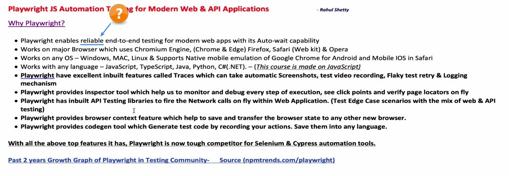
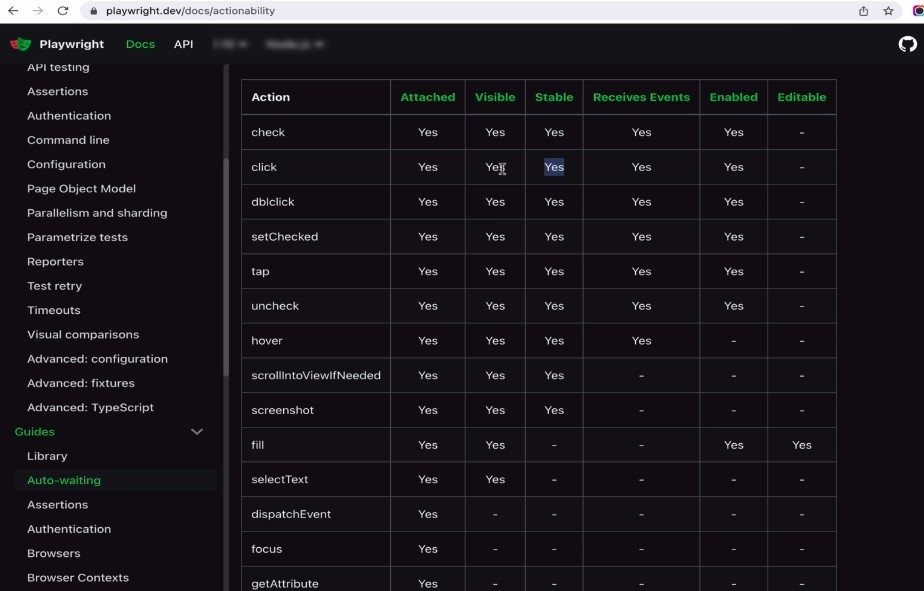
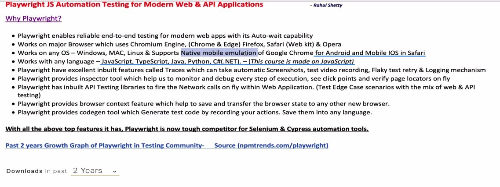
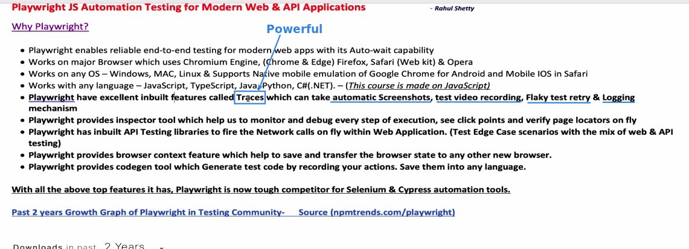
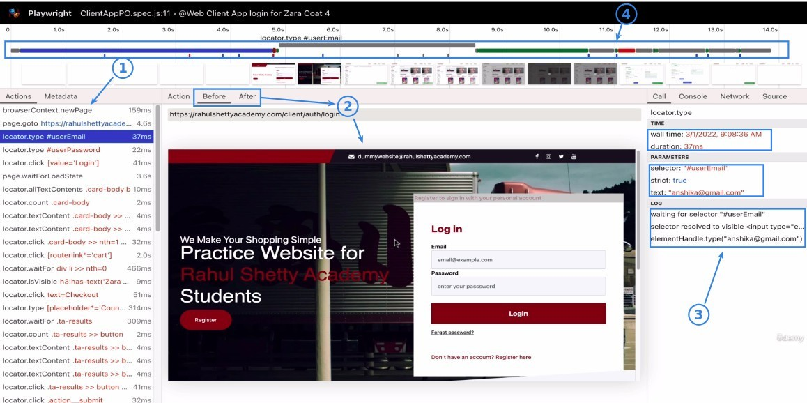

## **Playwright is more reliable**

- Other tools usually run actions as soon as the element is visible, but playwright can run actions when the element is really stable because it has a more detailed analysis of the state of each element.

  - This will give more reliable test results, not different results every time.

## **OS & Write languages**

- Playwright can help us test the situation in a mobile environment.

## **Trace**

> Trace is a very powerful feature of Playwright, it will record the changes before and after each action in detail.

