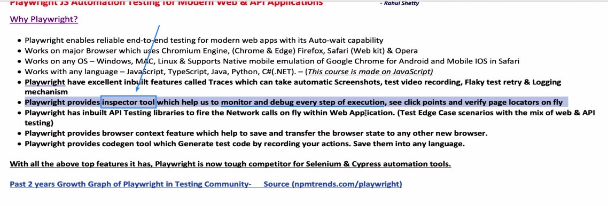
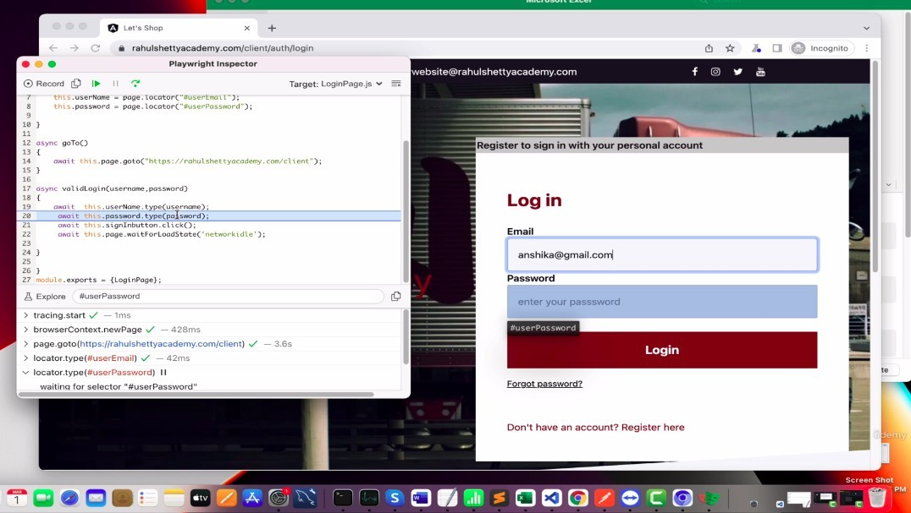
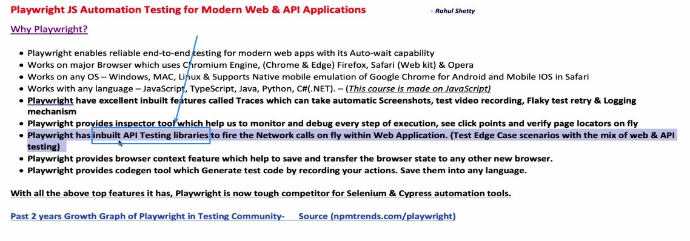
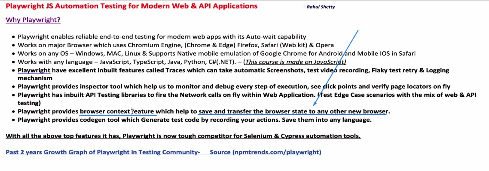
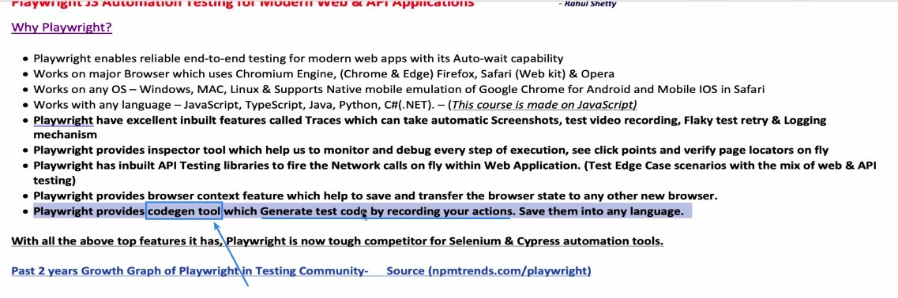
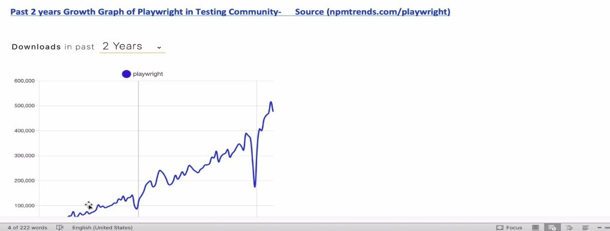

## **Inspector Tool**

> It allows us to track the changes before and after the test step by step from a codes perspective, and can even be used as a powerful debug tool.

## **Inbuilt API Testing libraries**

> Other tools require additional libraries to be loaded to do API testing, but Playwright has API testing capabilities in its own right.

- Combining web test and API test can create more test scenarios.

## **Browser context feature**

> Playwright can store all the data (storage, cookies) in the browser and inject it into the new browser, so that we can skip some of the login screens every time we start testing with the new browser.

## **Codegen Tool**

> Playwright will help newcomers generate scripts for testing.

## **Past 2 years growth graph of Playwright**

- The above chart only tracks javascript, so you can imagine how much more it would grow if other languages were included.
