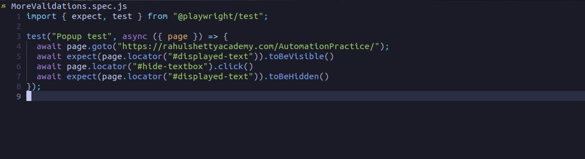
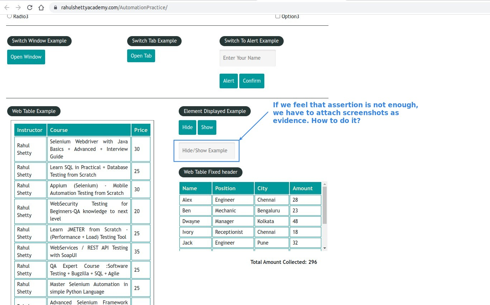
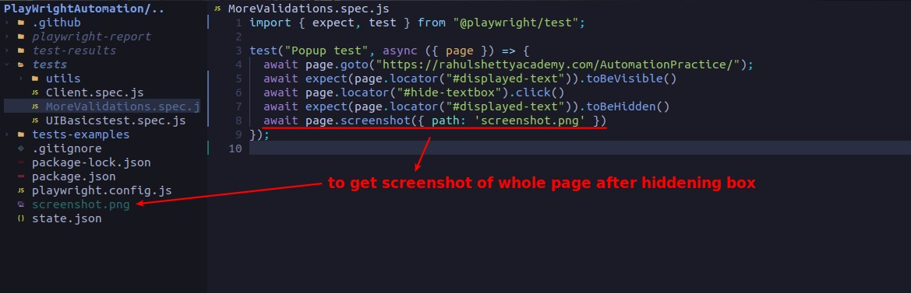
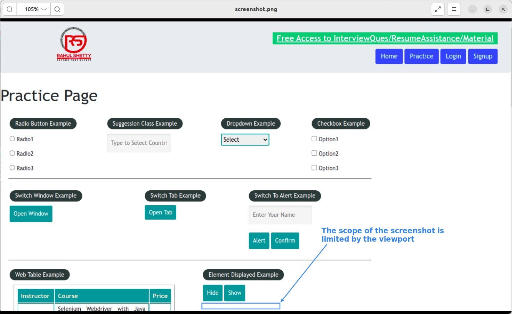
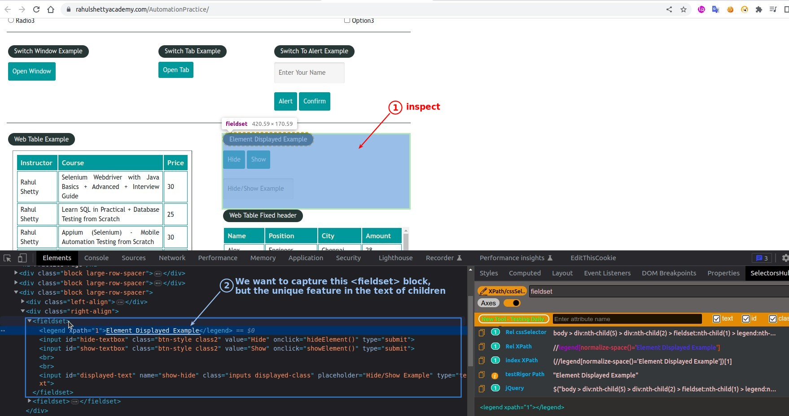
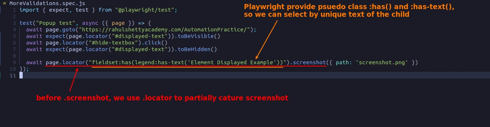
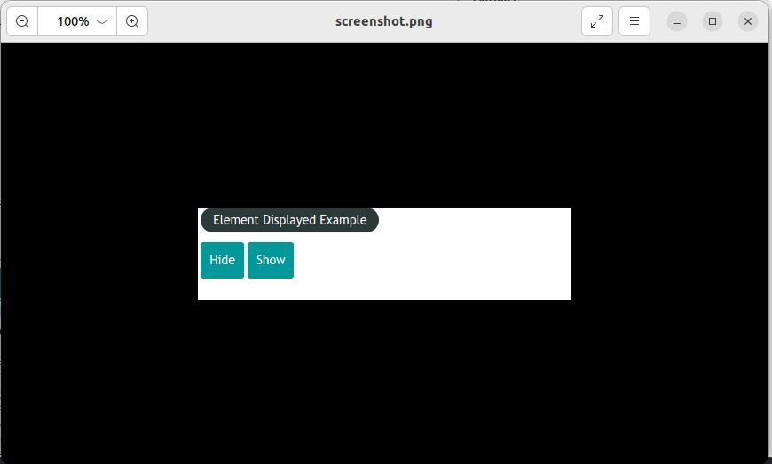

## **NEED: sometimes we need screenshots for evident**

## **page.screenshot**

- You can find that page.screenshop only captures the current viewport range

- To solve this problem, we can scroll to the desired position before screenshot or use the following partially screenshot.

## **locator.screenshot**

> locator also has method screenshot, which can be used to make partial screenshots.

- In addition to the screenshot, the above uses a more advanced CSS-selector, using the phsuedo-class ':has()' and ':has-text()' provided by Playwright.

