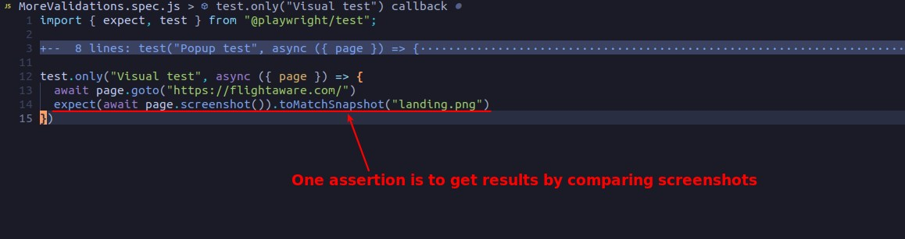
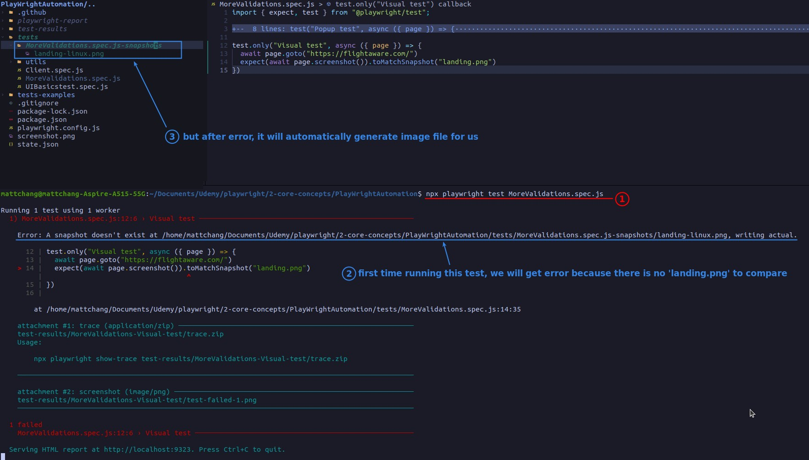
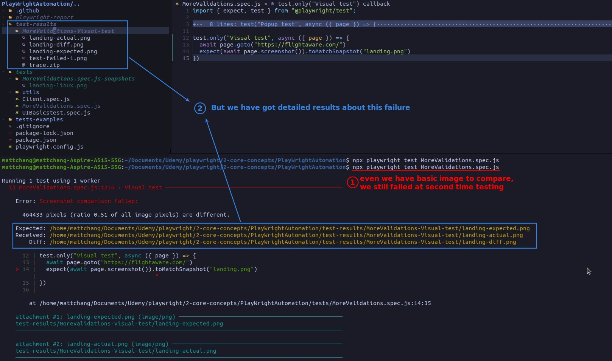
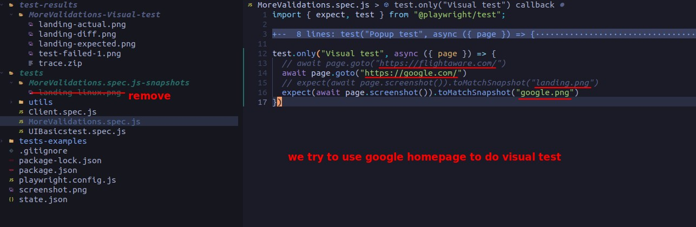
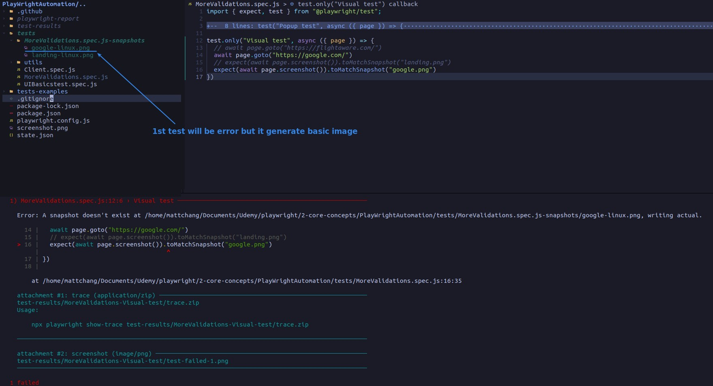
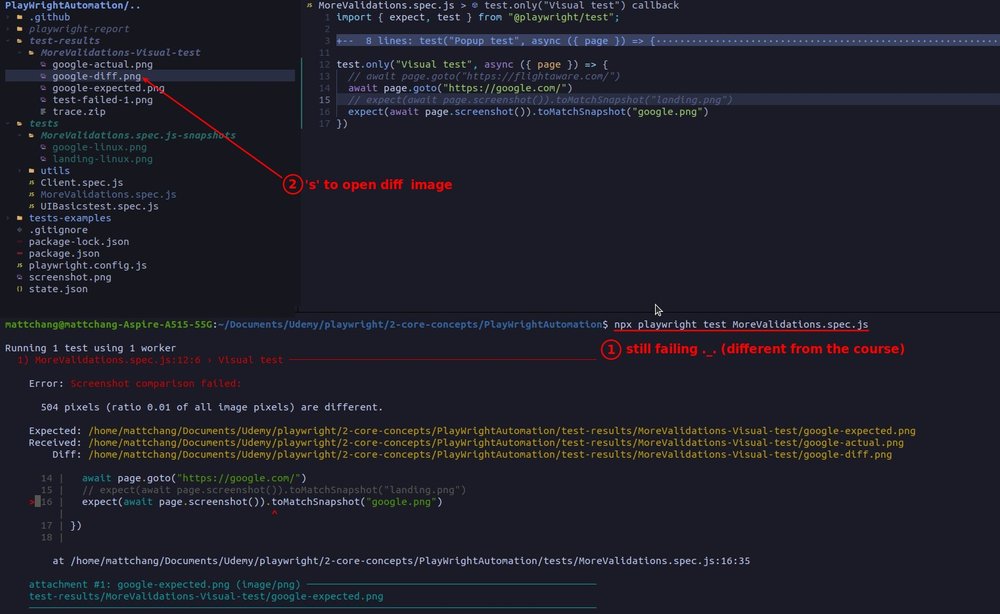
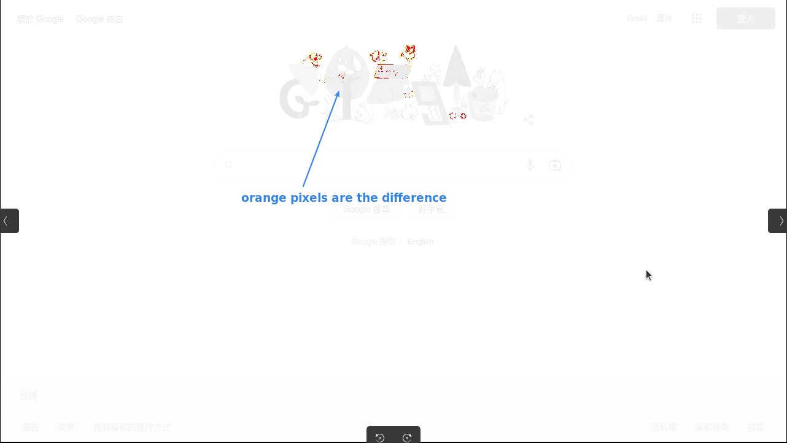
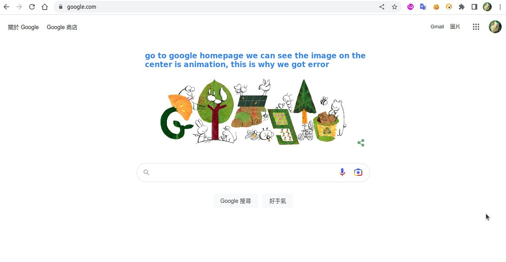

## **Assertion: toMatchSnapshot**

## **TEST**

### _1st run - get pattern picture_

### _after run - actual visual test_

## **Check images**

## **Change to use google home to do the visual test**

### _diff image_

- From the above picture, we can find that visual testing is done in pixel units to compare images.

### _checking google homepage_

- From the visual test of the above two web pages, we can find that the application of visual test is very limited, as long as there is a change in any pixel, we will get a test failure result.

  - Maybe we can change to use locator.screenshot instead of page.screenshot.
