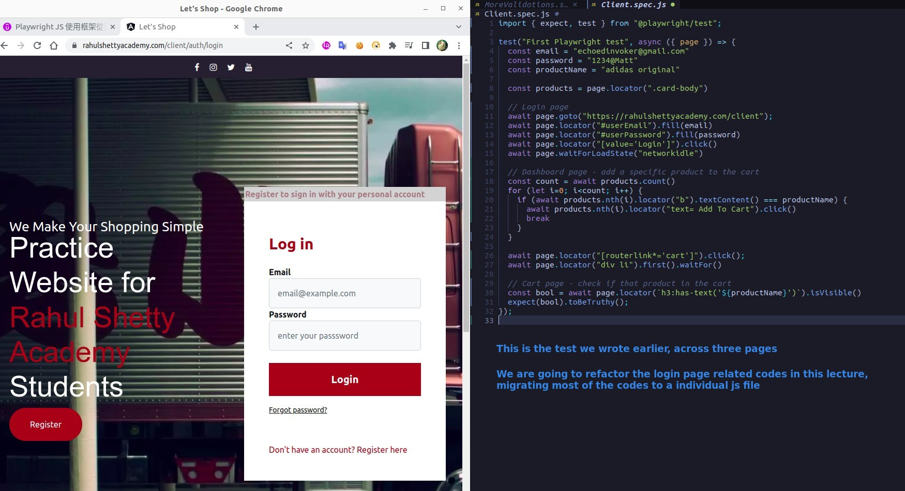
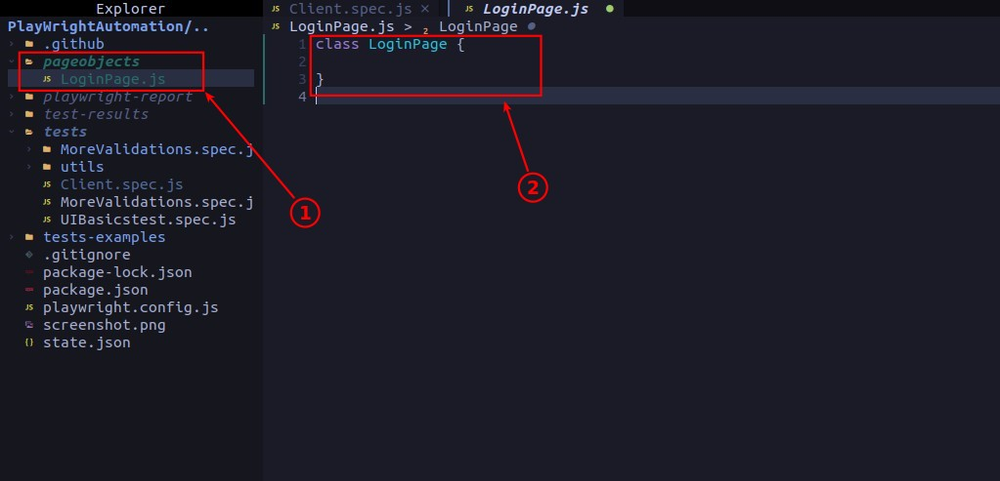
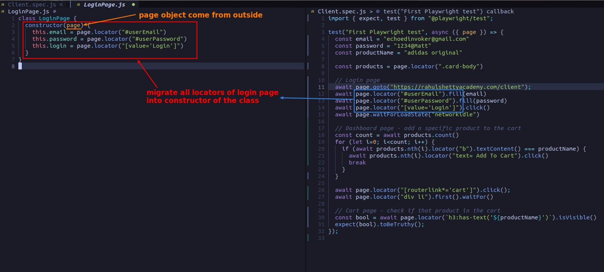
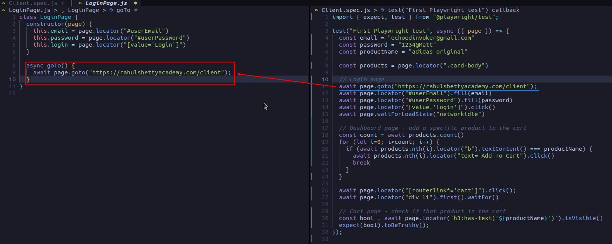
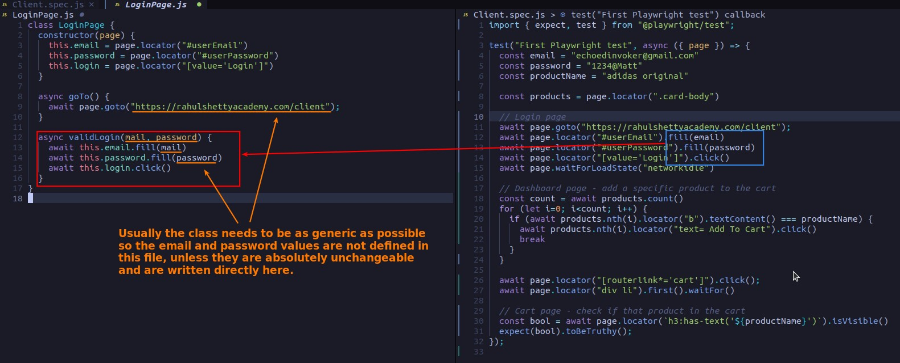
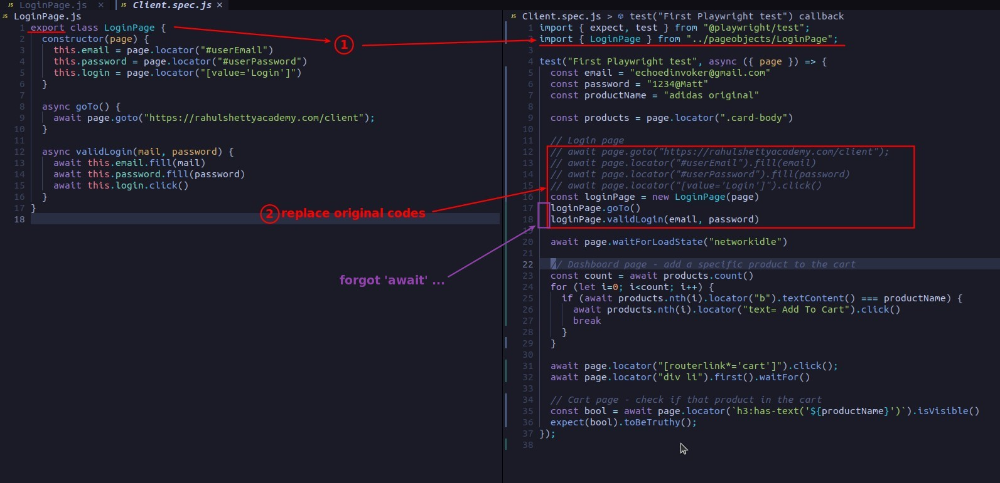
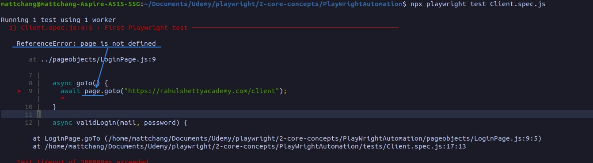
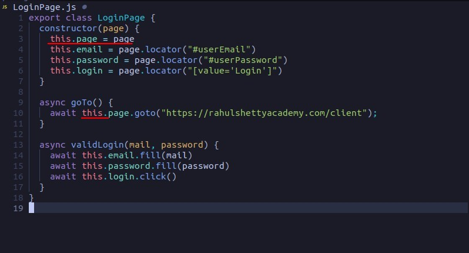
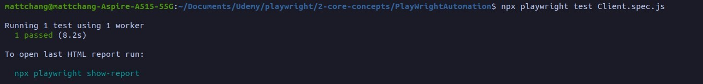
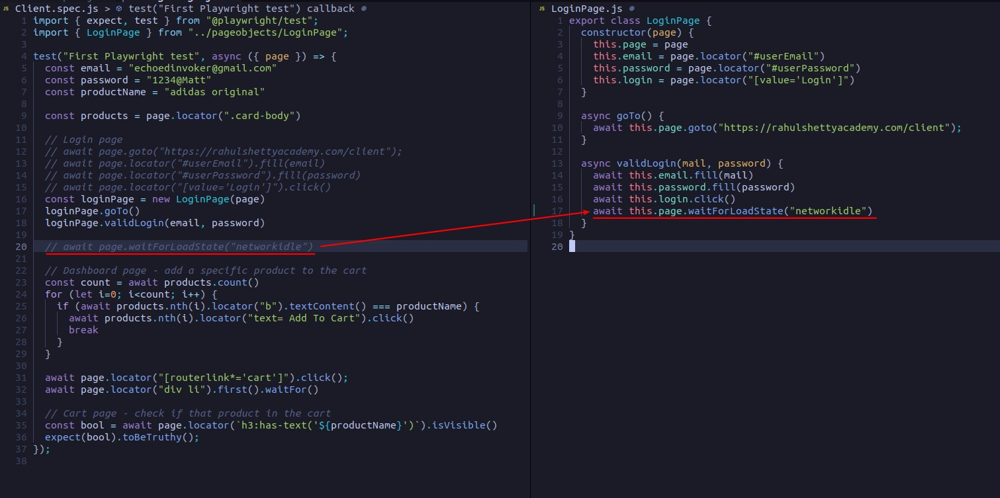

## **NEED**

## **Prepare: create js file & class frame**

## **locators to constructor**

- constructor cannot use asynchronous techniques.

## **others to methods**

## **replace codes in the test file by the class**

## **fix the error**

## **migrate waitForLoadState**

- Because this must be done immediately after clicking the login button, it should also be incorporated into the validLogin method of the class.
