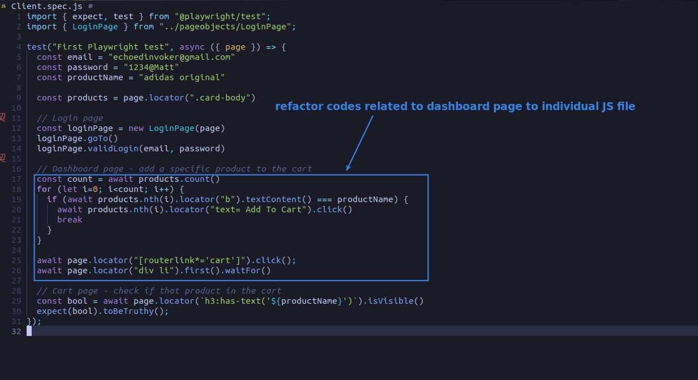
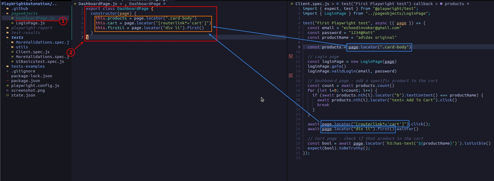
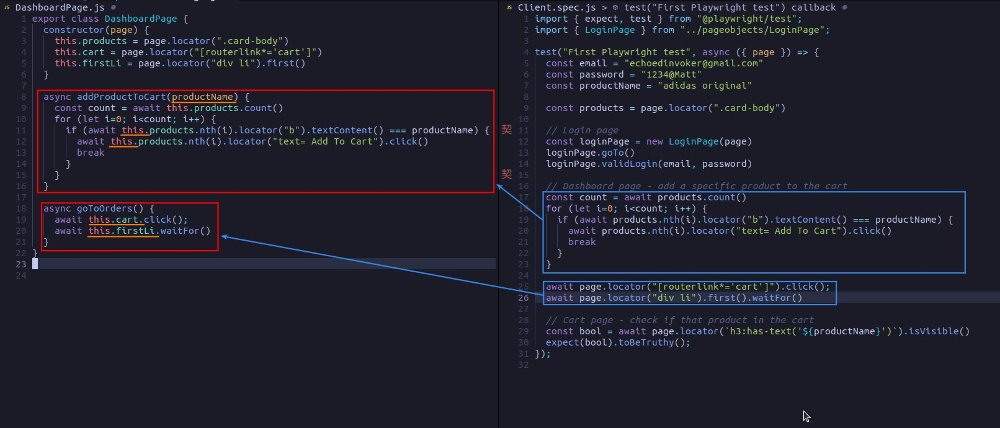
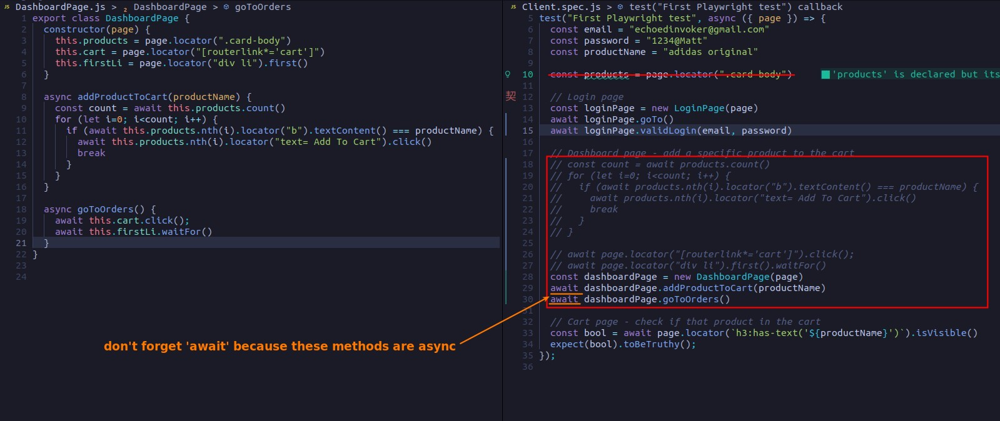
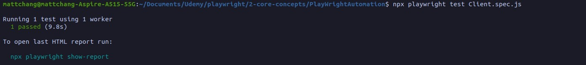

## **NEED: refactor dashboard page related codes to individual file/class**

## **Coding**

### _be careful: do not forget 'await'_

- Because the methods of the class are asynchronous.

## **TEST**

