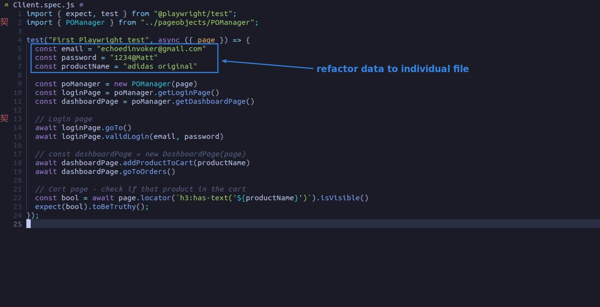
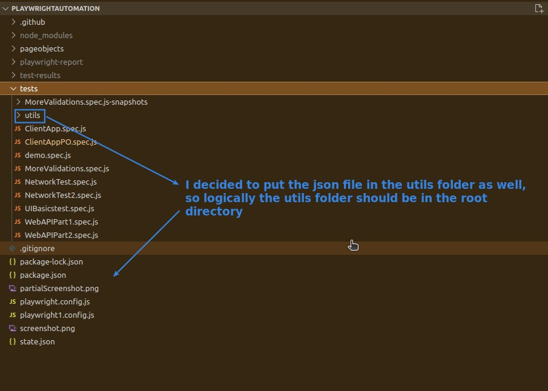
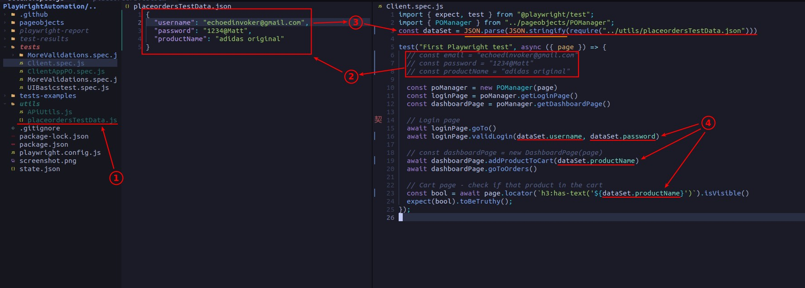

## **NEED**

- Generally speaking, there will be more than one test in the real test file, and the total number of data fields accumulated by multiple tests will easily exceed ten, so it will be more meaningful to use a separate file for management.

## **Plan of file system**

- Another approach is to create a folder dedicated to the data set, and usually the json file name will be the same as the test file name.

## **Coding: refactor**

- Note that even though json is considered a text file, it must first be converted to a string using JSON.stringify.
