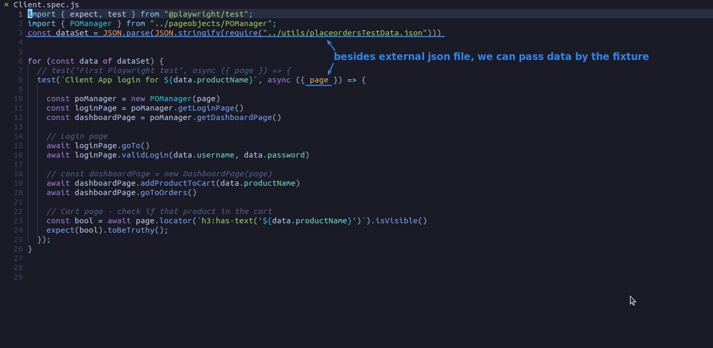
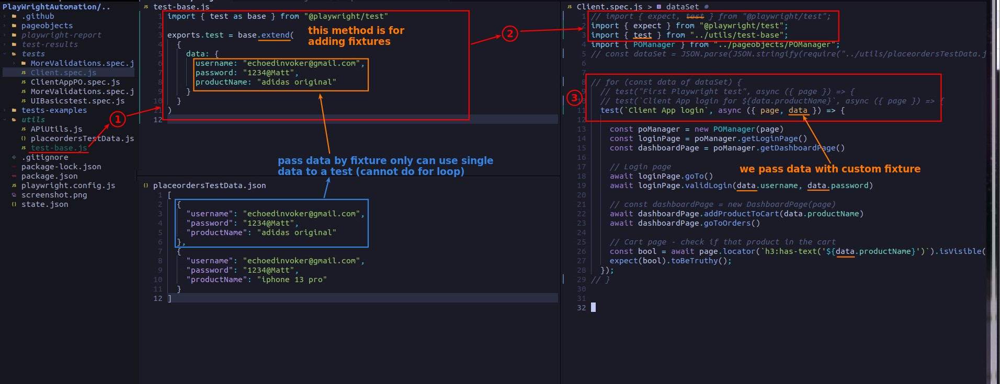
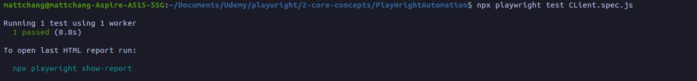

## **NEED: pass data with custom fixture**

## **Coding: build custom fixture and pass it to test script**

- We usually write the data set for each test in a test file in this way.

- However, if the same test annotation is used to run multiple data sets, you must use an external JSON file.

## **TEST**

