## **Need: Expect title of page**

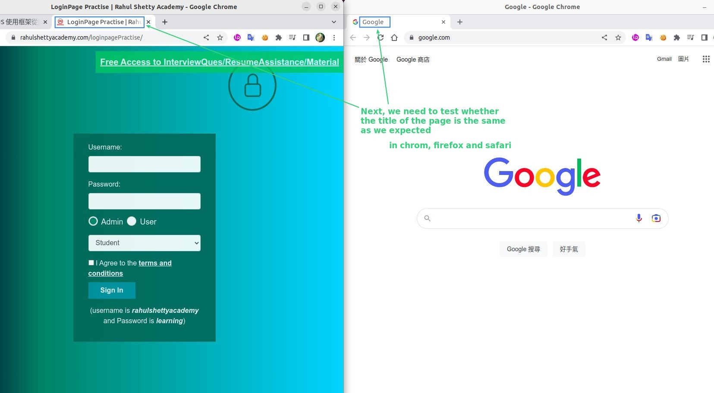

## **Print Page Titles in the console**

> We can print out some information in the testing process, such as page information, in the console.

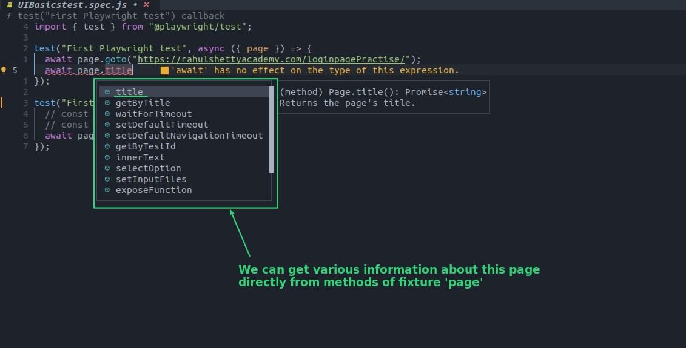

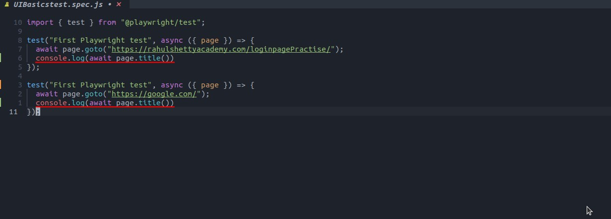

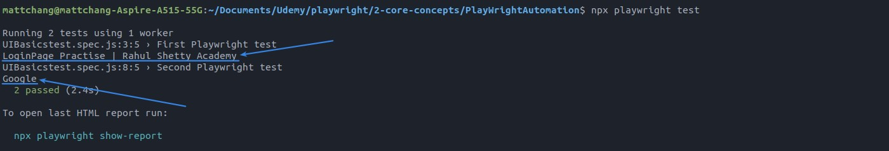

## **Assertion**

> 'Assertion' is to compare the expected result with the test result, we use function 'expect' to do it.

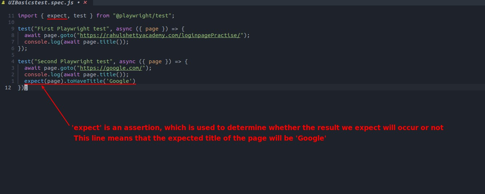

### _there are lots of assertions provide by 'expect'_

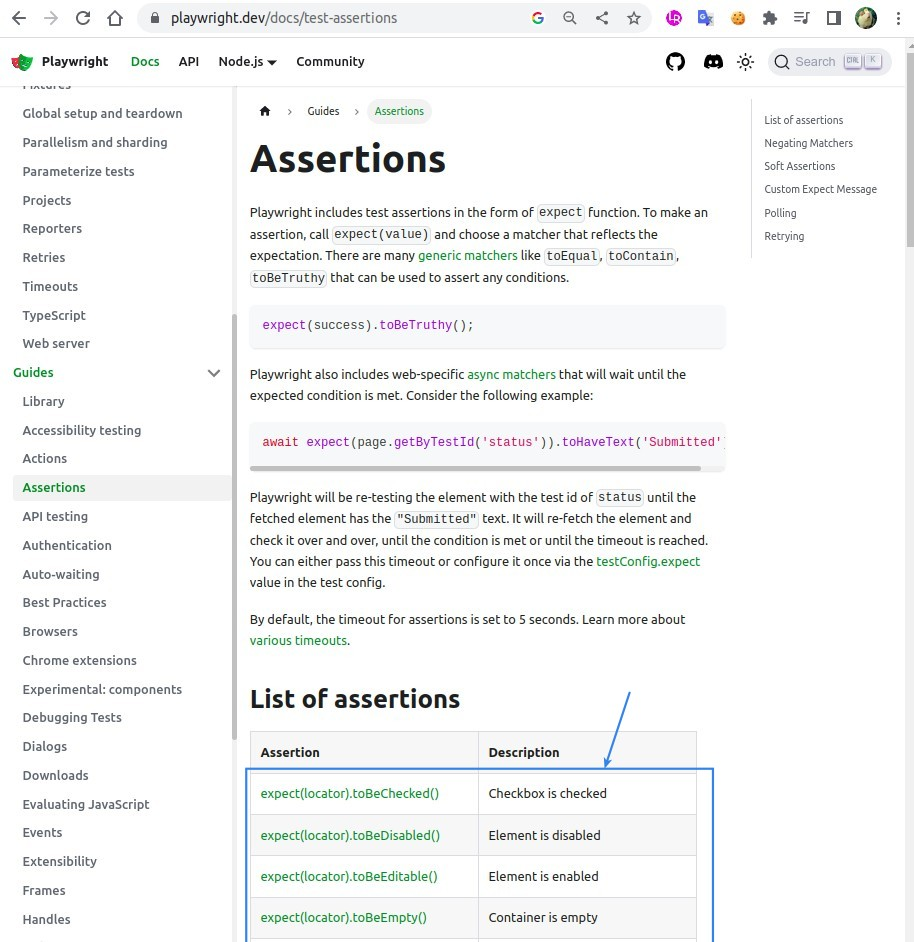

### _Glance test report_

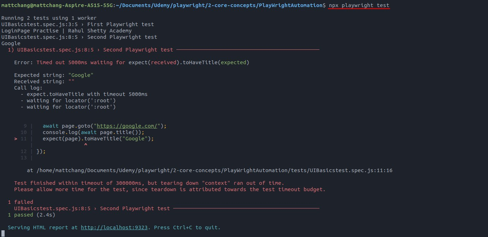

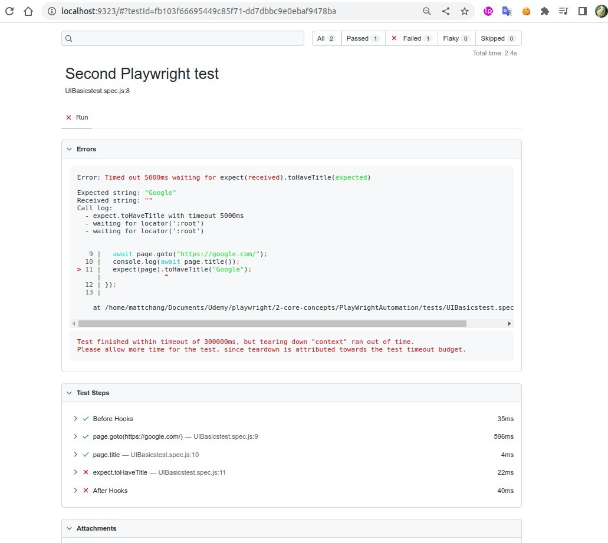

### _Don't forget await..._

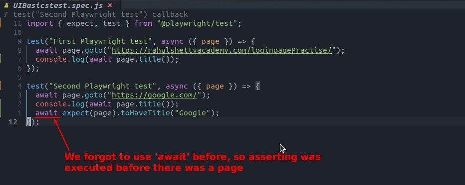

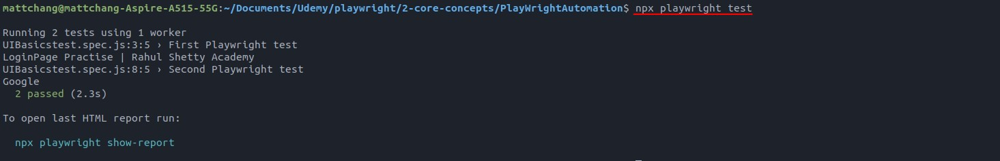

## **Change browsers**

> In order to meet the needs mentioned at the beginning, we change the browser type in the config and test it again.

### _firefox_

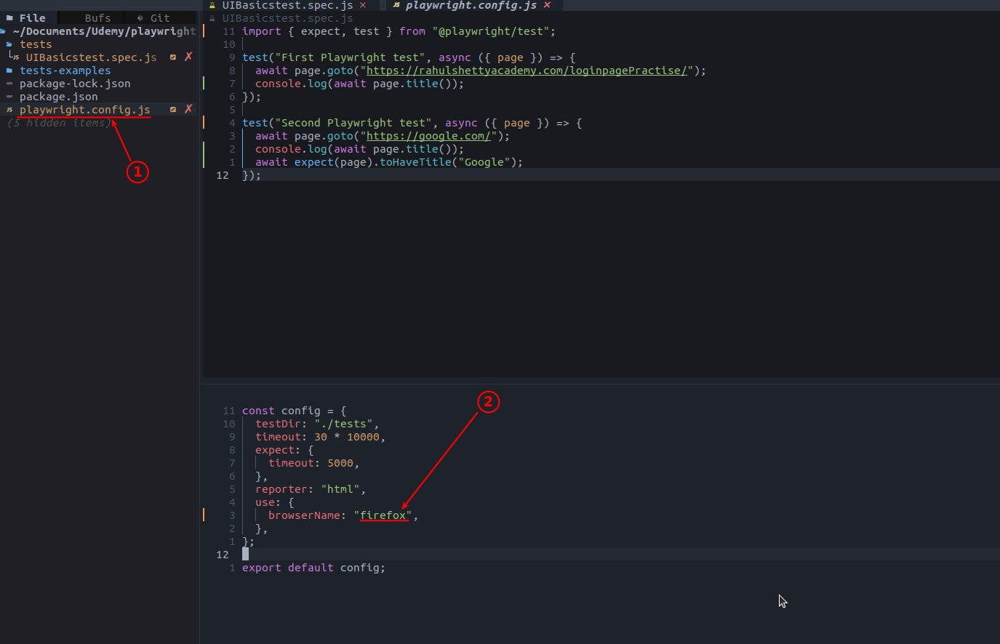

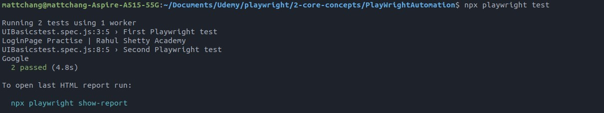

### _safari_

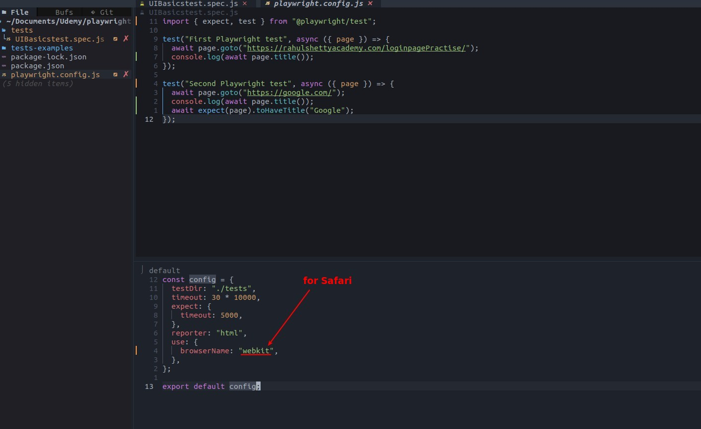

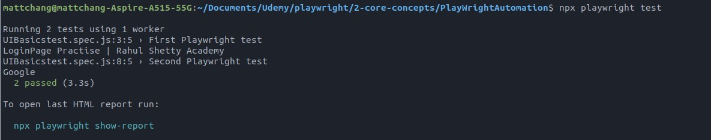
