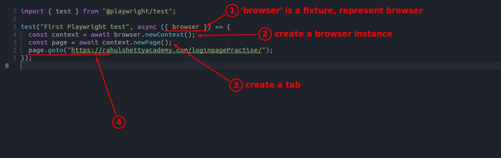
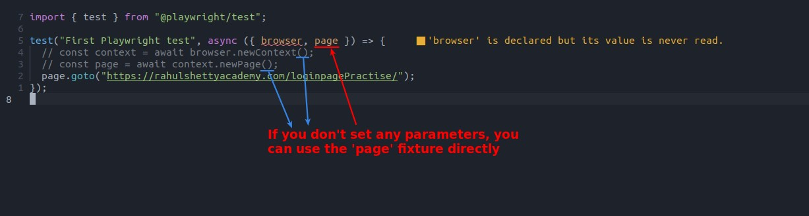
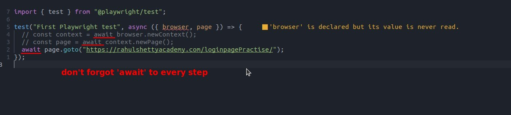
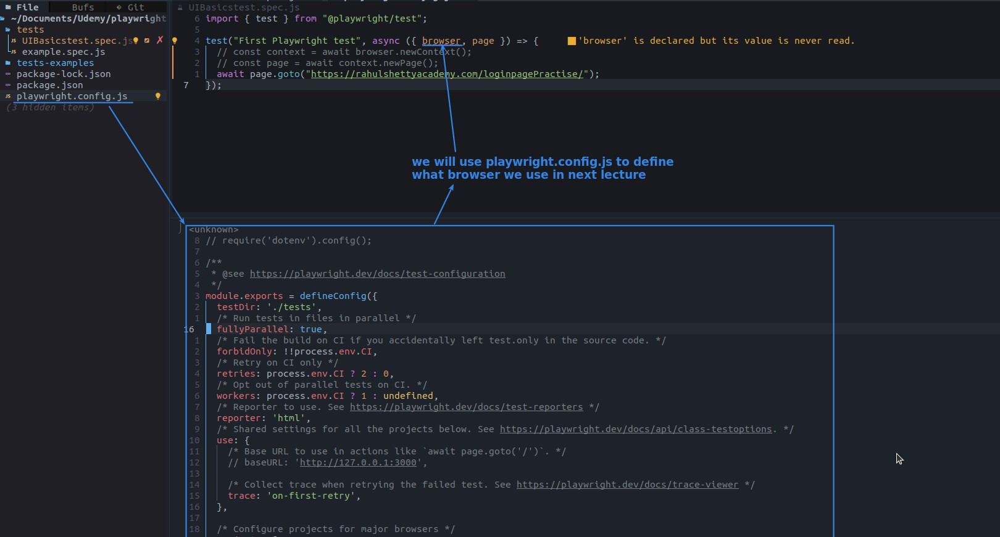

## **fixture 'browser'**

- fixture is a Playwright-provided global variable that can be used anywhere in a Playwright project.

- It must be passed to the test annotation as a parameter.

  - Be careful to wrap the fixture in curly brackets, otherwise the test annotation will not recognize it as a fixture.

- context means the content of the browser other than the web page itself, such as proxy, plugin, cookie... , so the method to open a browser uses 'newContext'.

  - We can set some context such as plugins, cookies in the 'newContext' parameter, if none of them are set, it is like opening chrome incognito.

## **fixture 'page'**

> If you don't set any parameters to 'newContext' and 'newPage', you can use the fixture 'page' to open the url directly.

## **be careful...**

## **way to set 'browser'**

