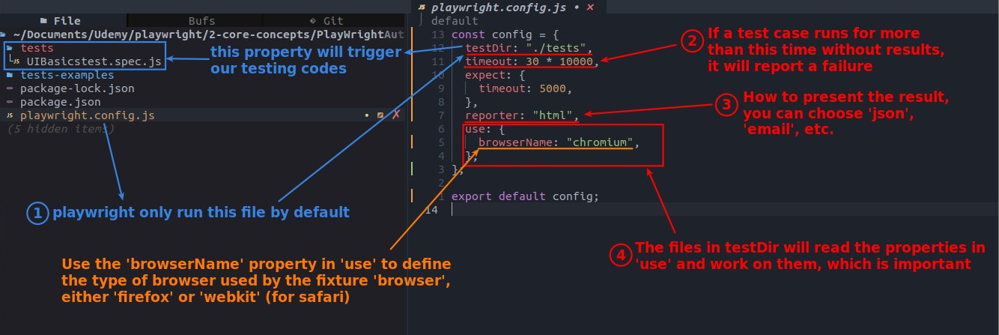
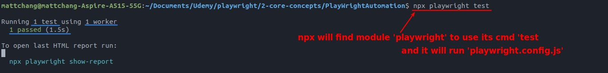
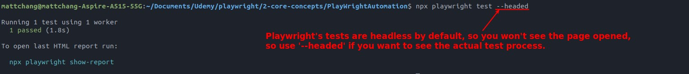
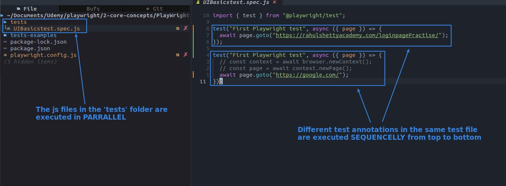
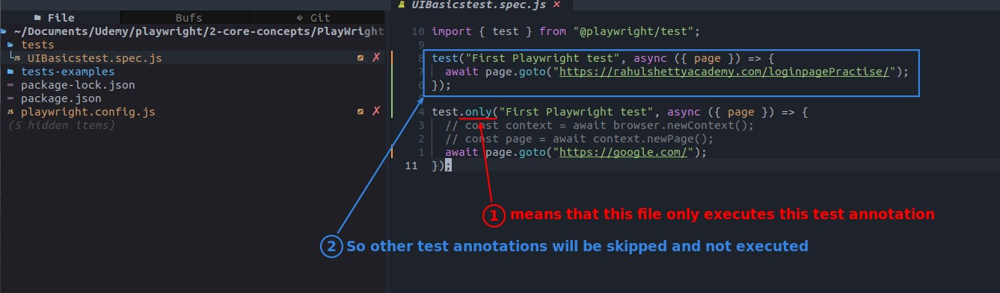

## **Configuring Playwright test**

> Although playwright.config.js is used to configure the playwirght test,it is actually the entry point for our testing.

## **Run Playwright test**

- npx is actually used to execute a module command in nodule_module, which saves us the work of finding the module path.

- After the test browser will automatically close, the test process is also very fast, naked eye observation is usually not meaningful.

## **Parallel or Sequence?**

> It is sometimes important to understand the order in which each test case is executed.

## **test.only**

> This is a very useful method, when you have just finished writing a test case, you will want to run it alone, then you can use this method.

