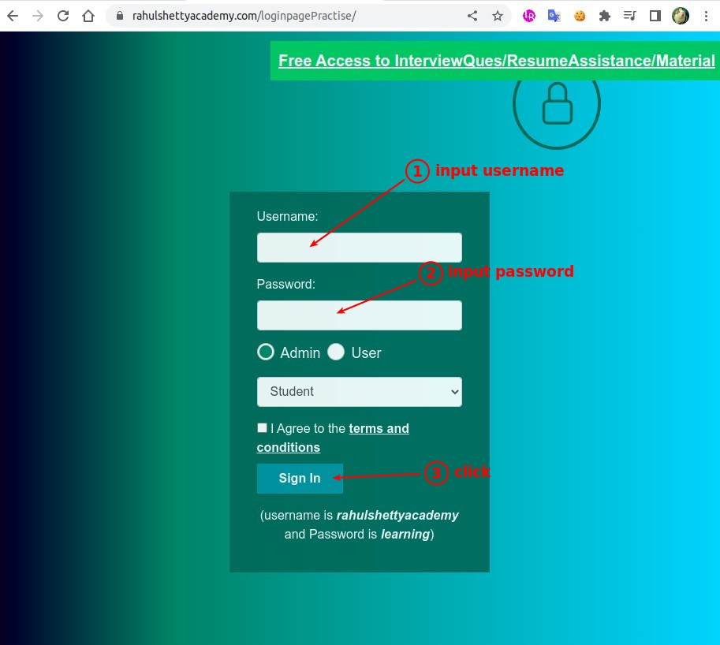
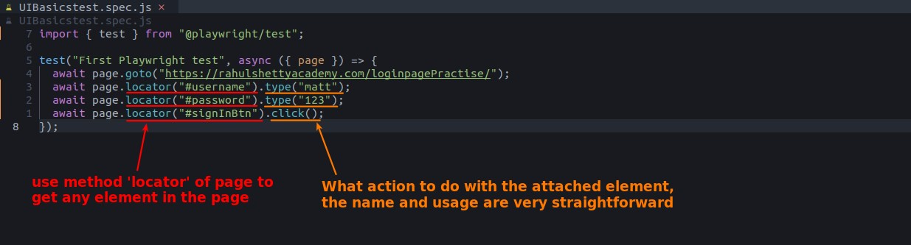
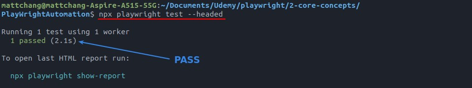

## **NEED: Automatic type username/password and click button**

## **locator**

> We use method 'locator' of fixture 'page' to get any element in the page.

- After getting elements, we can use its actions to do automations.

## **Test result & Login result**

- Because the codes we tested only have actions and no assertion, so as long as the actions are executed properly, the result will be a pass.

- If we want to test the login result, how do we write the codes?
