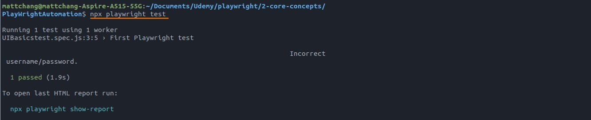
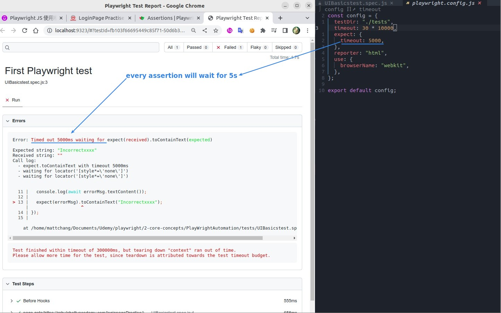

## **NEED**

## **Find valid CSS-selector to Incorrect Msg element**

> Pay special attention we only get this element when it is displayed, not when hidden.

- We cannot get hidden incorrect msg element, this is tricky...

## **method 'locator' don't return promise**

## **Two timeouts**

