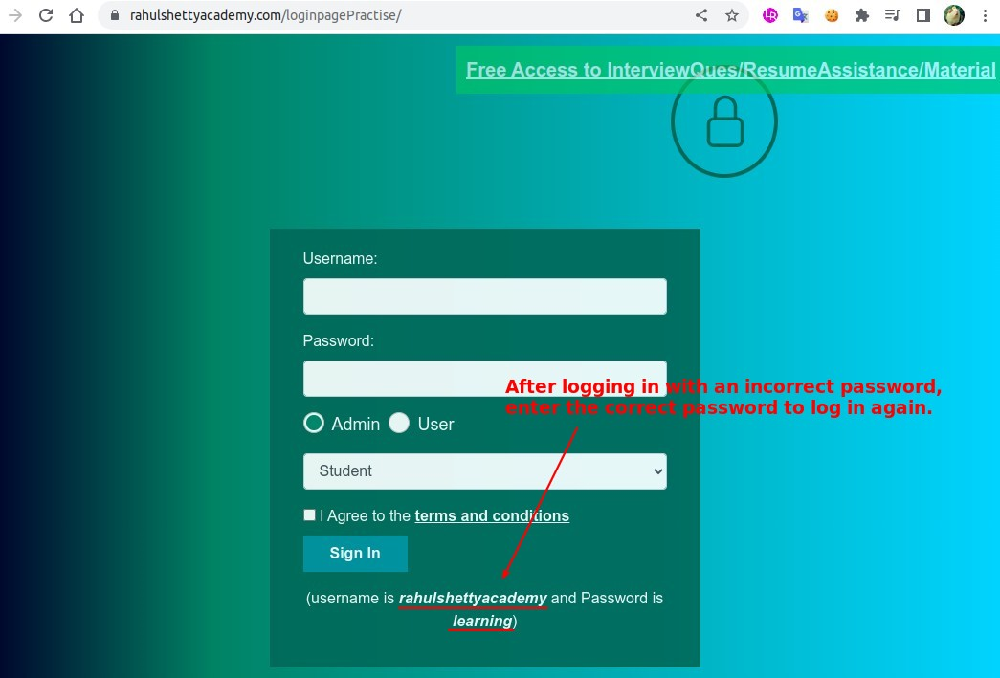
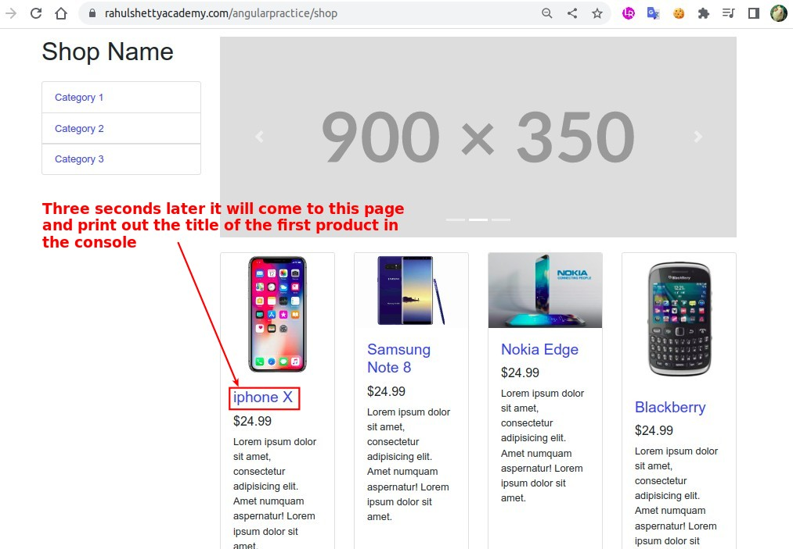
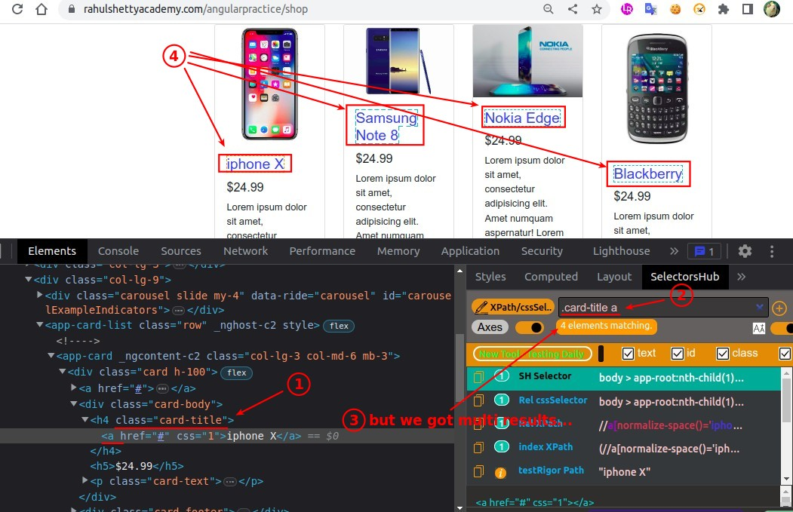
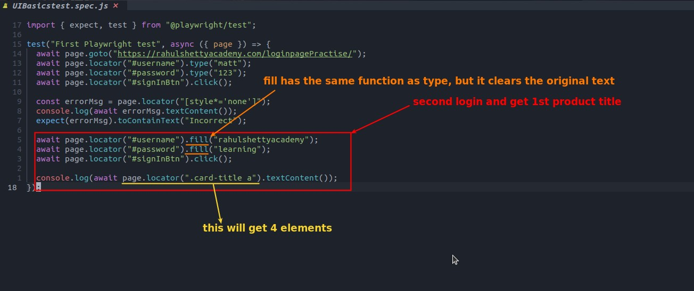
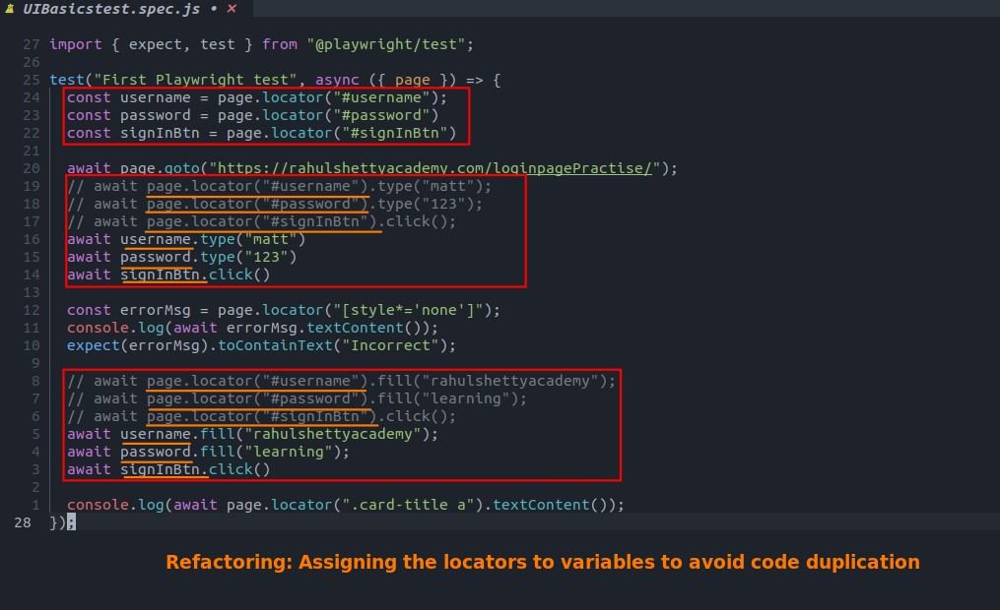
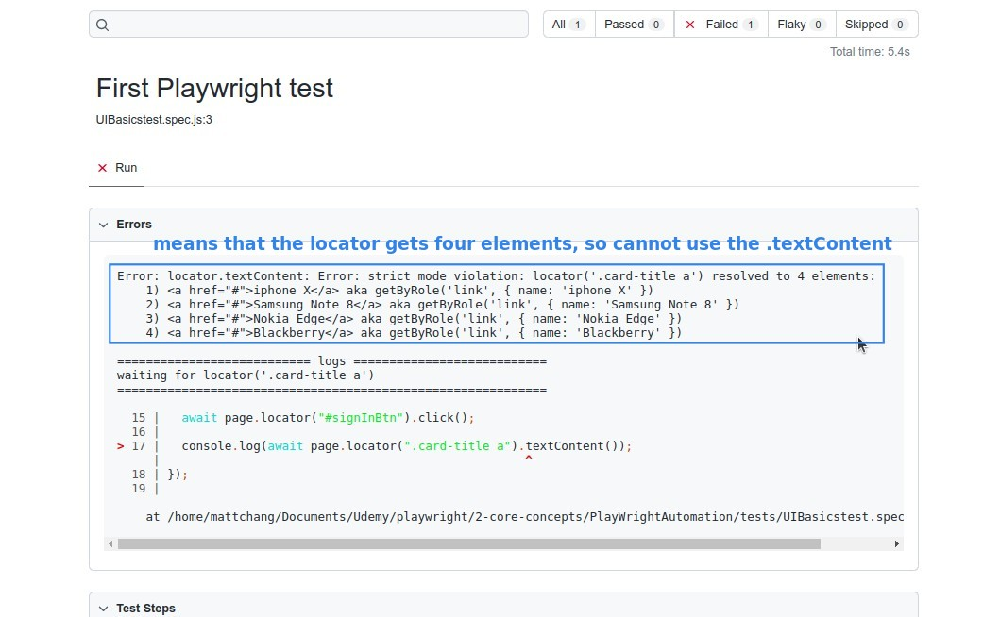
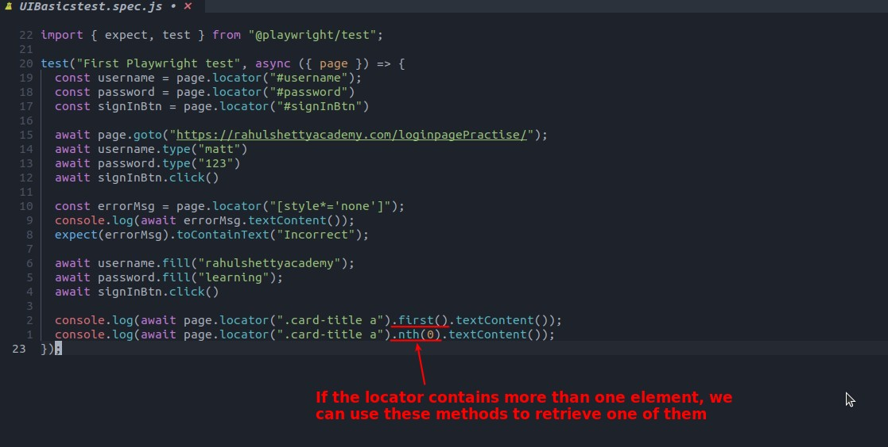
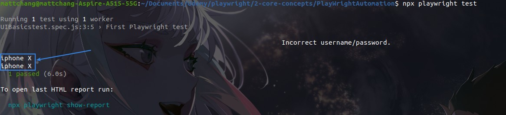

## **NEED: continuous 2nd login with correct name/password**

### _after 3 seconds... print title of 1st product to the console_

## **Find CSS-selector**

## **Write codes of 2nd login**

## **Error Report & Fix**

### _Extract single element_

