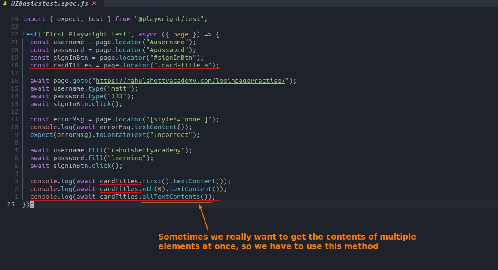
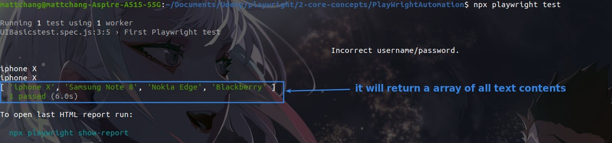
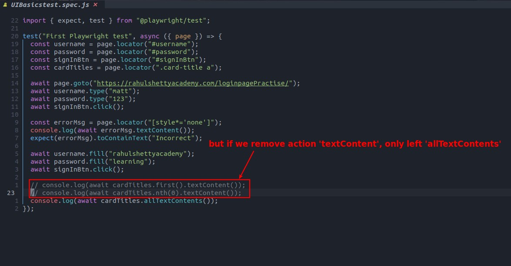
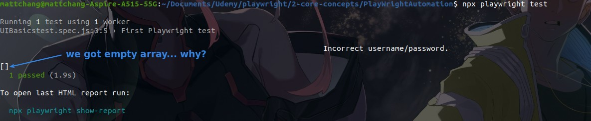
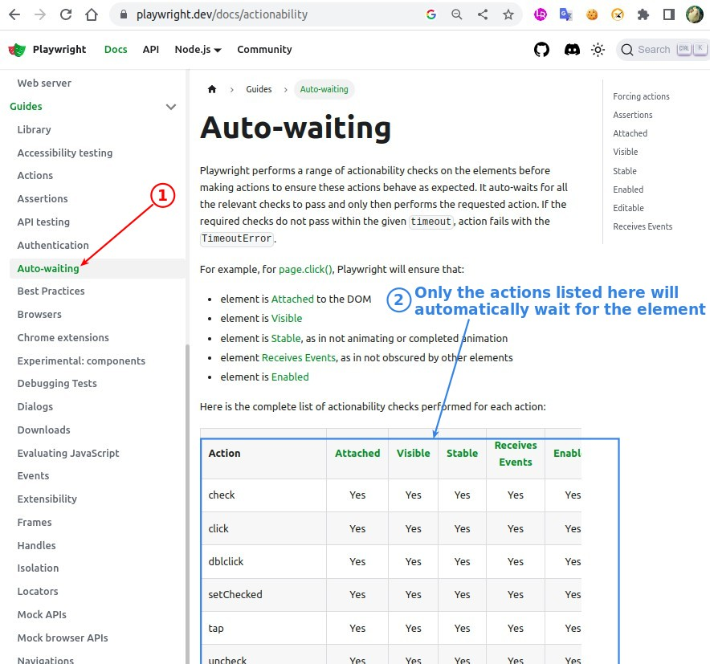

## **ACTION: allTextContents**

## **Auto-wait of Actions**

> Playwright automatically waits for elements to occur when triggering Actions, and different Actions have different criteria, and some Actions do not have a wait mechanism.

- allTextContents is not in the above list, so it does not trigger the auto-wait mechanism.
