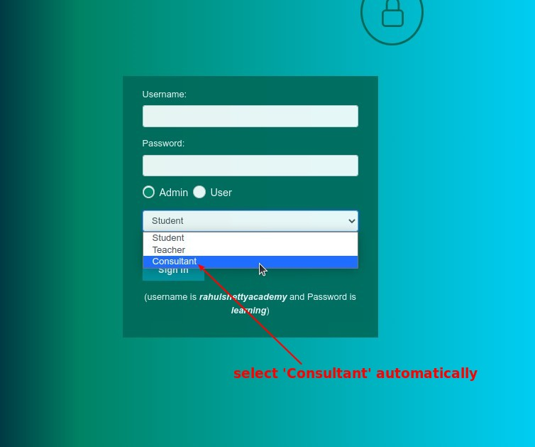
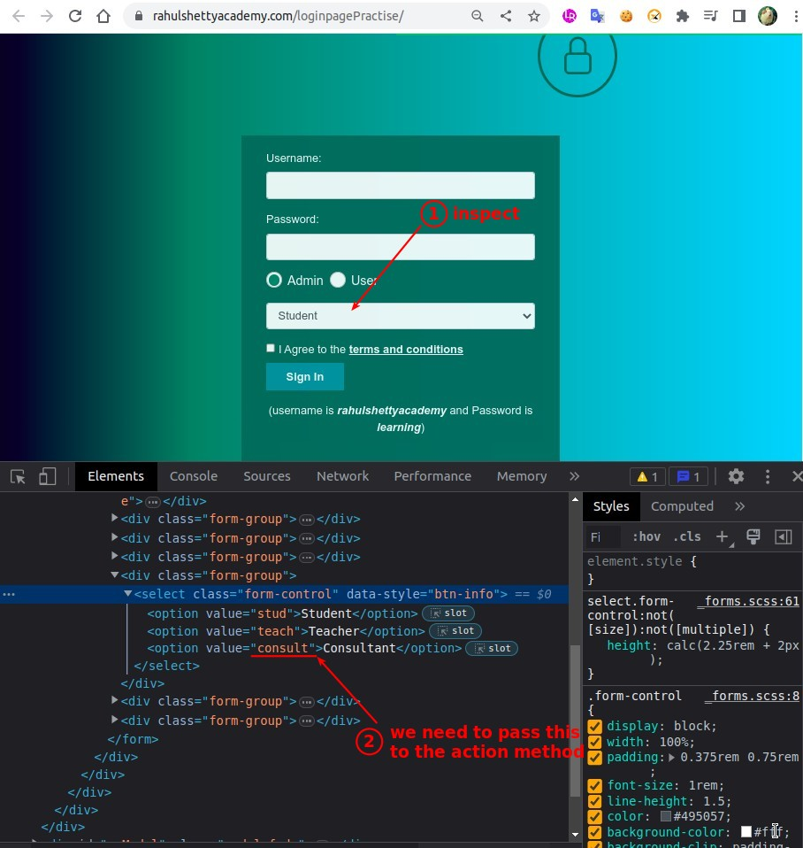
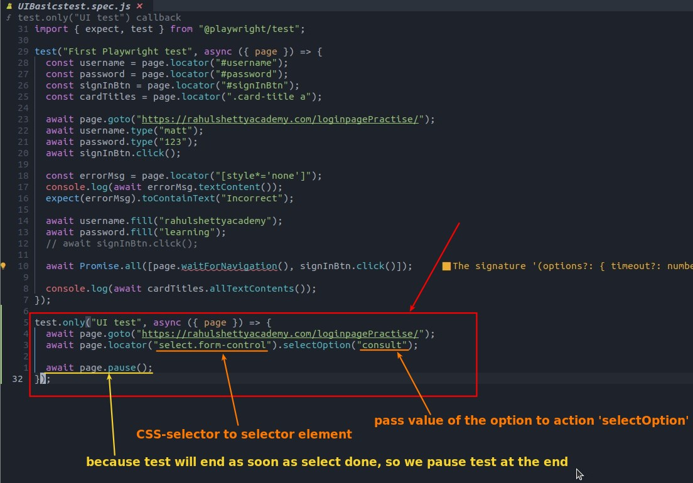
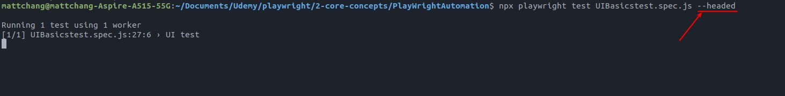
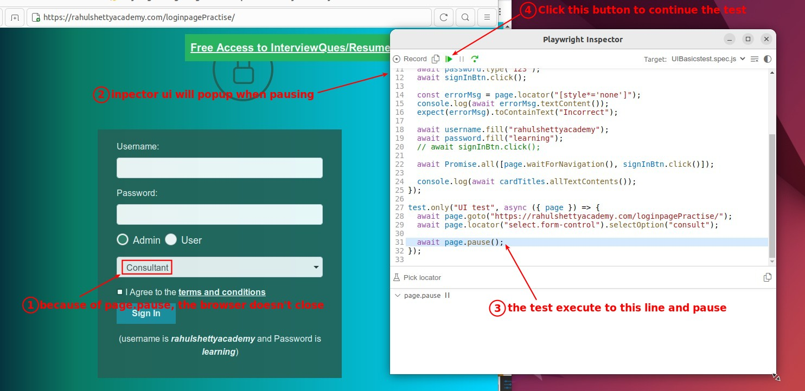
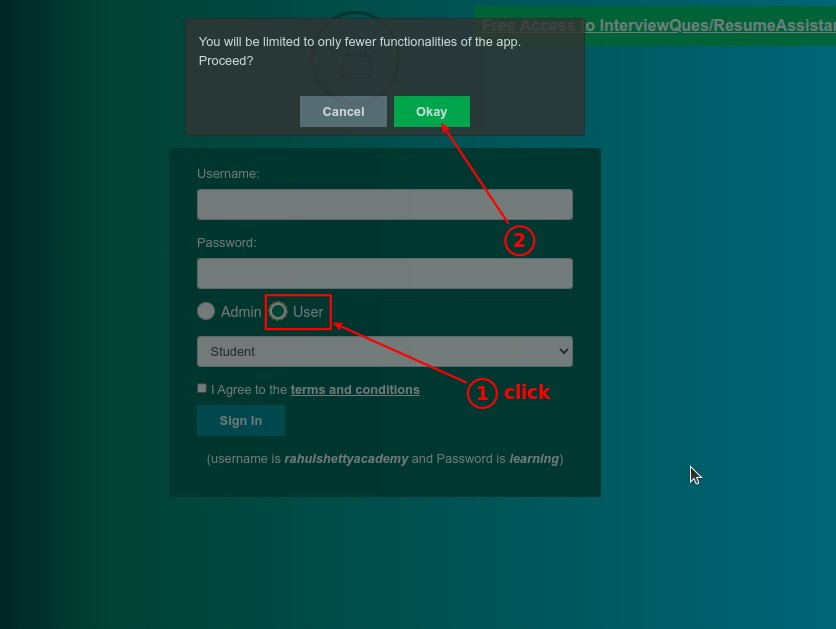
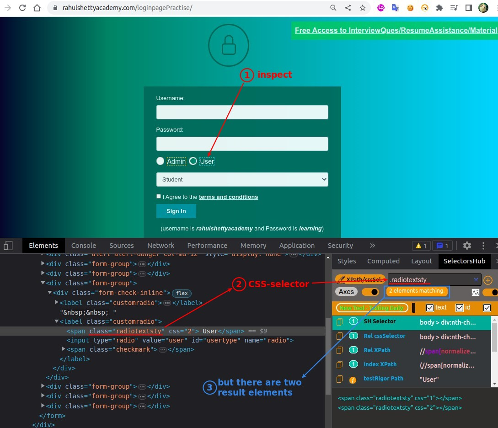
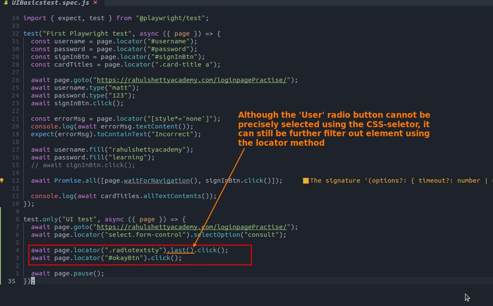
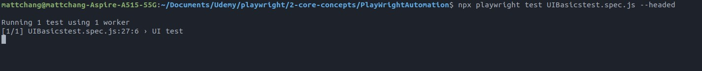
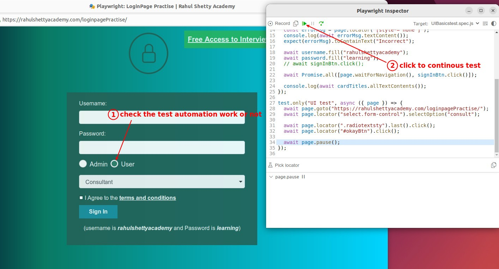

## **Automation of Static dropdown**

### _NEED_

### _pass 'value' of option to selectOption_

### _Test pause_

## **Automation of Radio buttons**

### _NEED_

### _If CSS-selector cannot get the targeted element_

### _Test pause_

