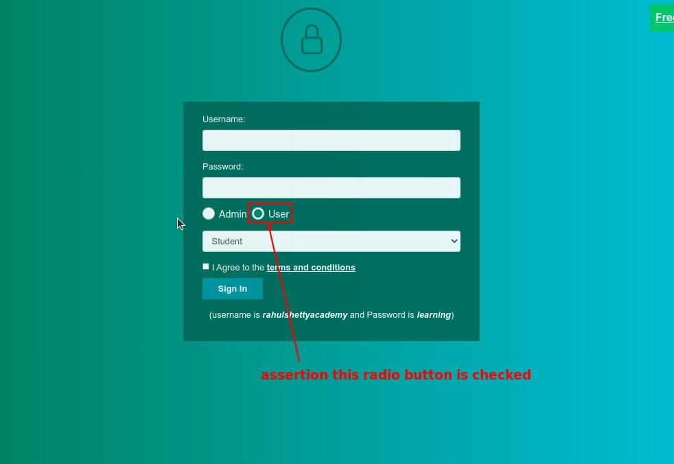
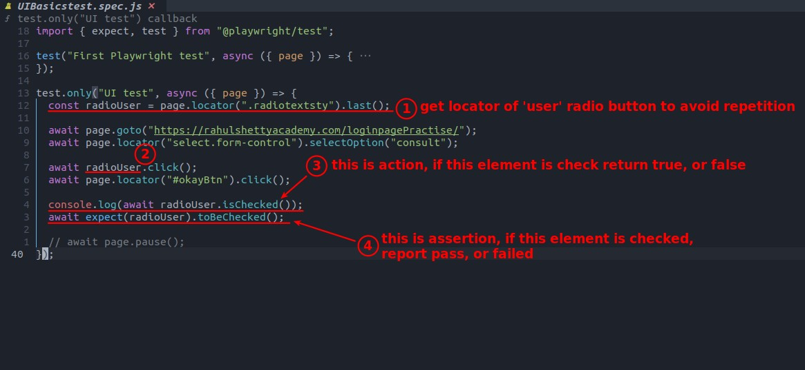
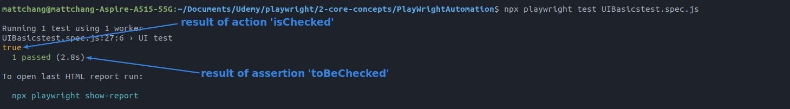
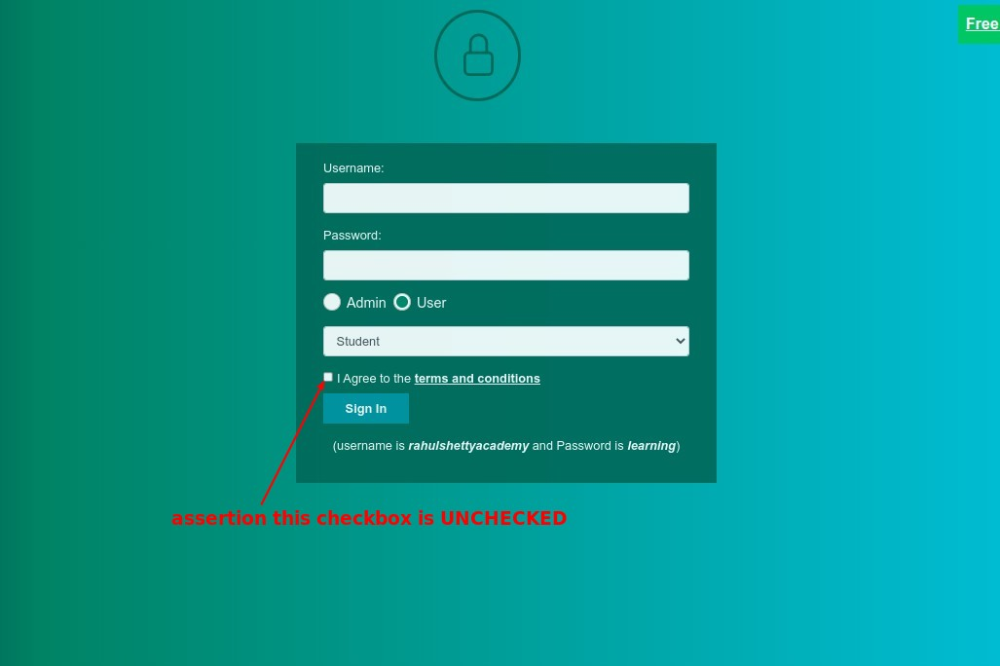
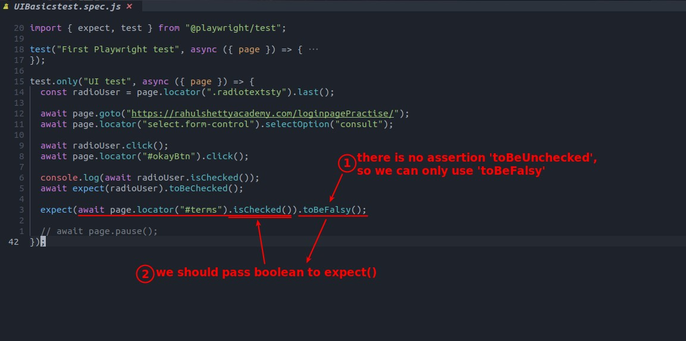
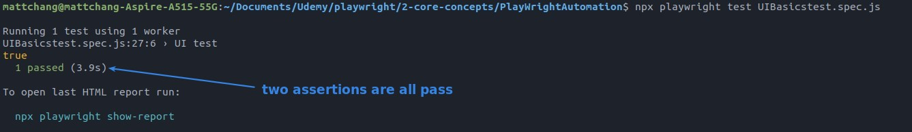

## **Assertion to raadio button**

### _NEED_

### _codes: isChecked and toBeChecked_

### _Test result_

## **Assertion to checkbox UNCHECKED**

### _NEED_

### _codes: toBeFalsy_

### _Test result_

