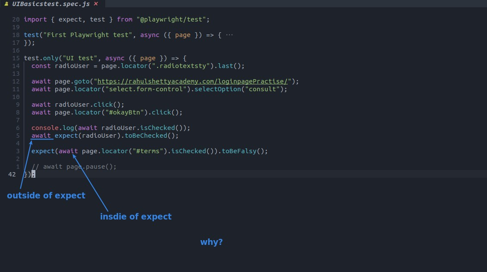
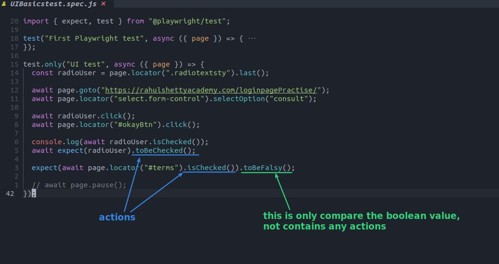
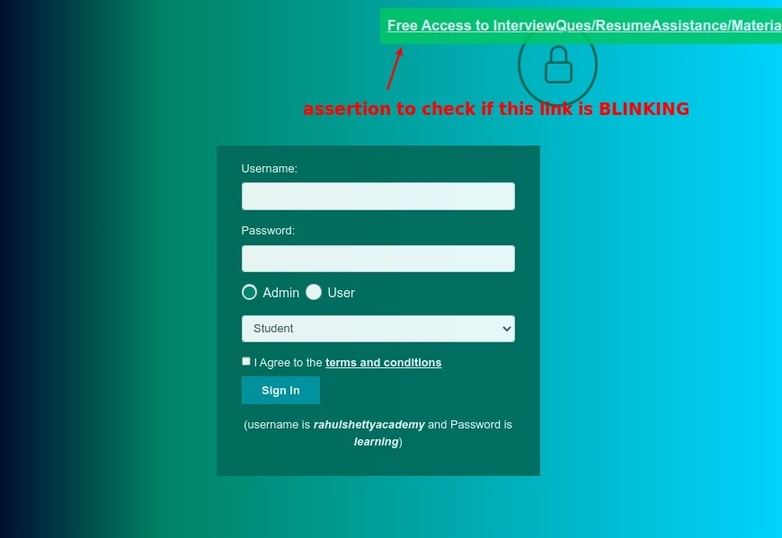
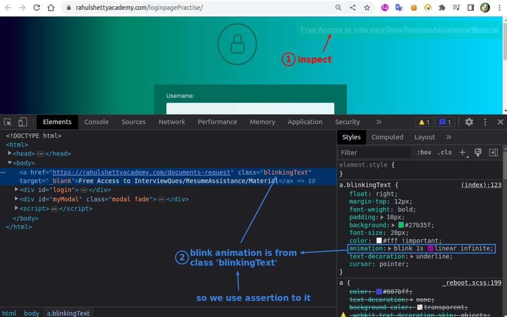
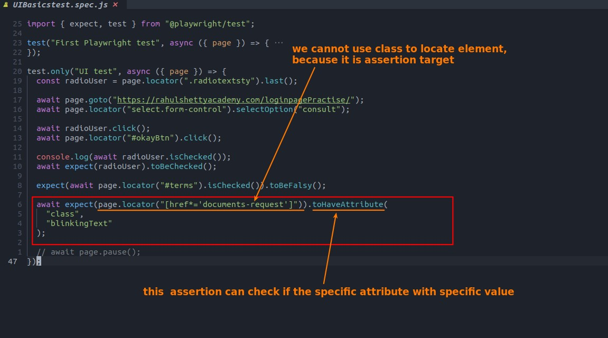
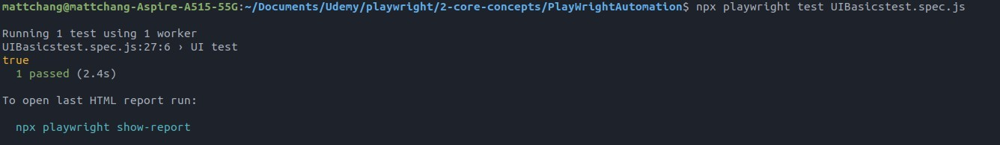

## **Why await locations related to assertion are different?**

## **Assertion to Check if link is blinking**

### _NEED_

### _Find out what make the link blinking_

### _Code: toHaveAttribute_

### _Test result_

