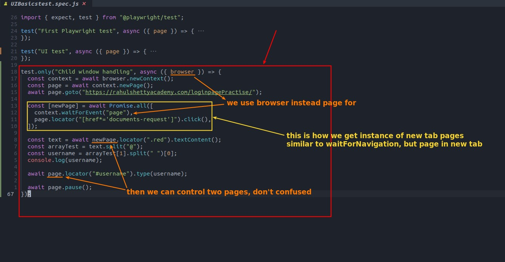
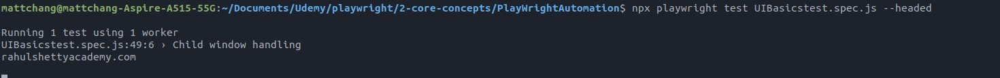

## **NEED: get username from new page, then paste it to original page**

## **Writing codes**

- Sometimes the action generates more than one new page, and there will be many pages in the array e.g. [ newPage1, newPage2, ... newPage1, newPage2, ...]

  - This is why it has brackets, and it cannot be omitted.

## **Run test**

