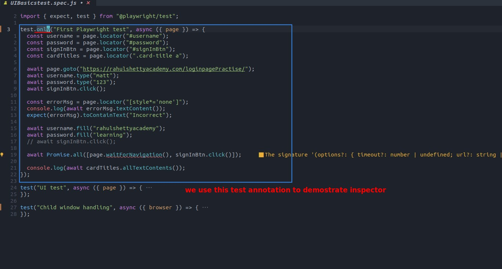
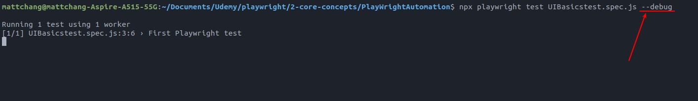
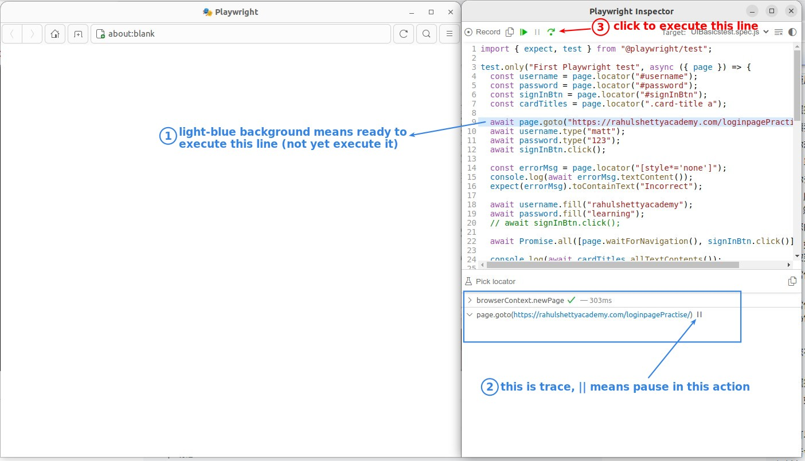
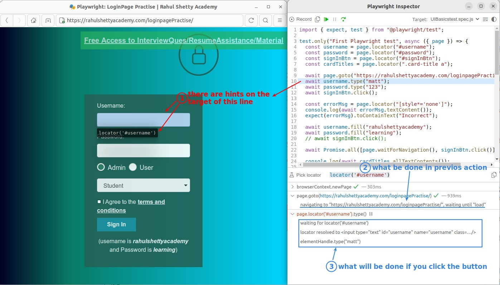
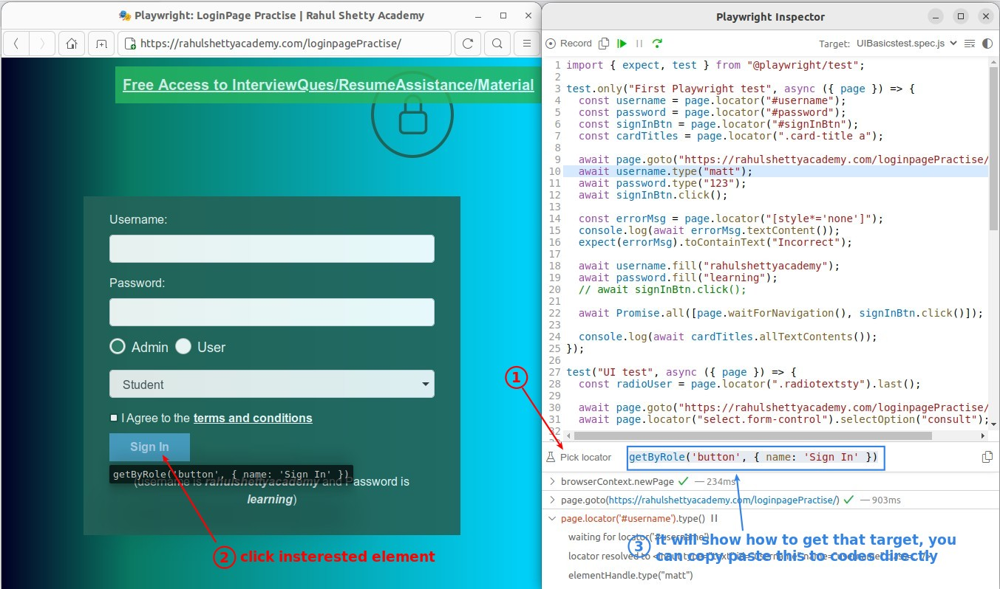
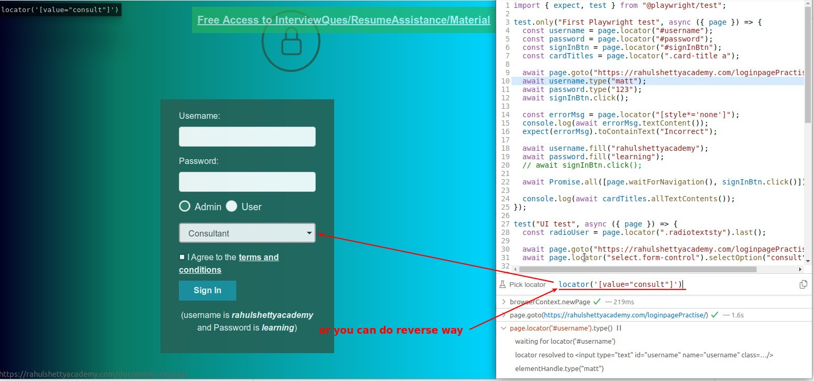

## **Prepare & Run debug mode**

## **Debugging demo**

### _light-blue background of codes_

### _hints of line target_

- Trace's steps are very detailed and not codes, seem to be presented directly to the general users in the report.

### _picker_

- It is useful to use the picker directly, because it shows the means to obtain elements other than using the locator method.

- useless...
