## **Review test scripts**

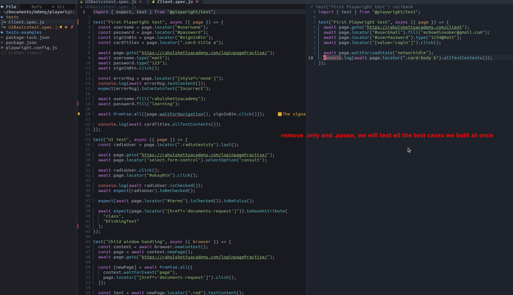

## **Set Playwright configuration**

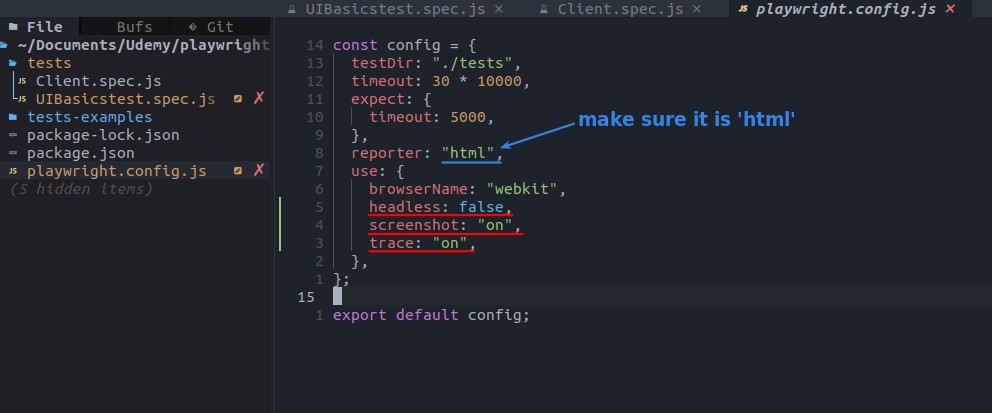

## **Run test and new folder/files**

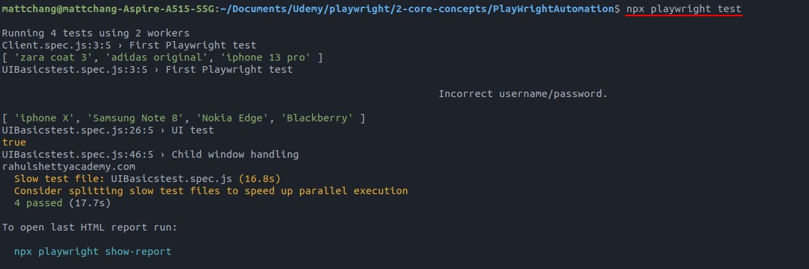

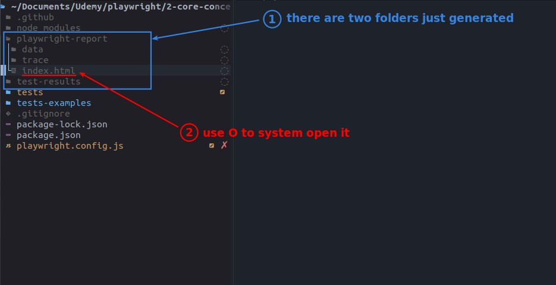

- These folders are hidden by default, use 'H' to show them.

## **Page of test result**

### _Overview_

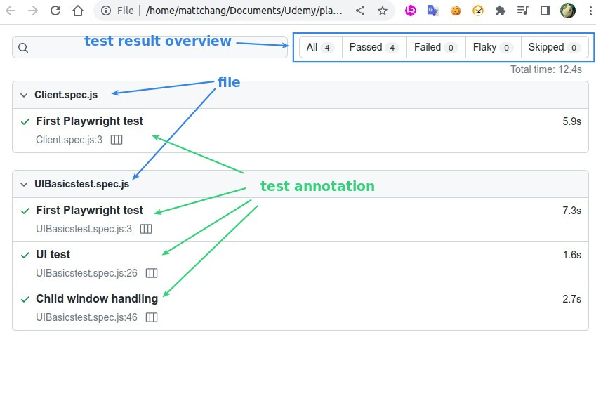

### _Single Test_

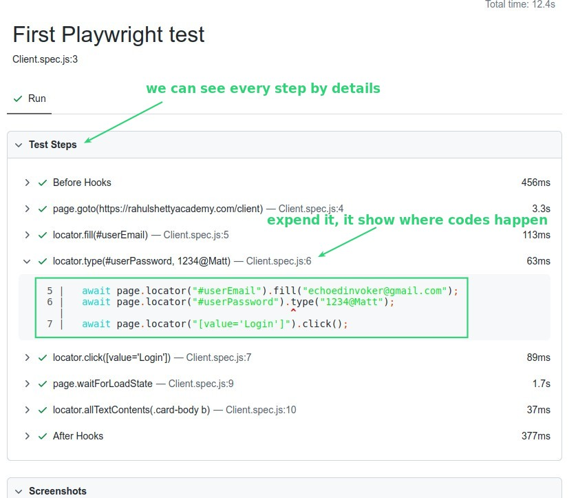

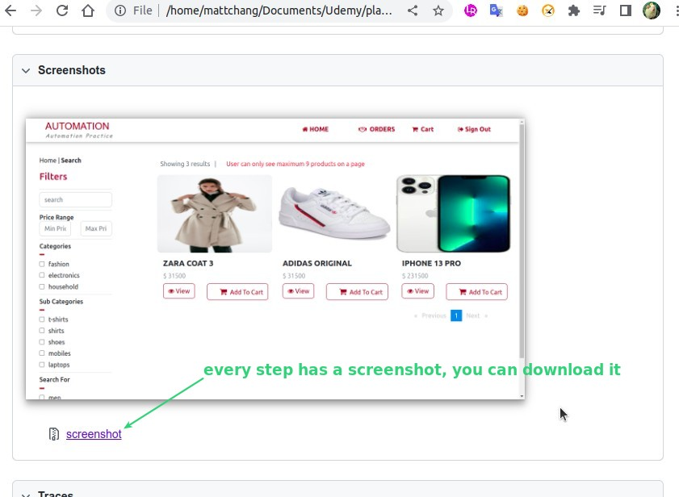

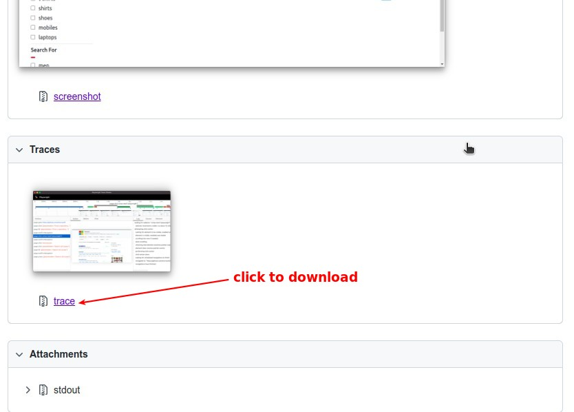

## **Trace demonstration**

> That's the point of why Playwright helps us save time on reports :)

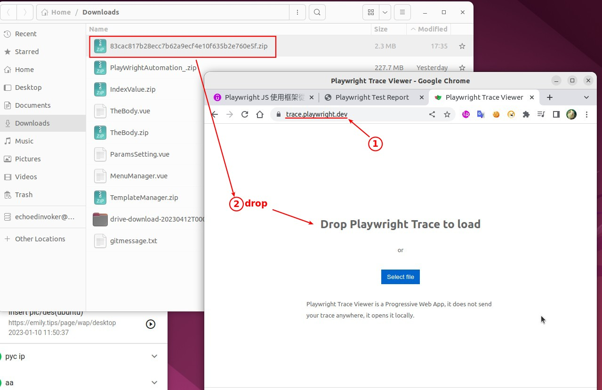

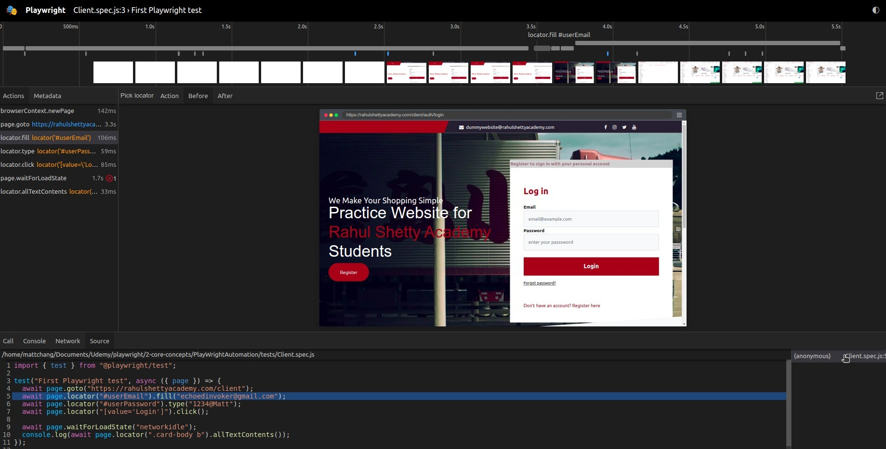

## **folder 'test-results'**

- We can pull trace.zip directly from here to trace.playwright.dev, which should save time when we need to repeat this operation.

## **Only generate trace when failed result**

> Because tracing takes a lot of pictures and records, it will increase the memory used for testing, so the following settings are recommended.

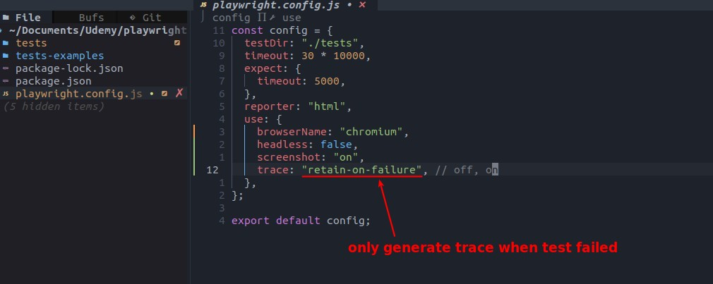
