## **NEED**

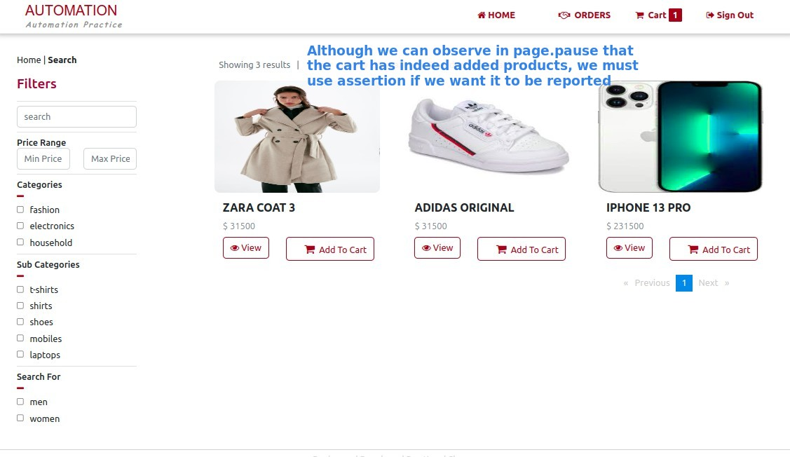

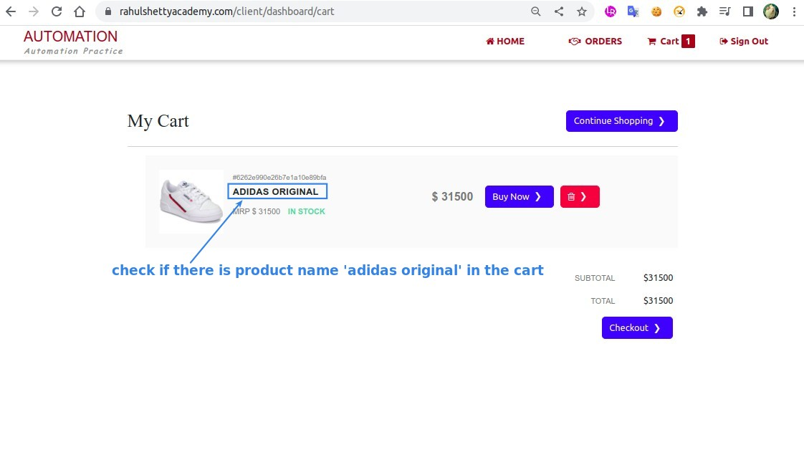

## **Inspecting page**

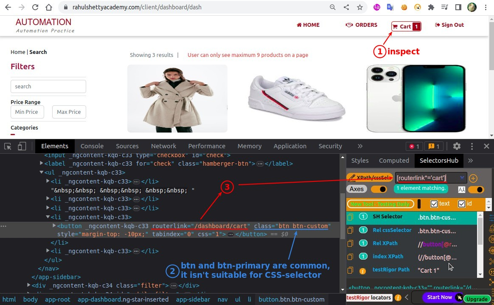

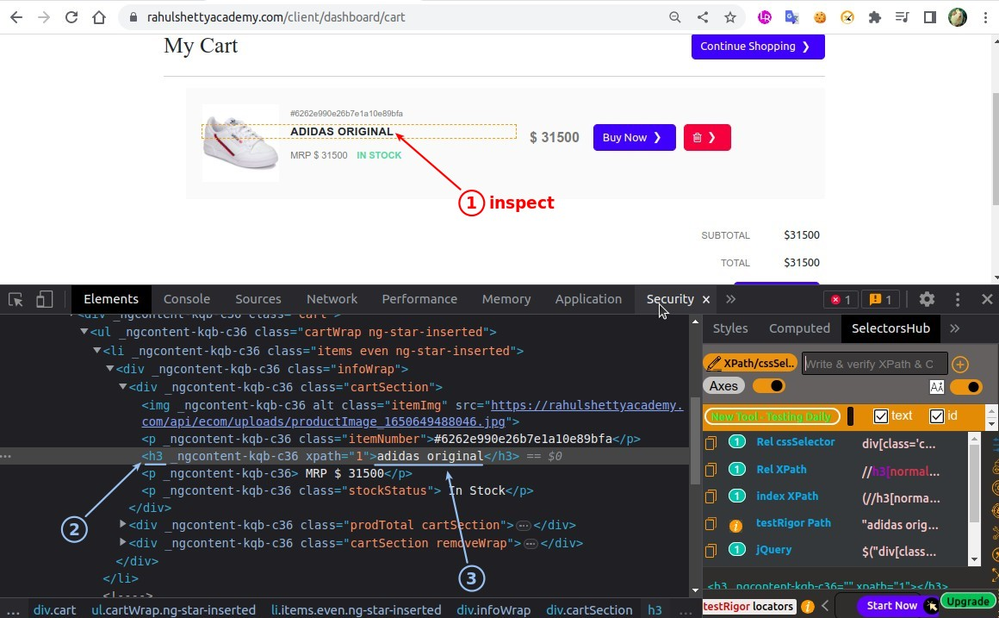

## **Coding: 1st try**

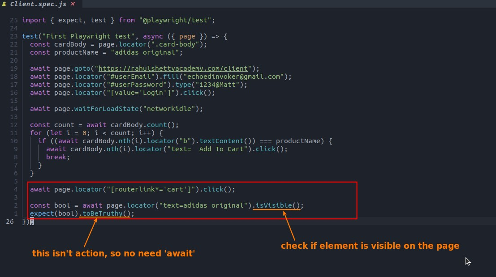

## **Test & Analyze the result**

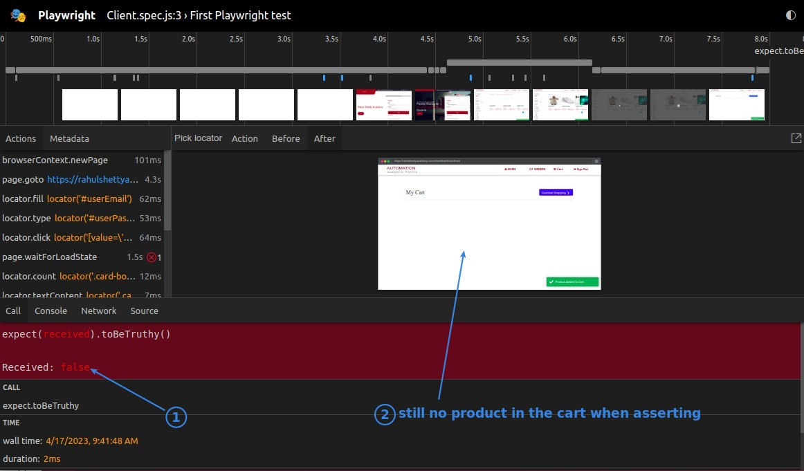

### _Risk 1: Previous page has same text_

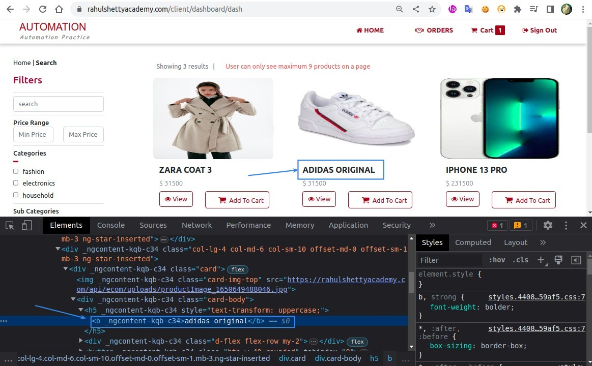

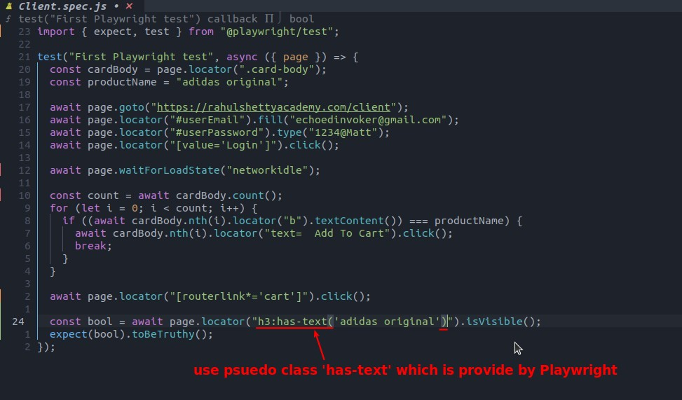

### _Risk 2: Products in the cart appears delayed_

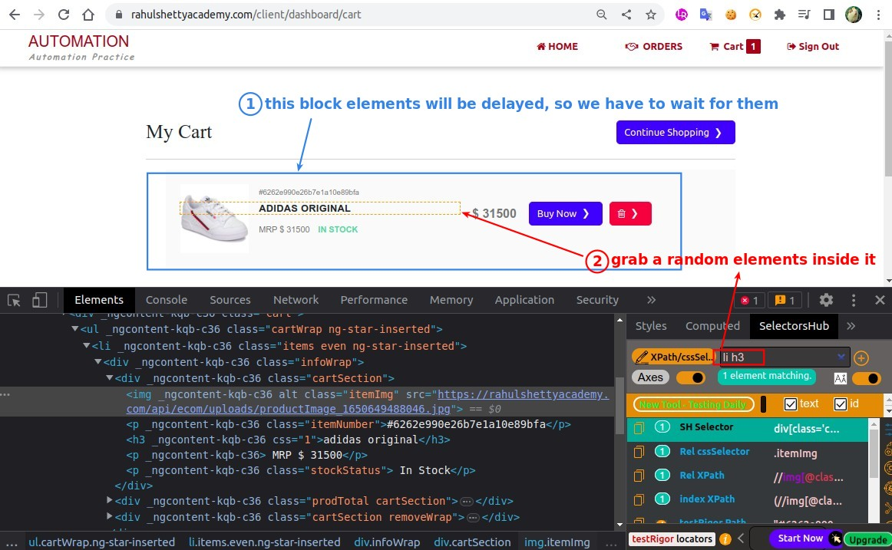

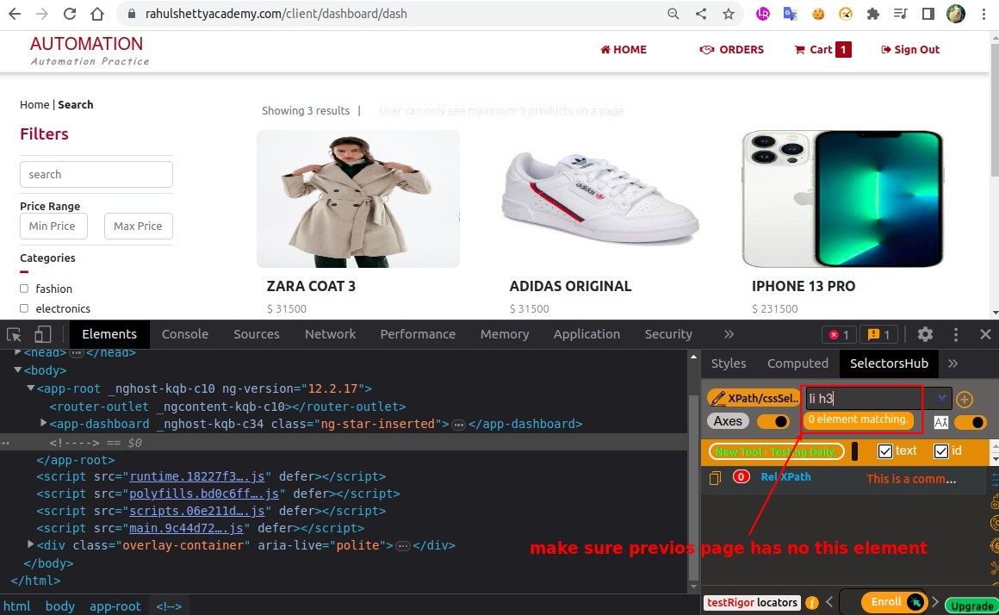

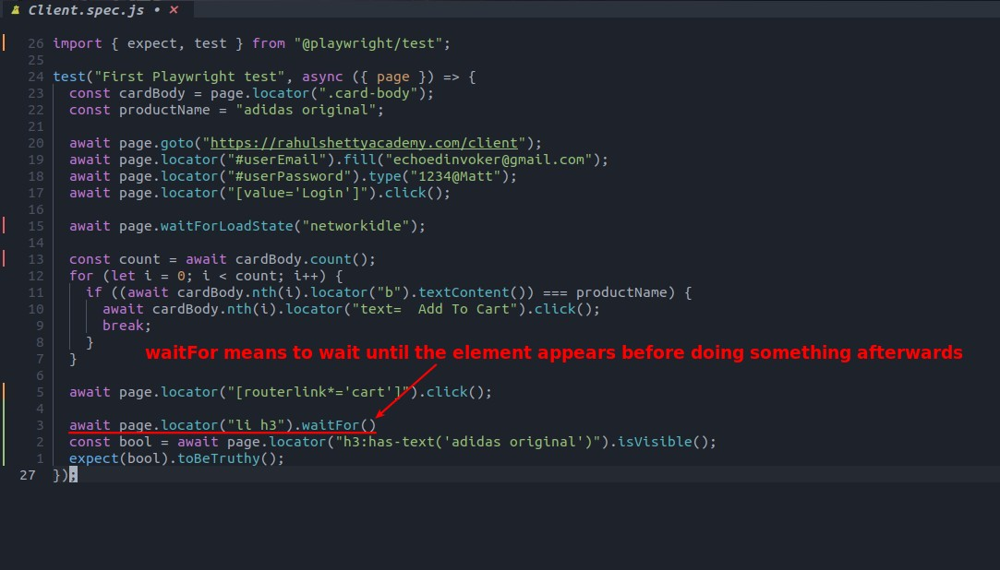

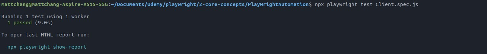

## **If there are already multiple products in the cart**

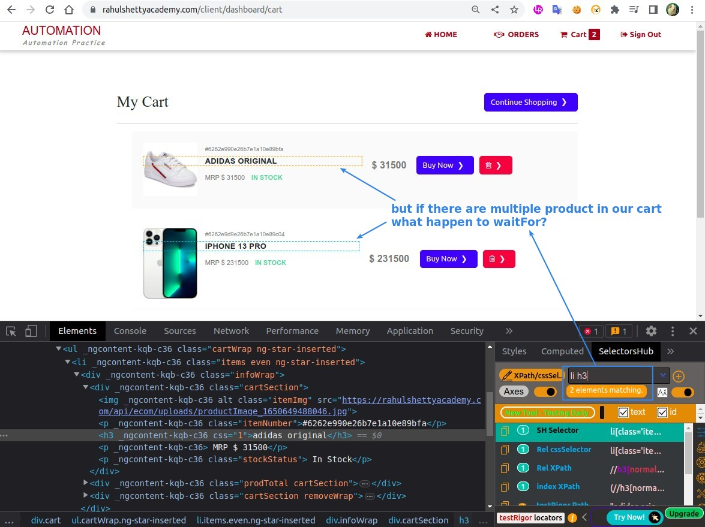

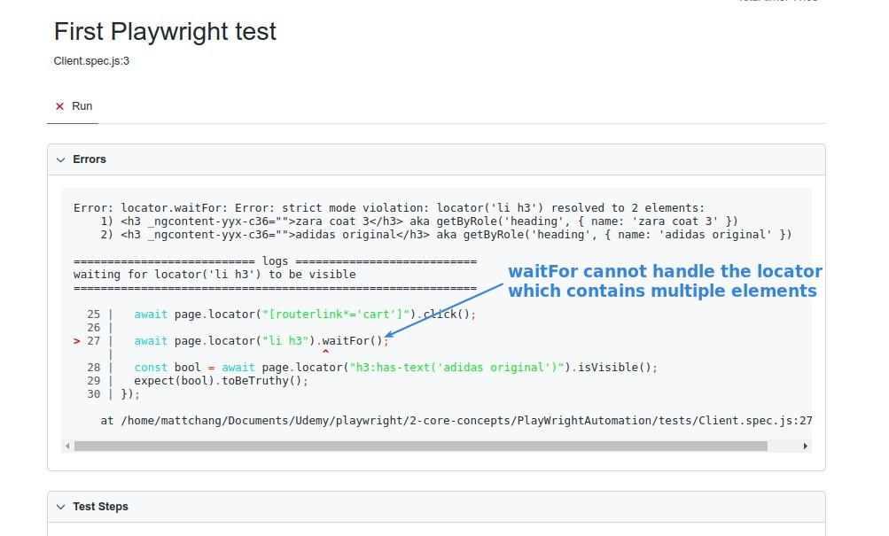

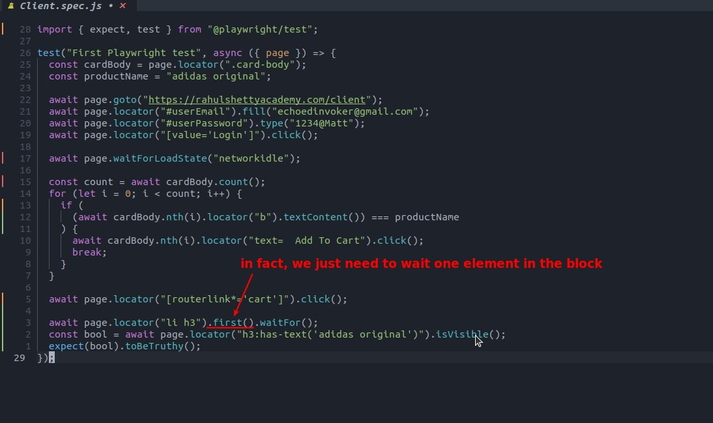

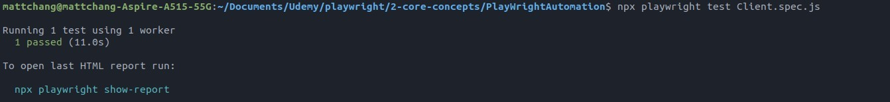
