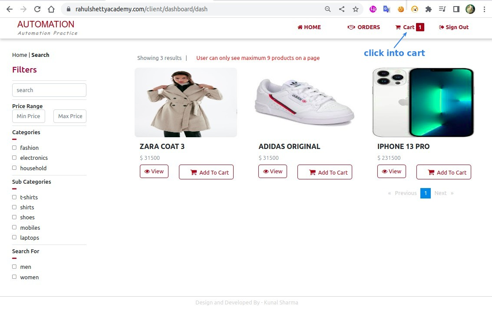

## **NEED**

## **Inspecting page**

## **Coding: 1st try**

## **Test & Analyze the result**

### _Risk 1: Previous page has same text_

### _Risk 2: Products in the cart appears delayed_

## **If there are already multiple products in the cart**

