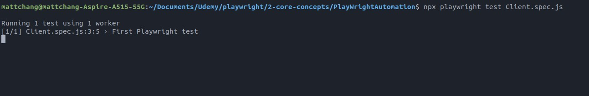

## **NEED**

- The point of this lecture is suggection dropdown box.

## **Inspecting**

- 3 and 4 are two possible options, each with its own advantages and disadvantages.

- The dropdown box will only appear after we type some characters.

## **Coding**

- When we use text as a condition, we have to be very careful about its formatting.
  - We can also use some string handling methods to increase the error tolerance, such as trim, lowercase, includes.

## **TEST**

