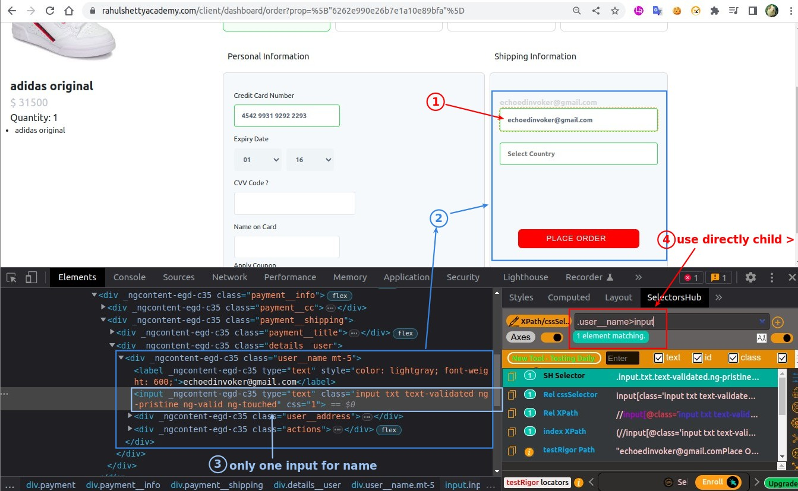
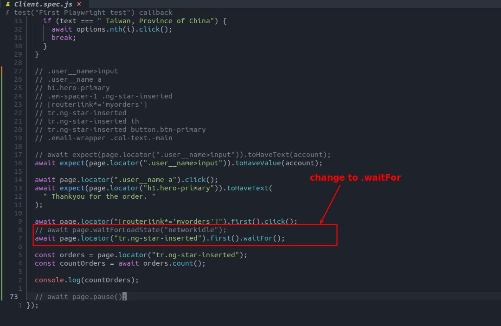
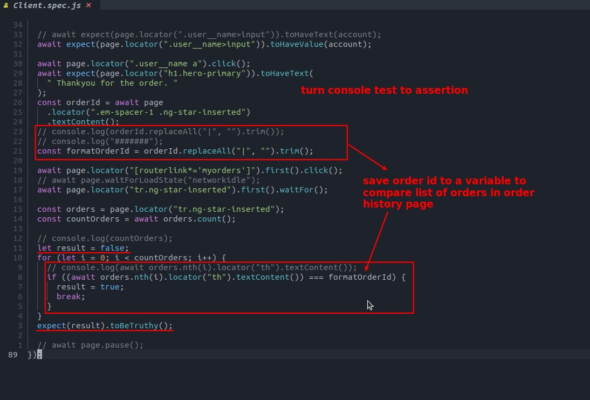

## **NEED**

## **Inspecting**

### _Place order page_

### _Thank you page_

### _Oder history page_

### _Summary of single order page_

## **Assertion: check account in the order page**

## **Assertion: Thank you**

## **Assertion: Check if order id from the thankyou page recorded in the history**

### _Point: create custom-wait for .count()_

### _replaceAll & loop_

## **Assertion: Check if order id from thankyou page appear in the summary page**

