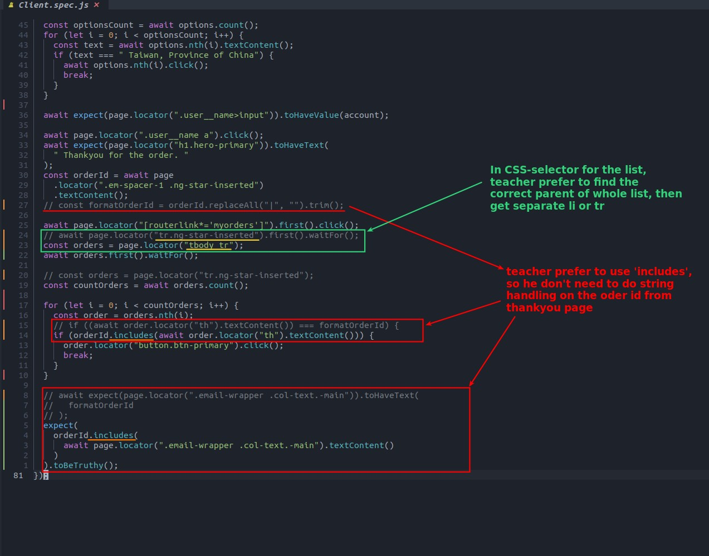

## **Difference between me and teacher**

> We already complete whole test script by our self, now to compare it with teacher's solution.

## **Other concepts**

- Even if you know that the newly added order will appear at the end of the history, it is better to use iteration rather than .last(), because it is the safest and most robust way to use it, since the order may be inserted by other users in the process.
