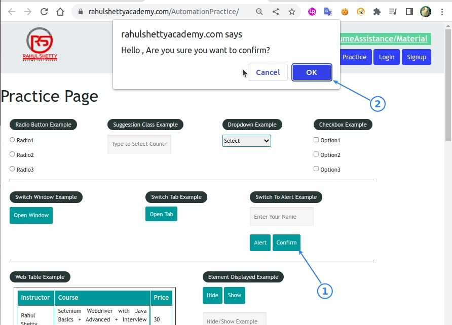
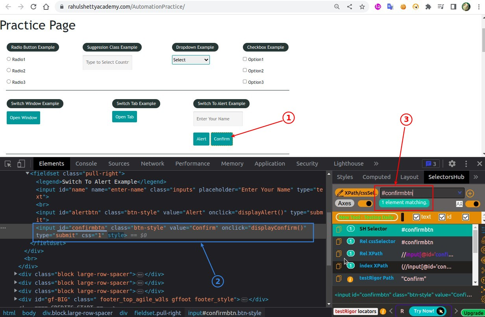
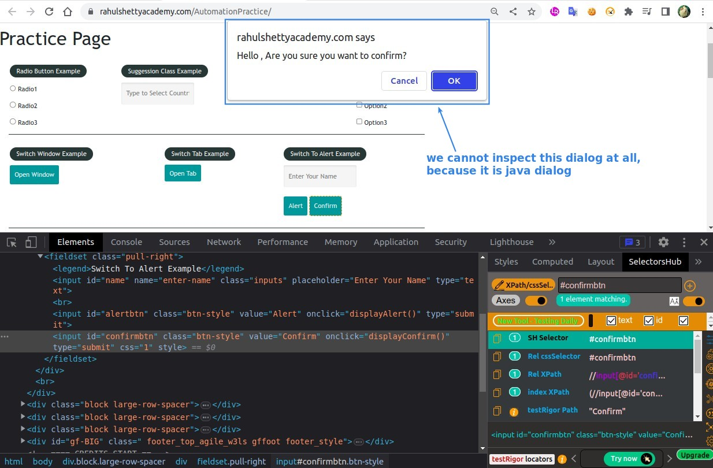
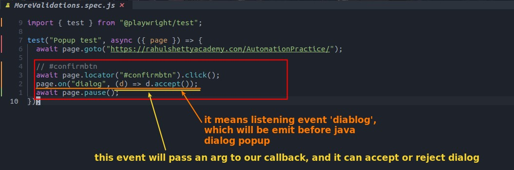
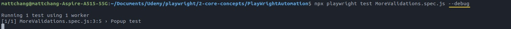
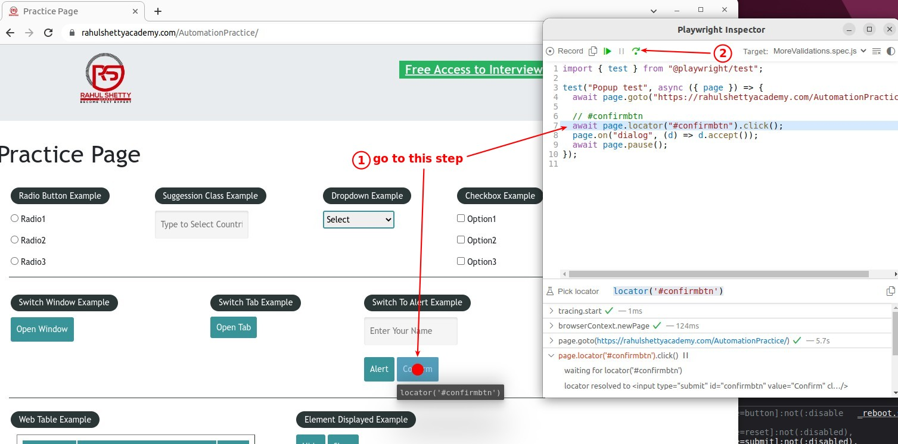
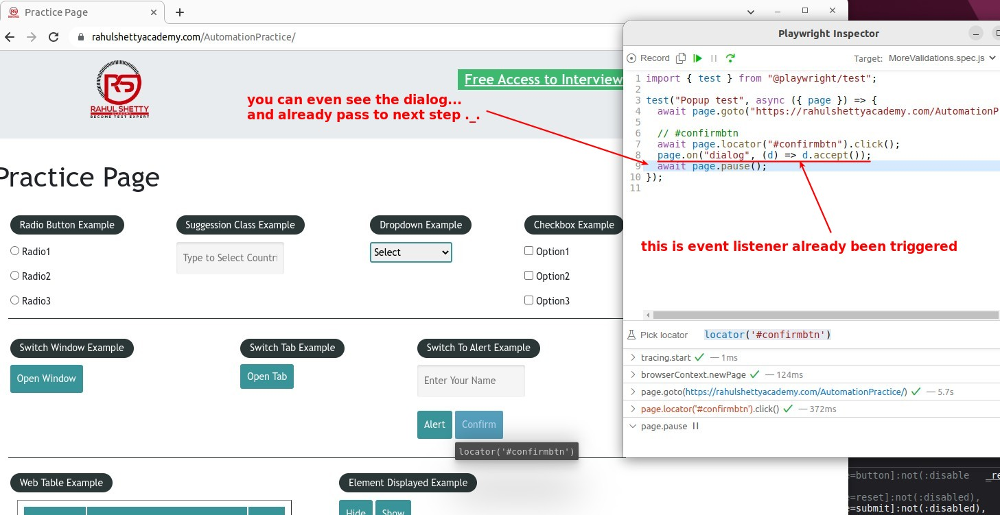
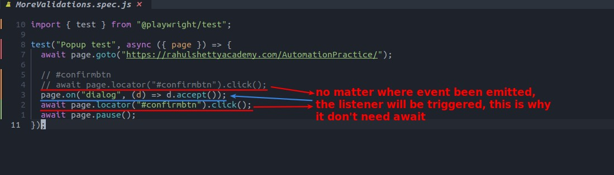

## **NEED: confirm dialog**

## **Inspecting**

- If we cannot inspect dialog at all, it is **java** dialog.

## **Coding: page.on**

> Although a java dialog does not have an element, we can control it by the event that triggers it.

## **TEST**

## **page.on listen event everywhere** 

> Did you notice that page.on doesn't have await?

