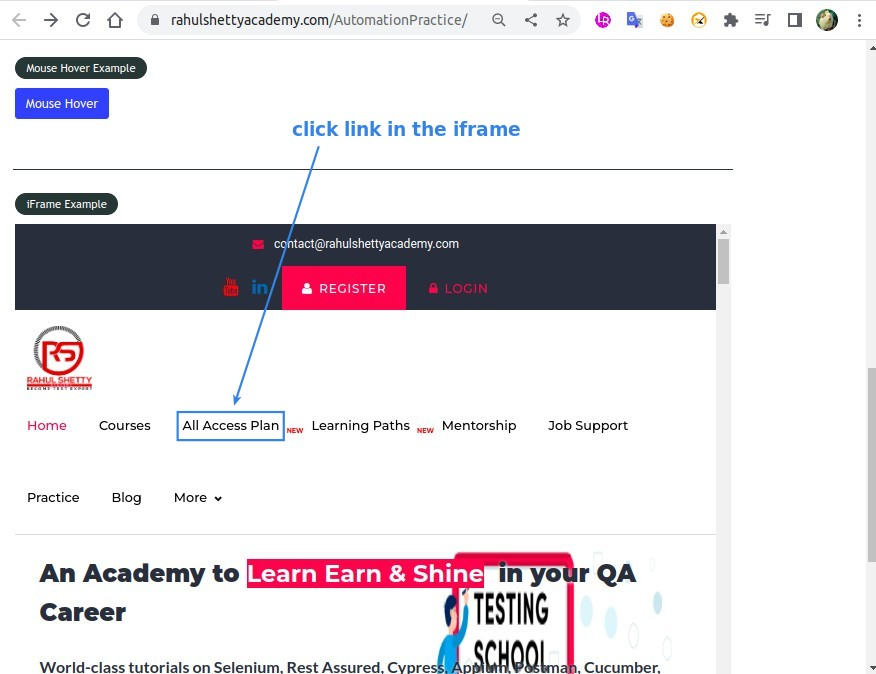
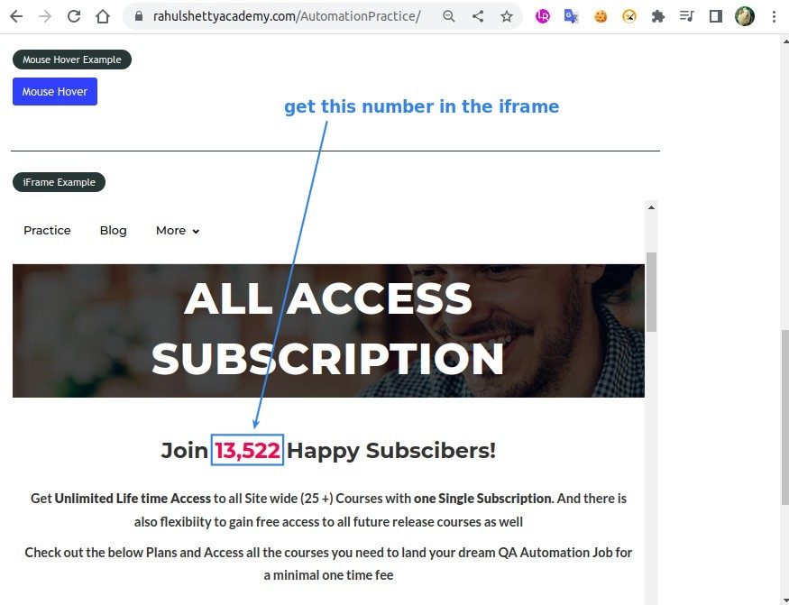
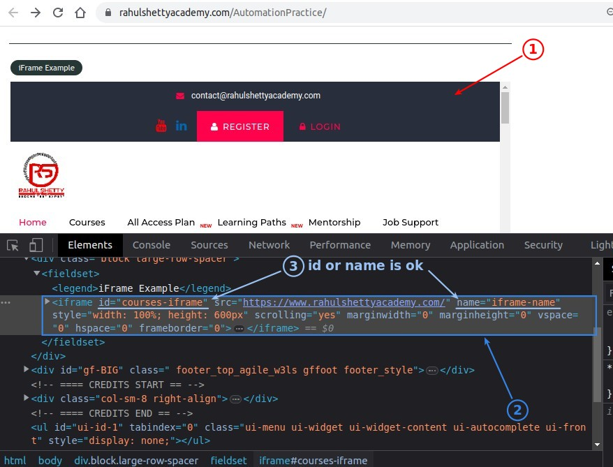
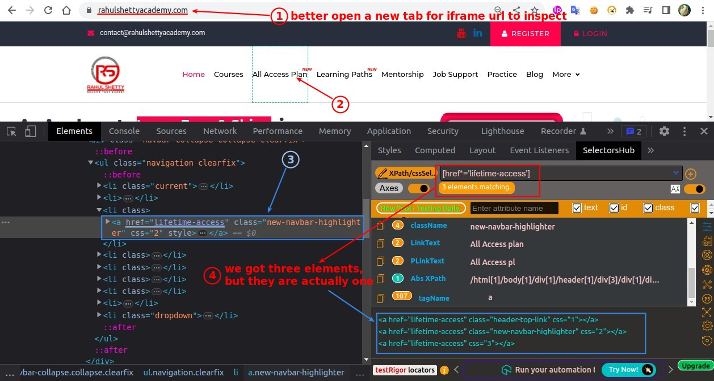
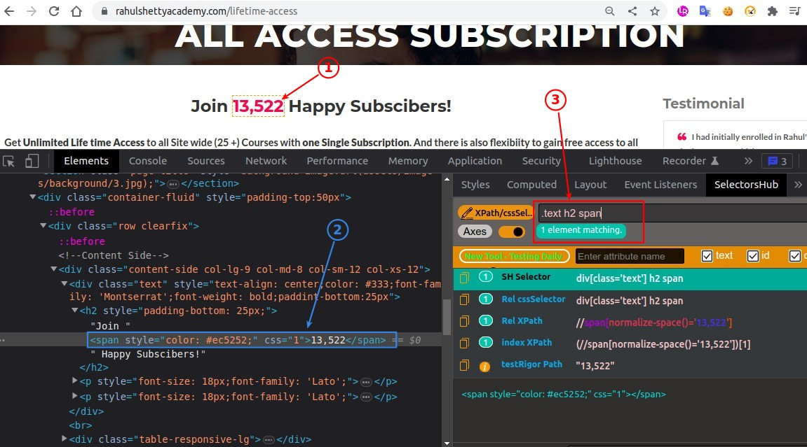
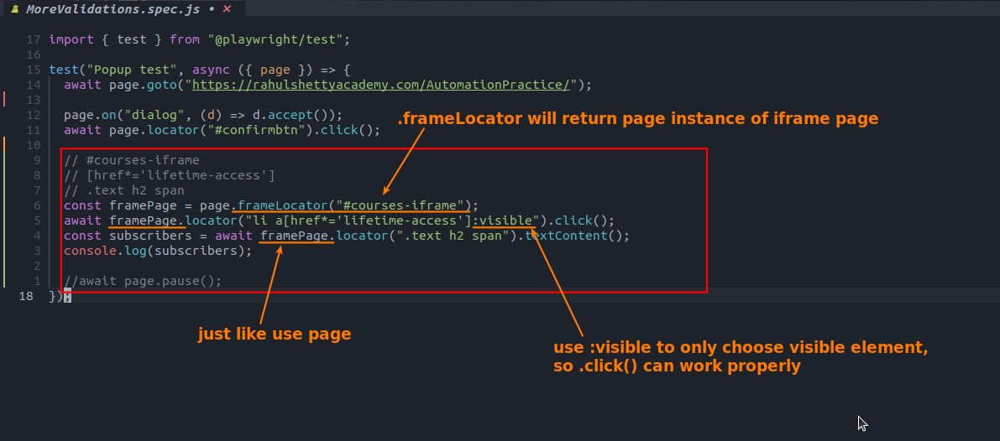
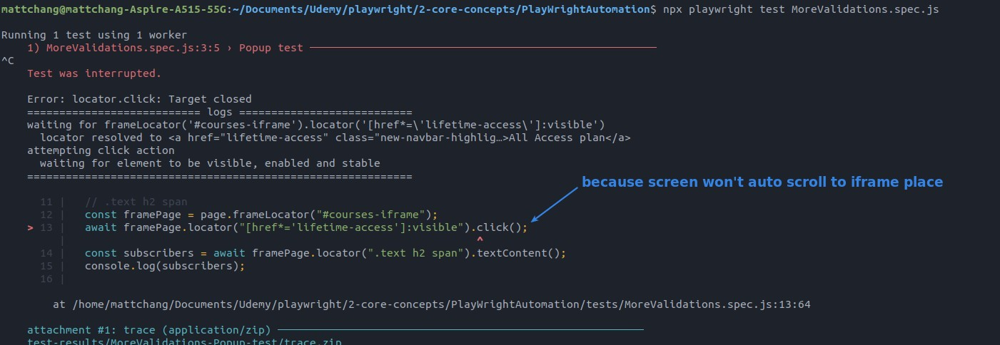
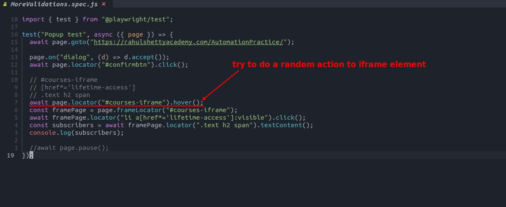
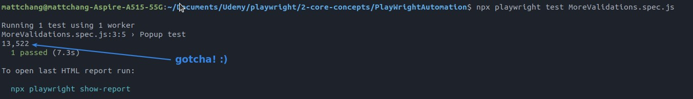

## **NEED: manipulate contents of iframe**

## **Inspecting**

## **Coding: frameLocator & :visible**

- :visible is a feature provided by Playwright, added after the CSS-selector, which filters the elements selected by the previous CSS-selector, leaving only visible one on the page.

## **Fix: scrolling problem**

- The error occurs because when we use the framePage action, the auto-scrolling happens on the page in the iframe instead of the mainframe, so the mainframe never scrolls to the position of the iframe.

- Simply use page (not framePage) to do any action on the iframe element, which will trigger auto-scrolling to the iframe position.

