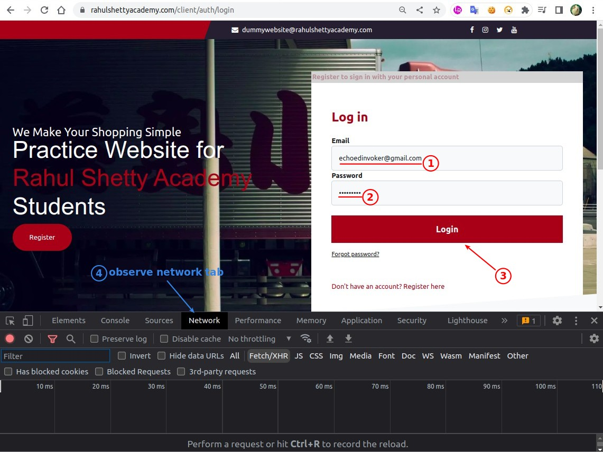
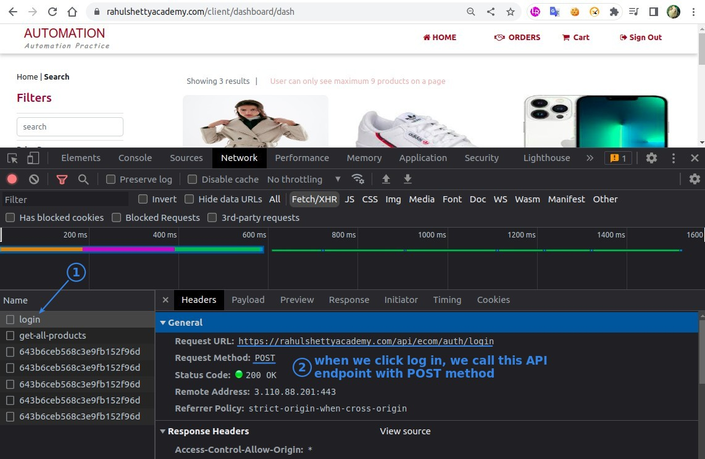
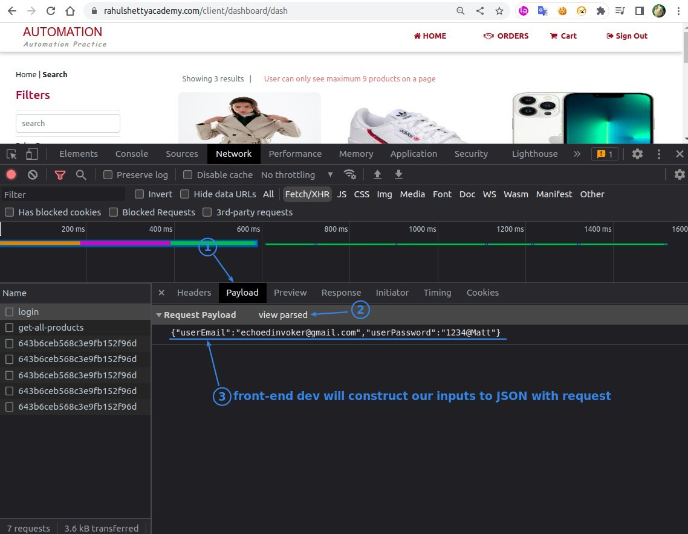
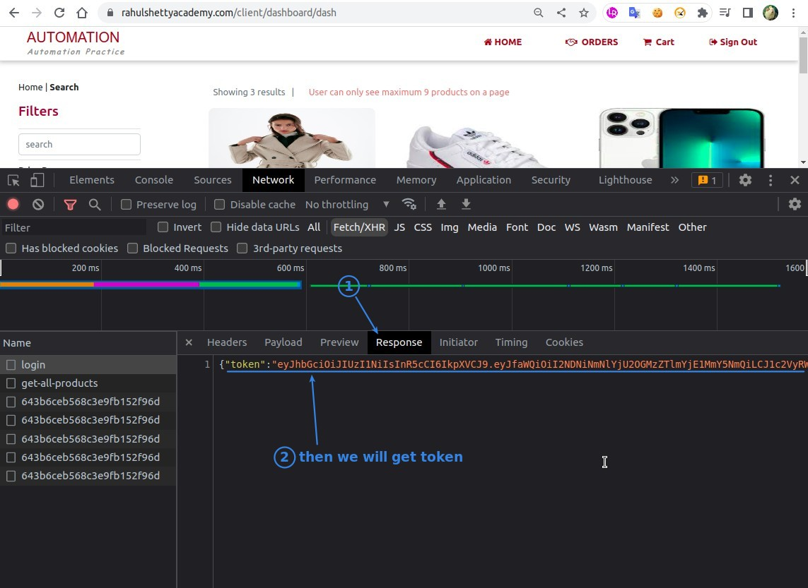
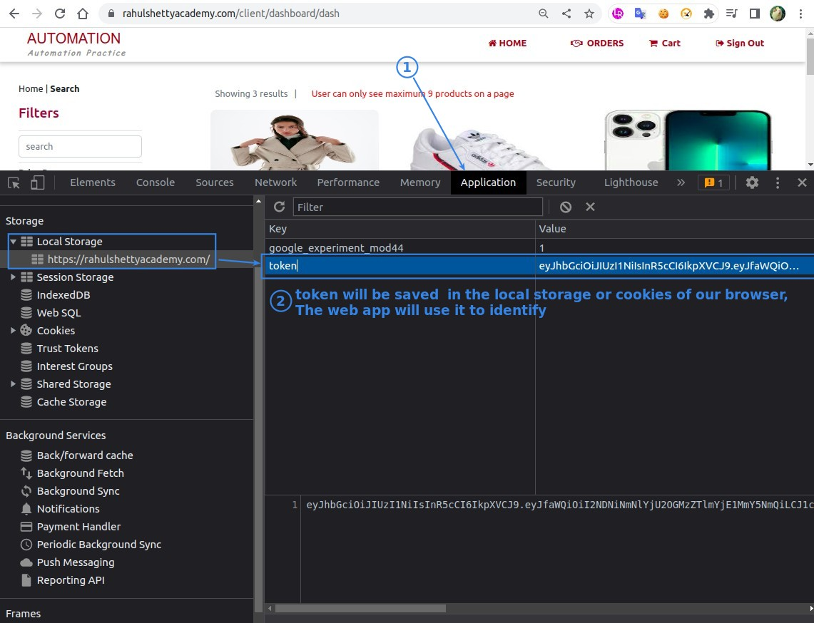
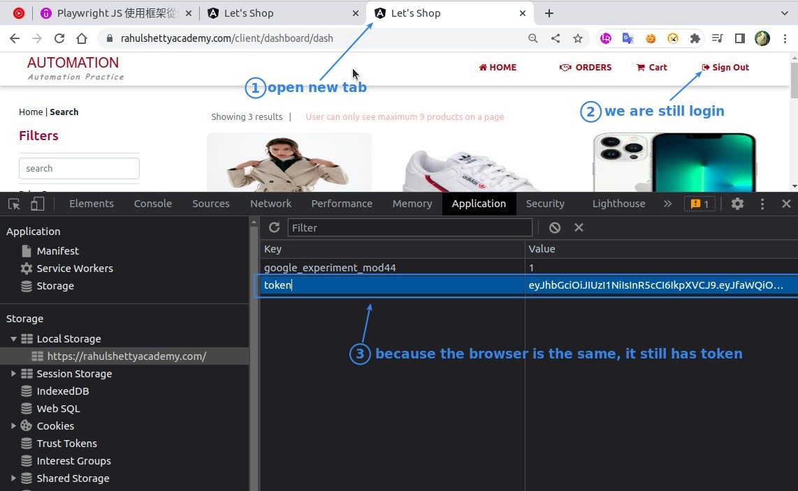
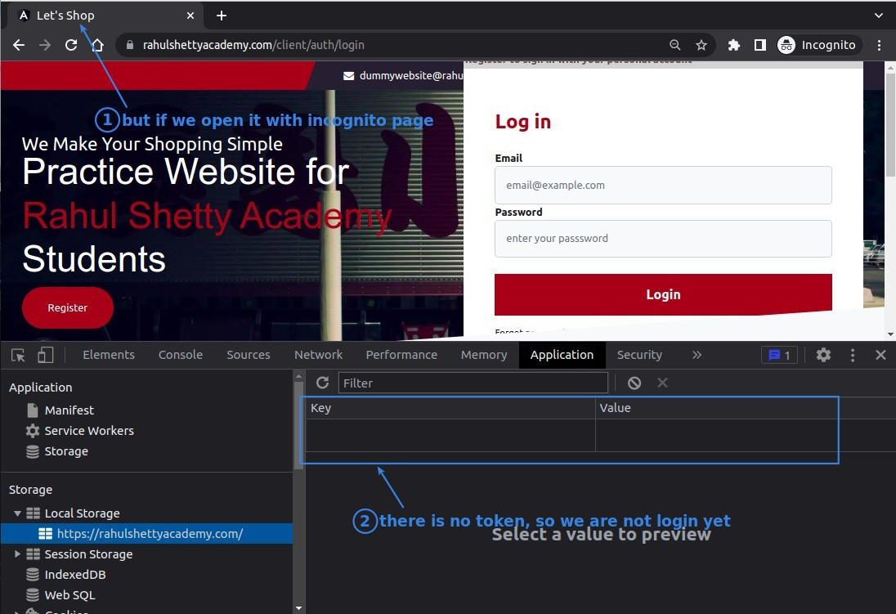
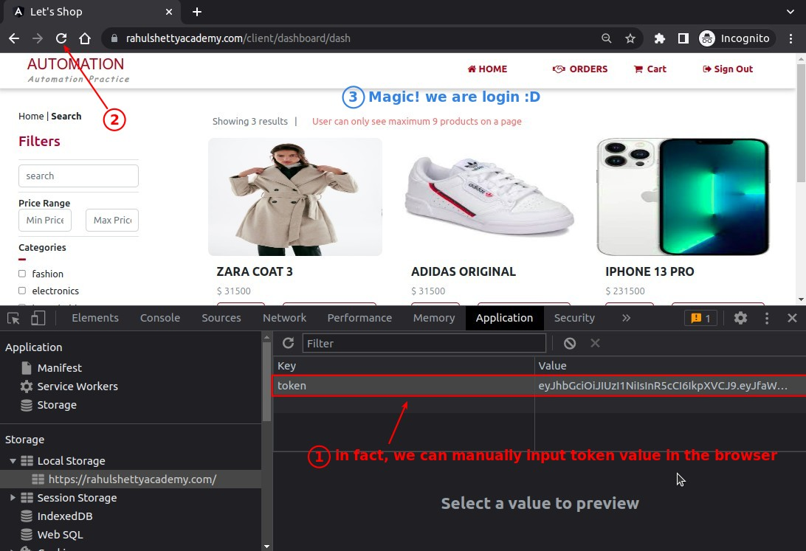

## **Walkthrough the Login**

### _API call_

### _Save Token in the Browser_

## **Features of Token in our browser**

## **What does it mean for us to test?**

- Playwright can automate the process of calling the API and saving tokens to the browser.

  - This way you can skip the login step directly.

    - Login may take five seconds, however, call API is immediate, which saves a lot of time.

    - Some web pages may have unstable login pages, which may affect the results of subsequent tests.
