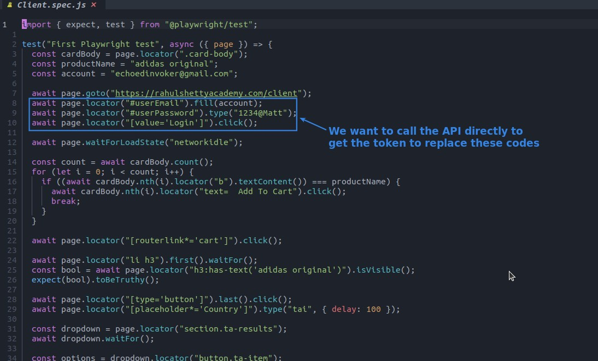
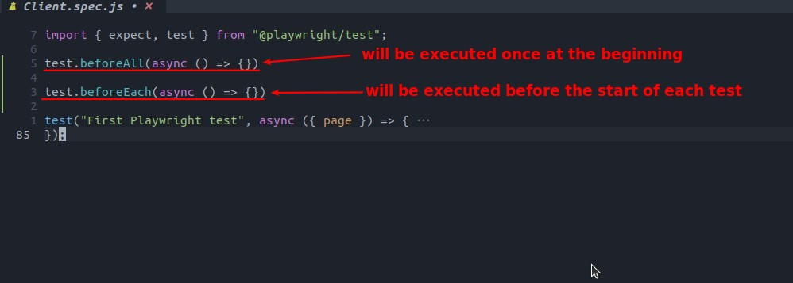
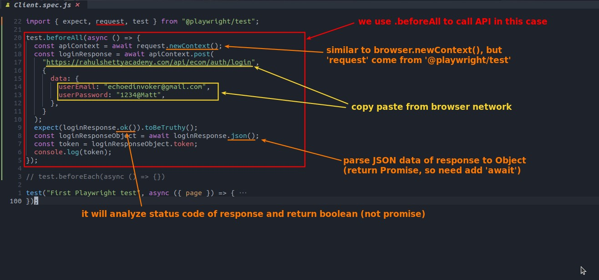
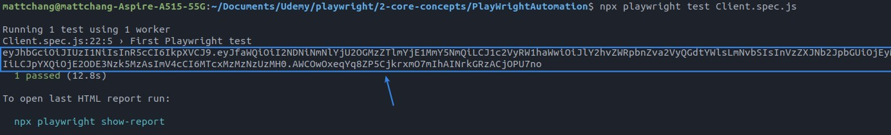

## **NEED: make API call n' get the token**

## **Coding**

### _test.before..._

> There are two type of test before we can choose.

### _make API call_

- When entering each method, you should pay attention to what it returns in the prompt window, and add await if it's a Promise, often because you don't notice it and get stuck.

- There must be at least one general test, test.beforeAll, before it will run.

## **TEST**

