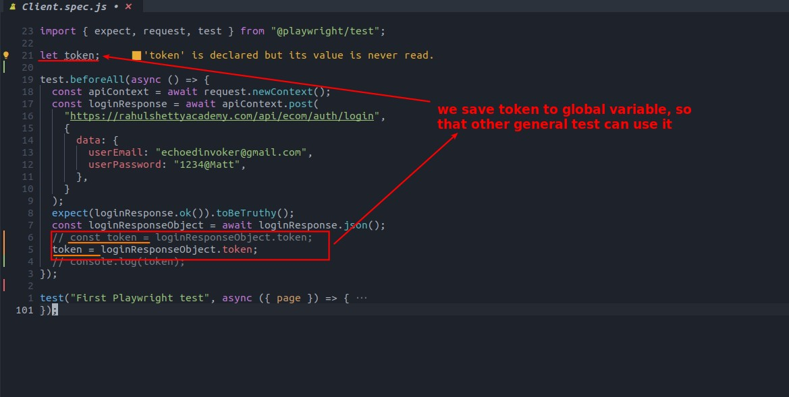
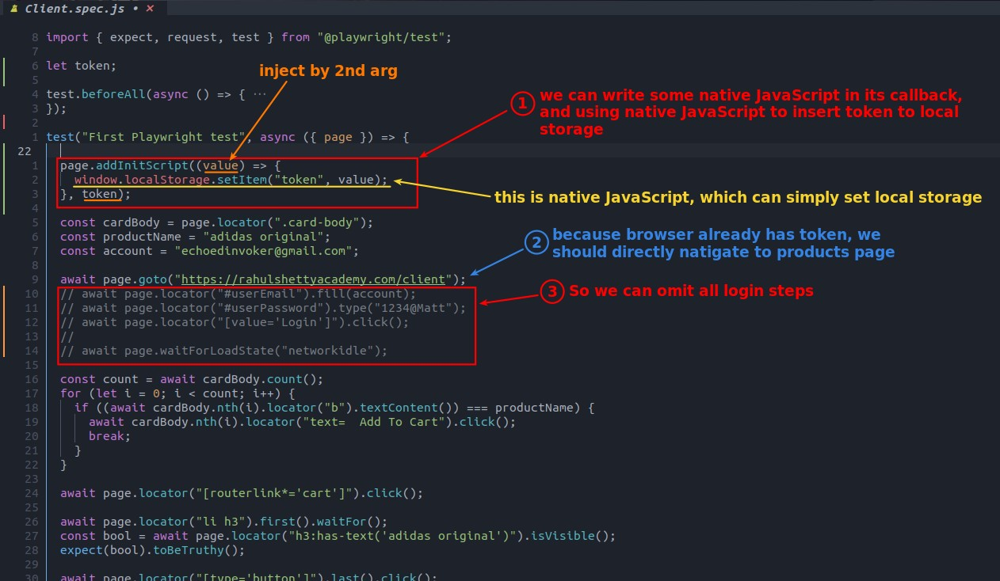
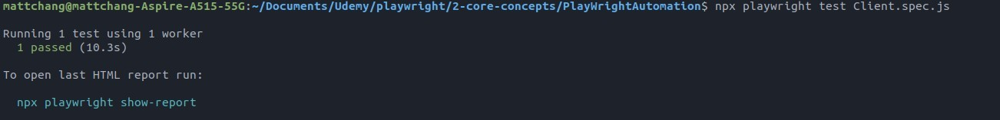

## **Coding**

### _Assign token to global variable_

> Because the process of injecting a token into local storage is in the general test, the token must be set to a global variable.

### _Insert token to local storage of browser_

- Basically, the codes in addInitScript will be executed initially, and the details can be found in the reference.

## **TEST**

