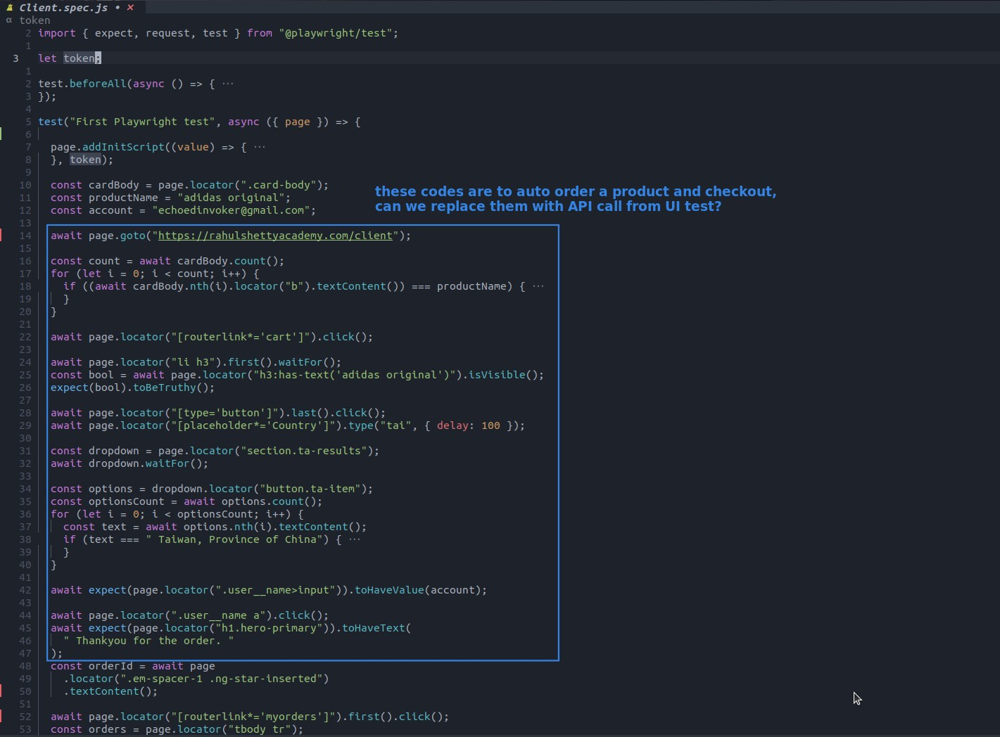
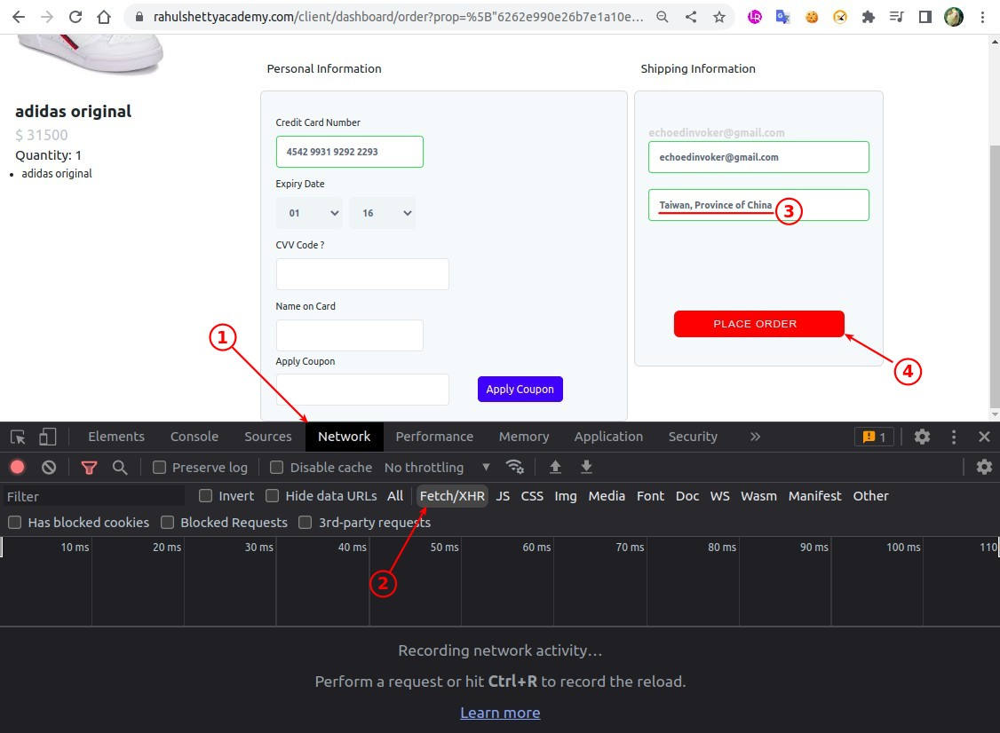
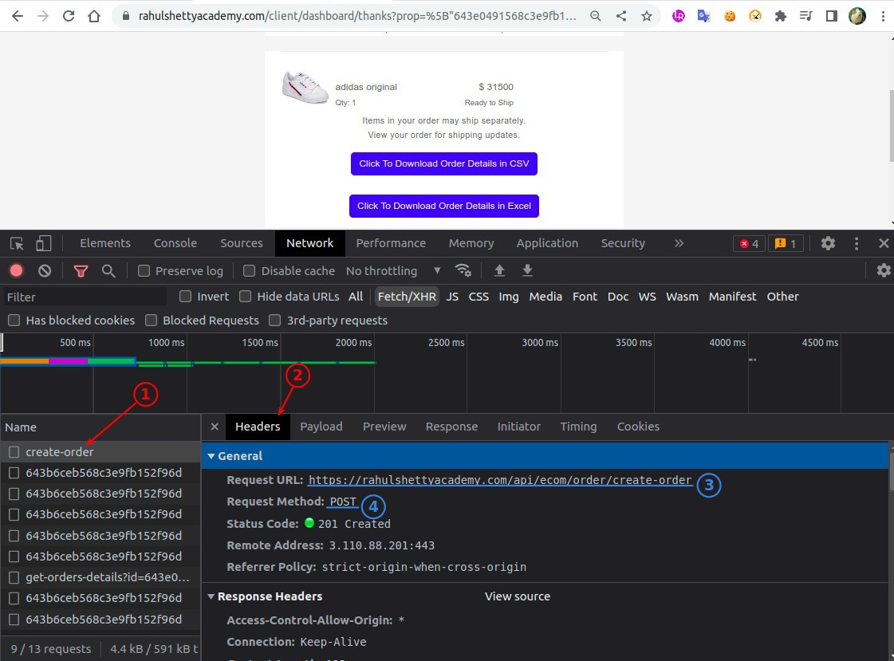
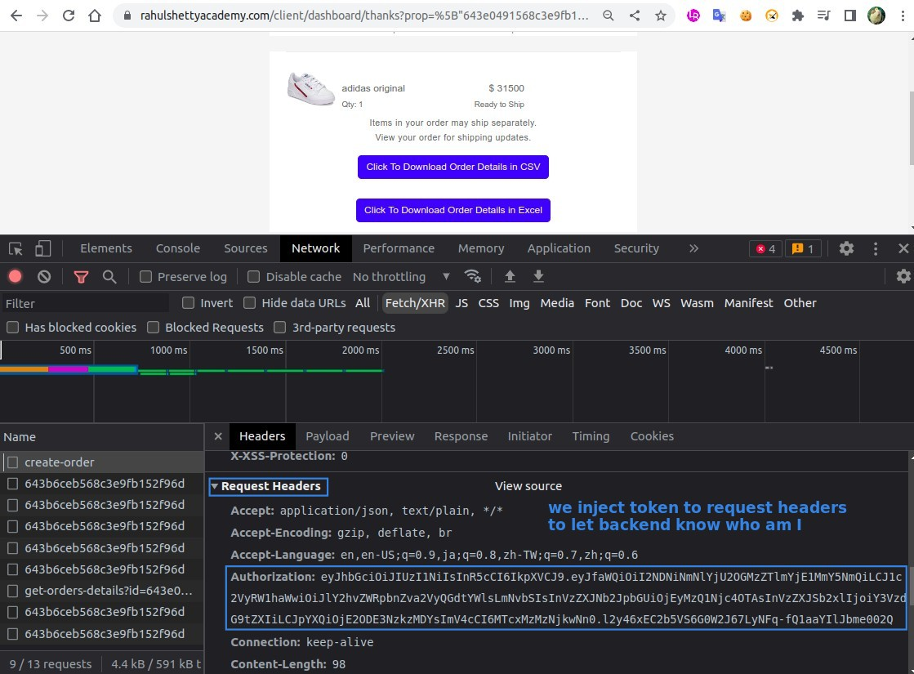
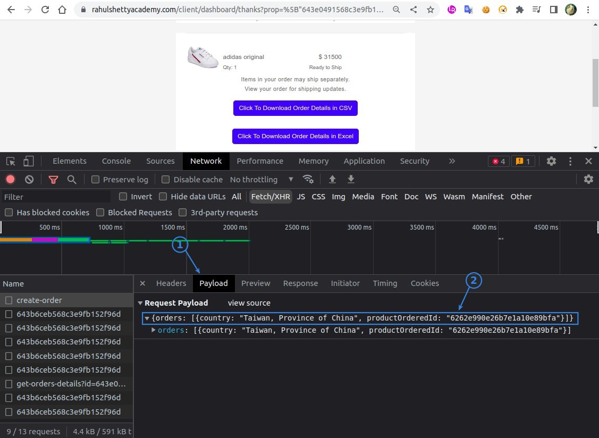
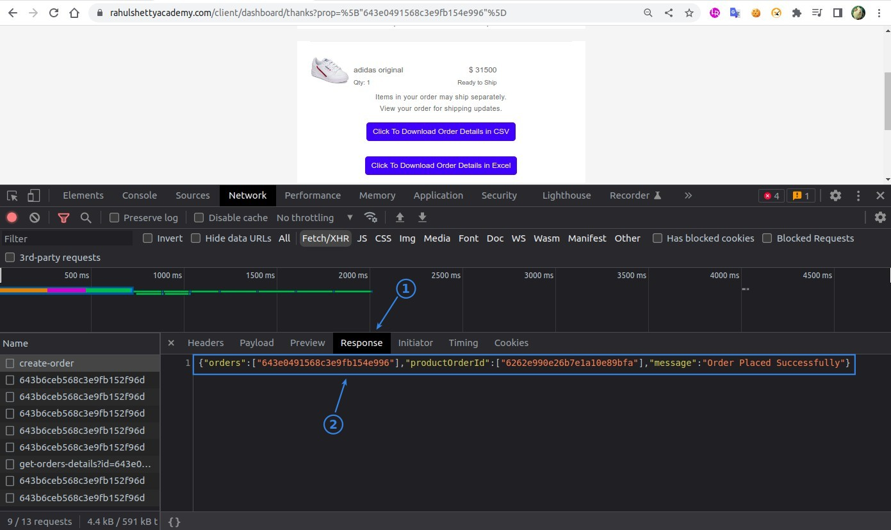

## **NEED**

## **Inspect order process on the browser**

- When we send an order API request, the token in the local storage is automatically filled in the request header with the attribute 'Authorization'.

  - The backend uses it to determine who is ordering the product.

- Besides using the API to order products directly, we will also get the order id directly from the API response, so there is no need to check the thank you page anymore.
