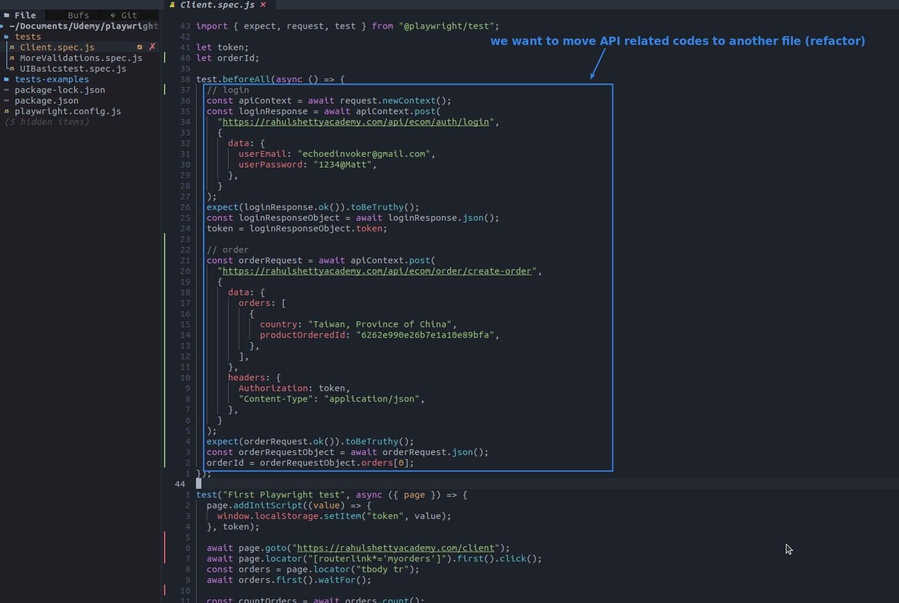
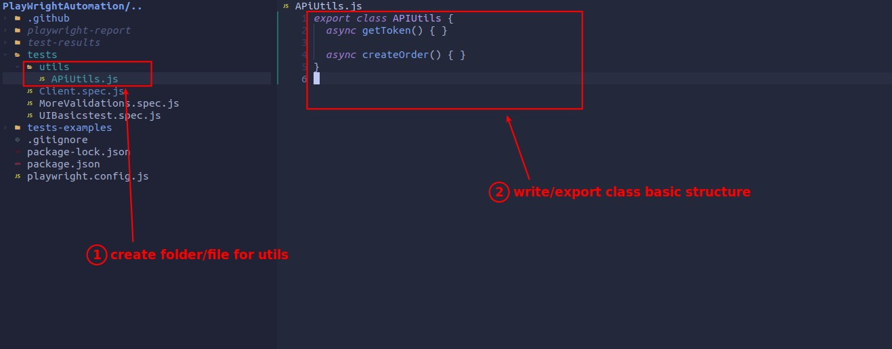
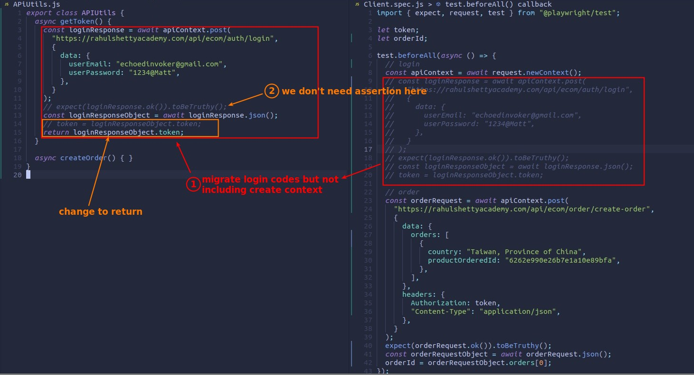
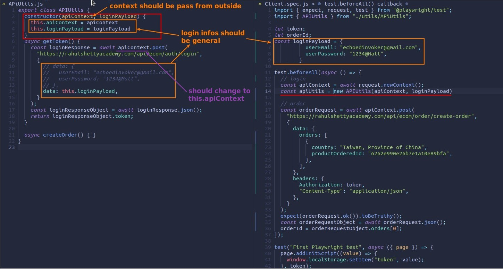
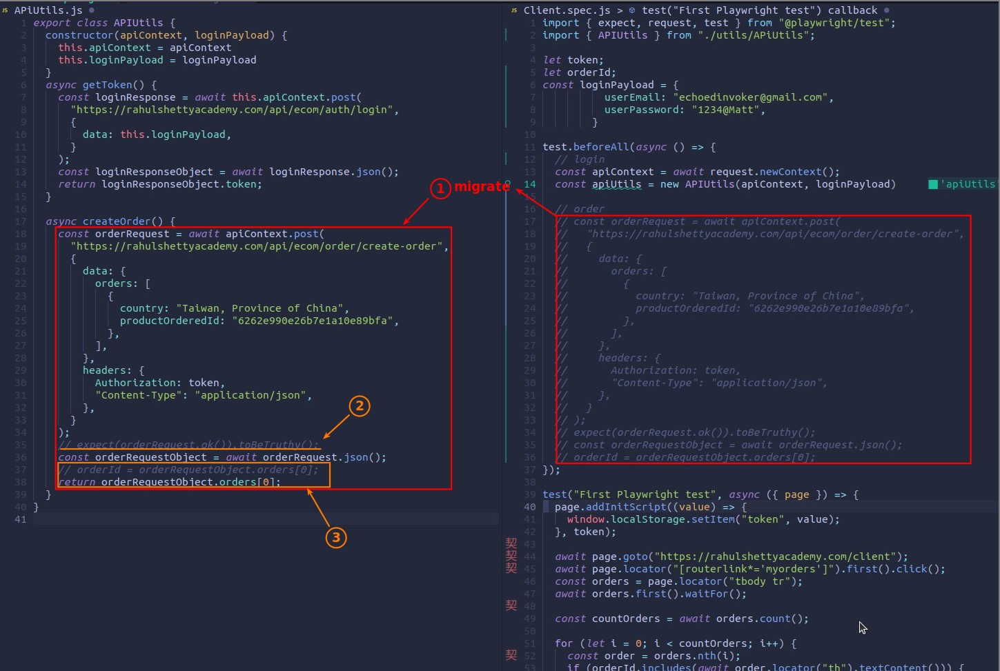
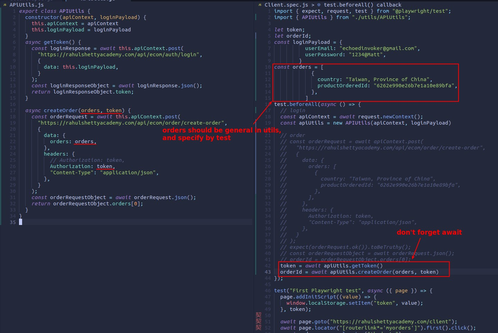
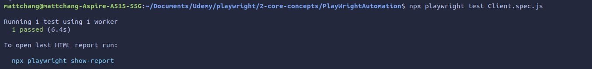

## **NEED: refactor API call to another file**

- We can write the API call in the test file, but separating it into a dedicated file will be more systematic and readable.

## **Migrate login**

- apiContext and loginPayload are important elements of this class, so use constructor to bound them to 'this' keyword, which has the advantage that they can be used throughout the class.

## **Migrate order**

> Basically the same as login, except that the payload does not need to be bound to 'this' keyword. 

## **TEST**

