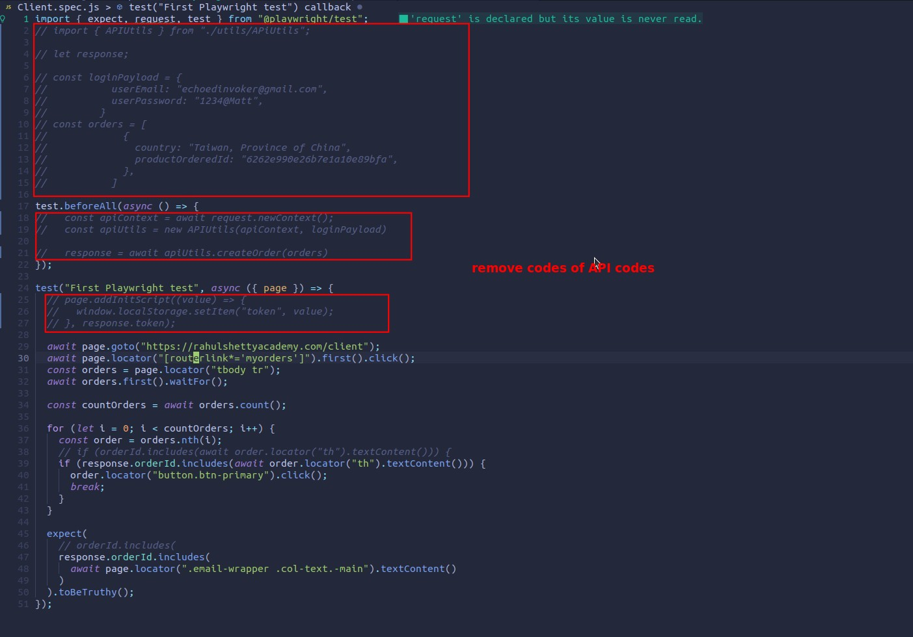

## **Issue: 30% Web apps not only use token to authenticate**

## **The previous way is very suitable for 70% of cases, but may not be suitable for 30% of cases**

## **Get all states of browser at once**

## **Create a global context with injected states**

- Then we use this global context to skip the login step of the general test at the beginning of each general test.
