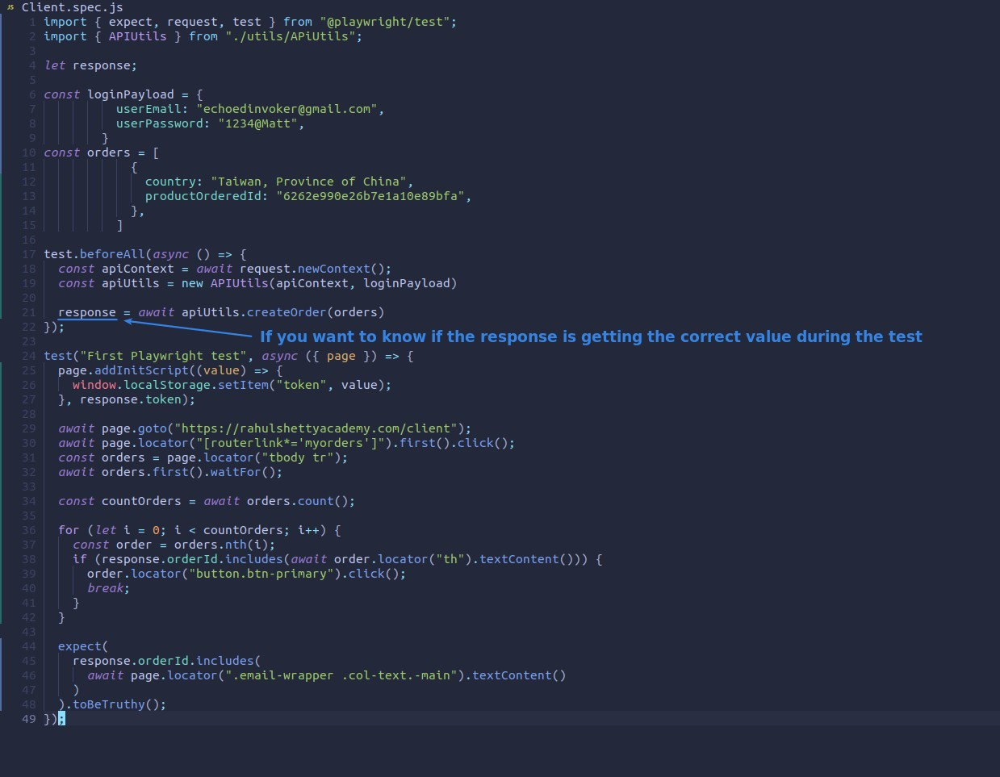
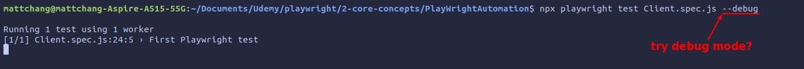
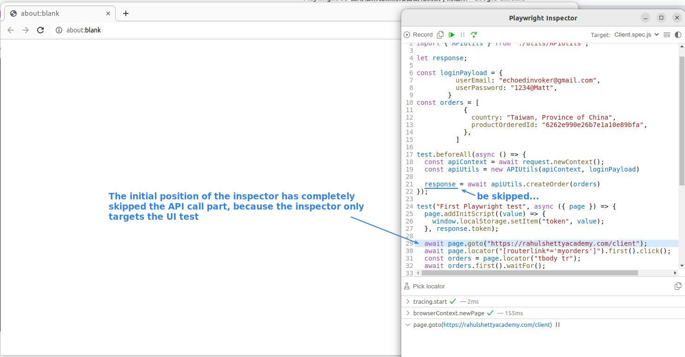
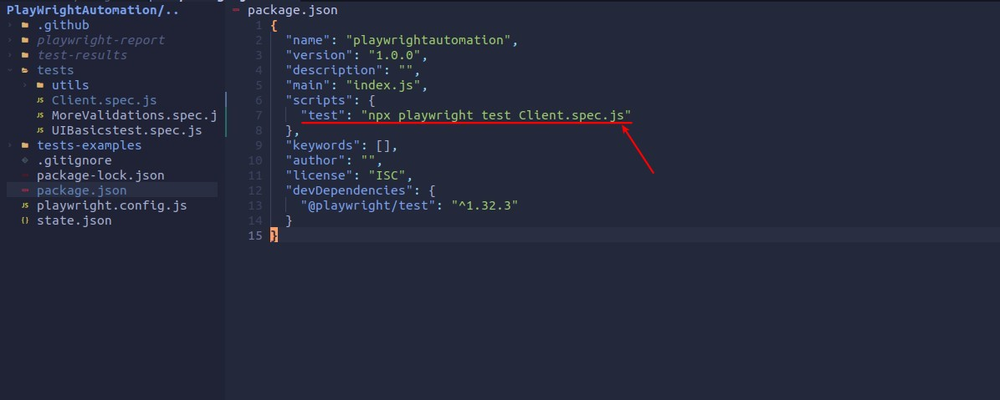
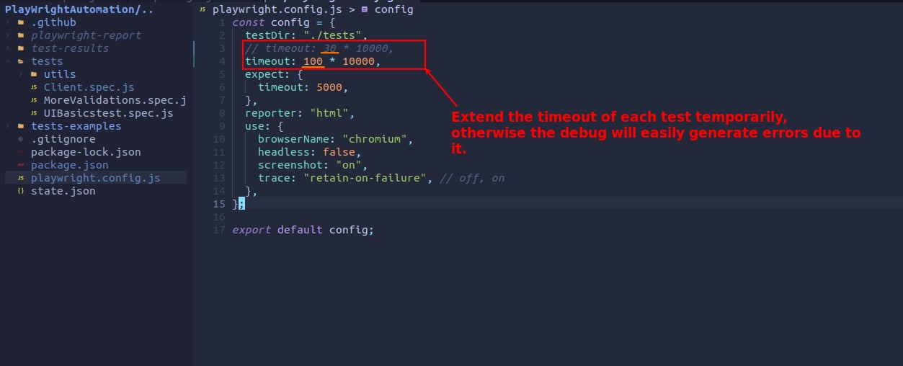
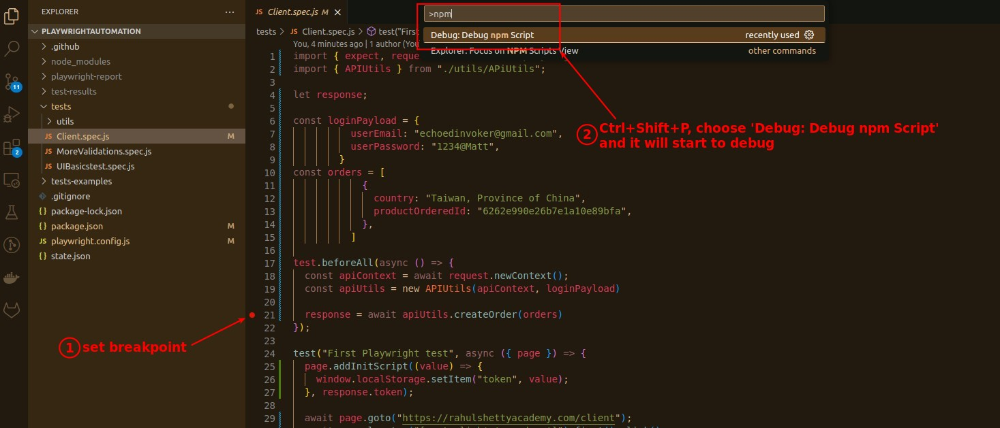
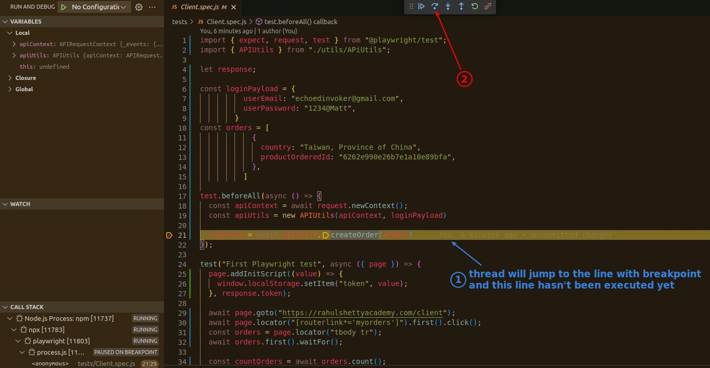
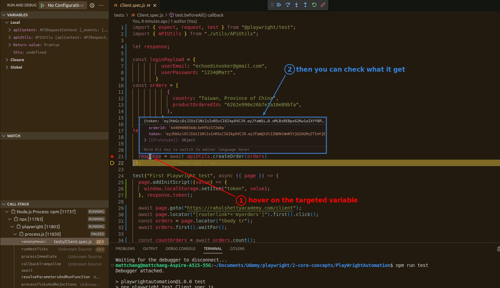

## **NEED: debug for API codes**

## **Try debug mode and inspector**

## **Prepare of VS code debug**

### _script of package.json_

### _timeout of playwright configuration_

## **VS Code debugging**

