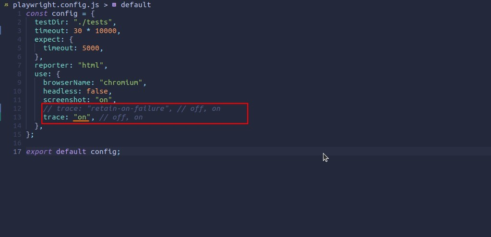
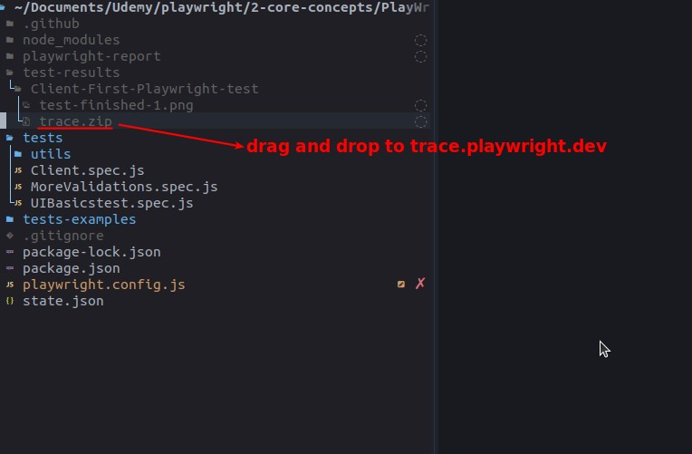
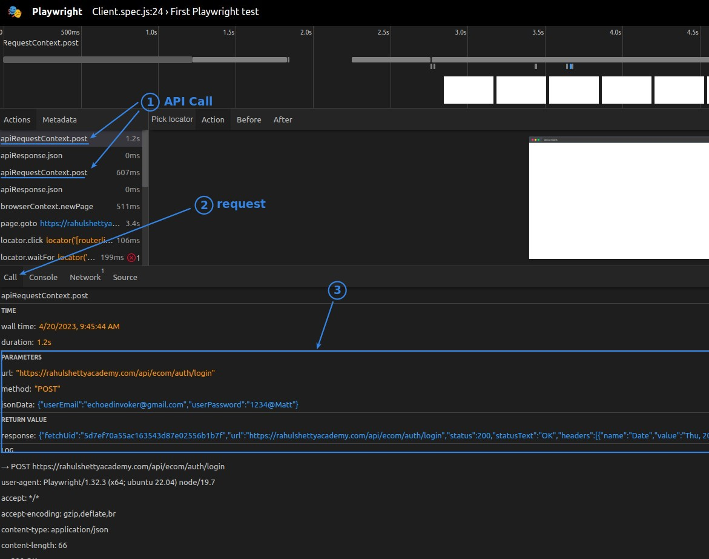
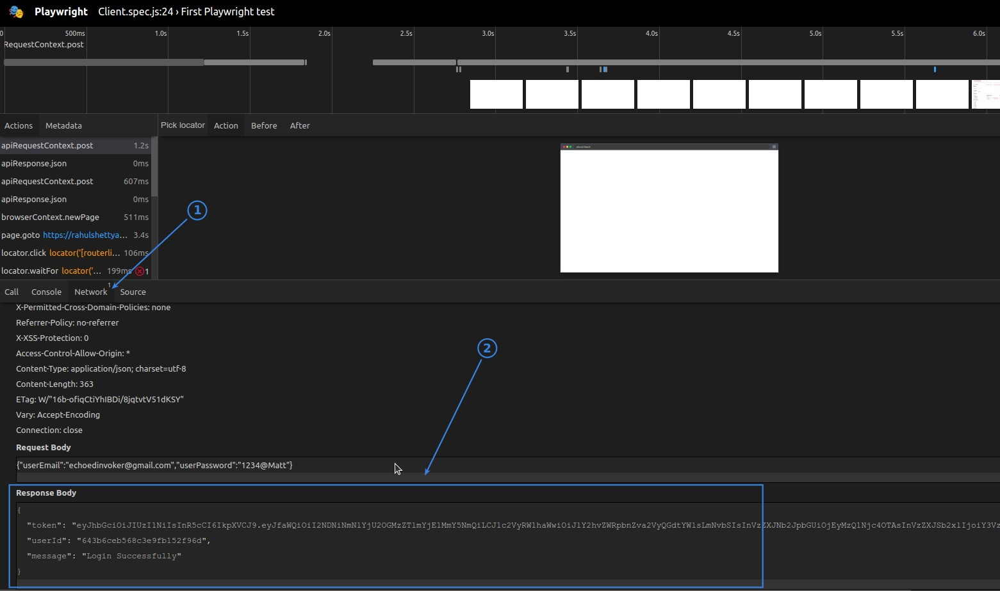

## **Set Playwright configuration**

## **Drag and drop trace file to**

## **Trace demo for API call**

- When we need to observe more of the network, we can use the trace demo to observe it instead of VS Code.
