## **NEED**

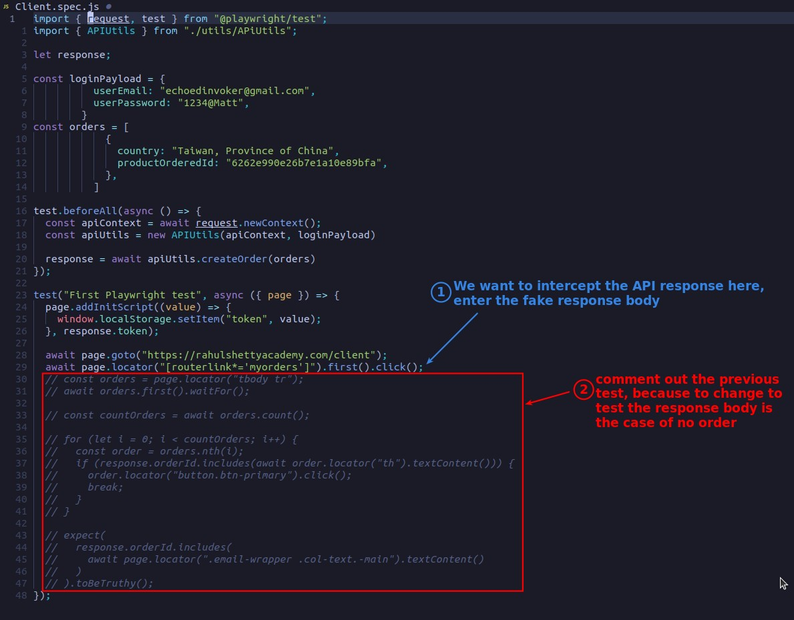

## **Inspecting: network when clicking ORDERS**

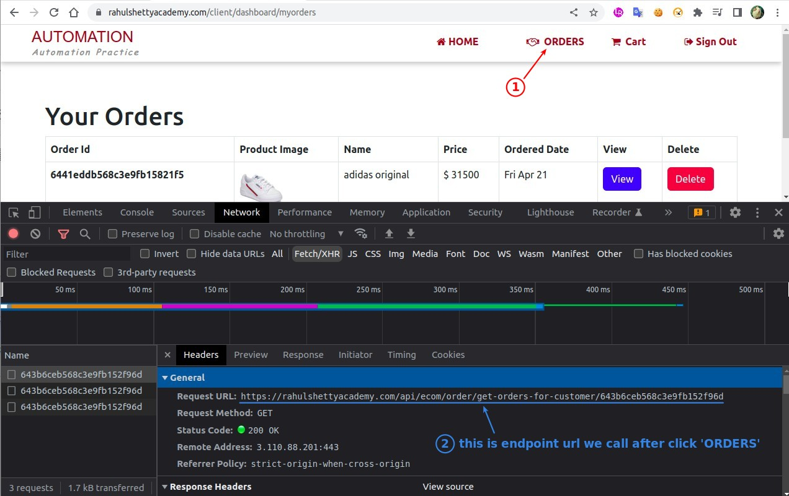

## **Coding: set listener for route**

### _initiate setting without mock data_

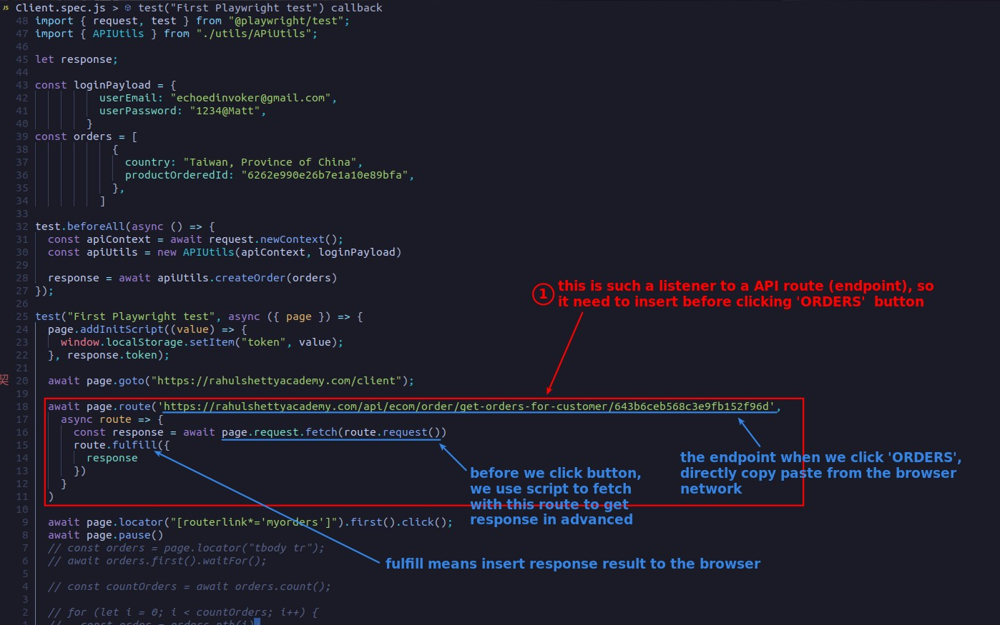

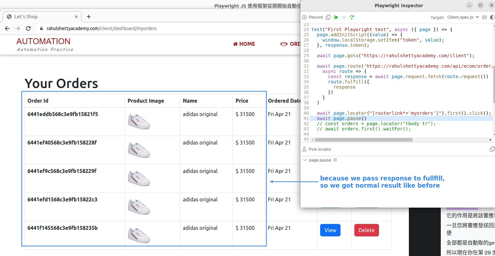

### _add mock body data_

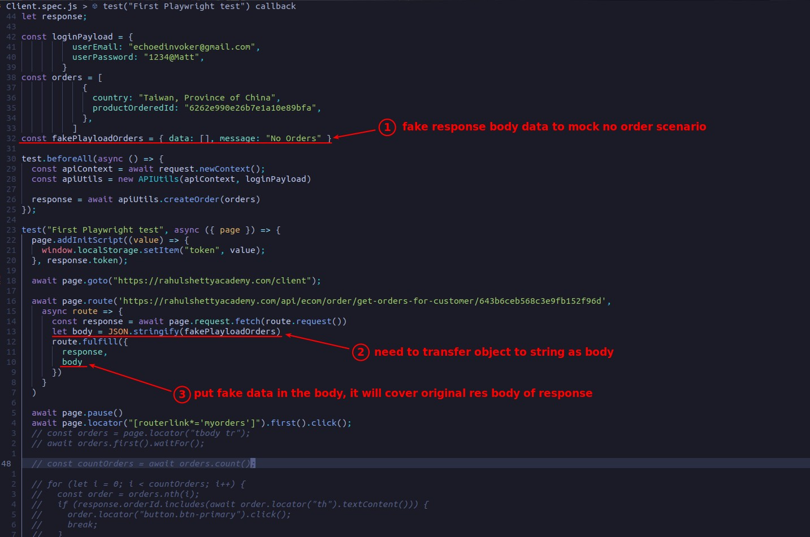

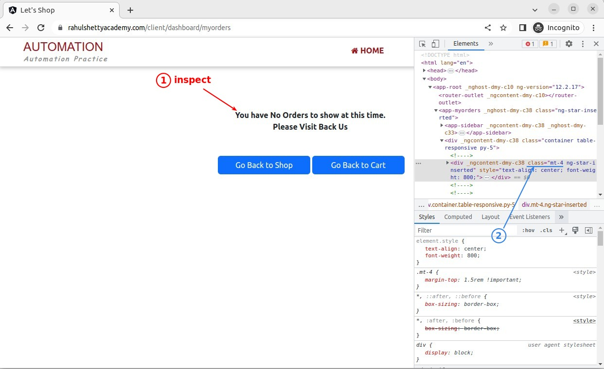

- 'response' is the response that will be returned by a normal fetch, and we can use other properties to cover the data in it.

## **Remove pause and try go get no order message**

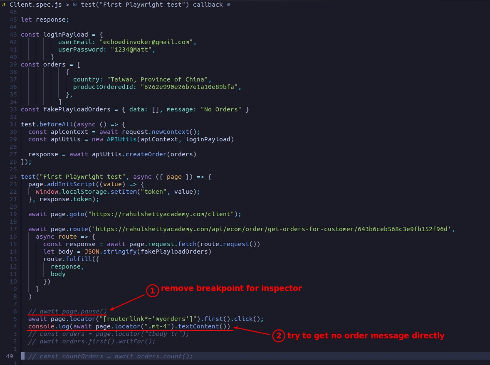

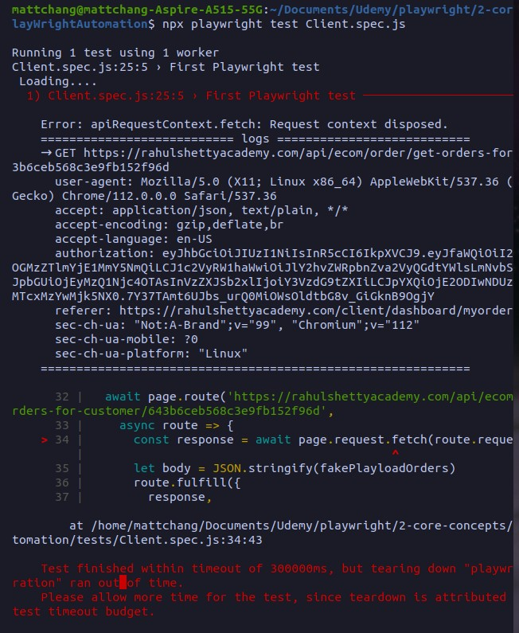

## **Fix the timeout problem**

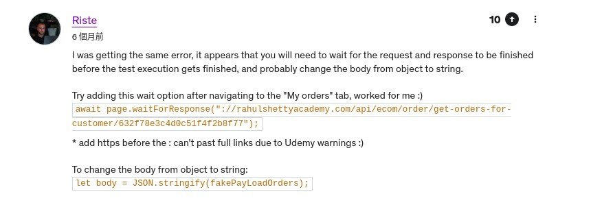

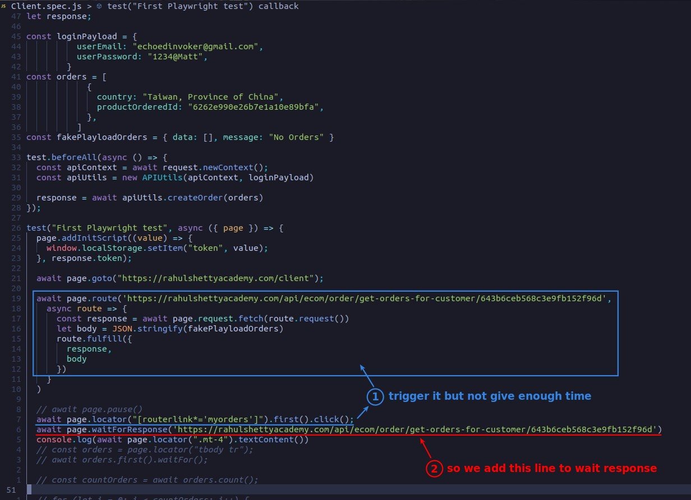

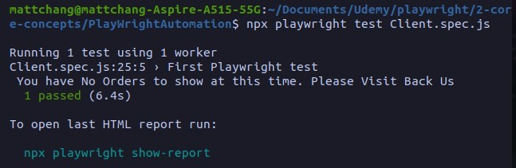
