## **NEED/Prepare: view a non-existed order**

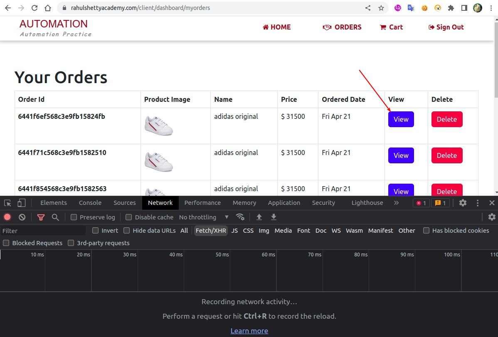

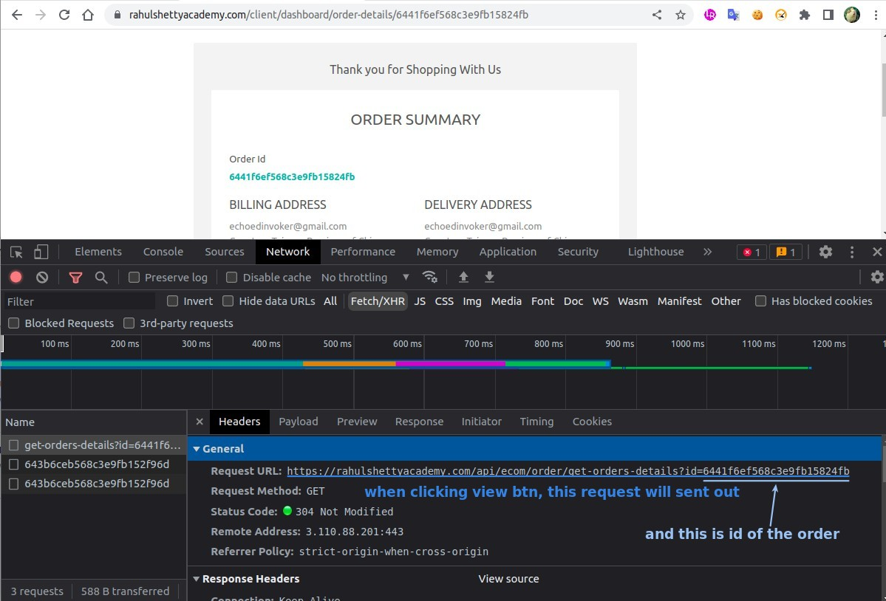

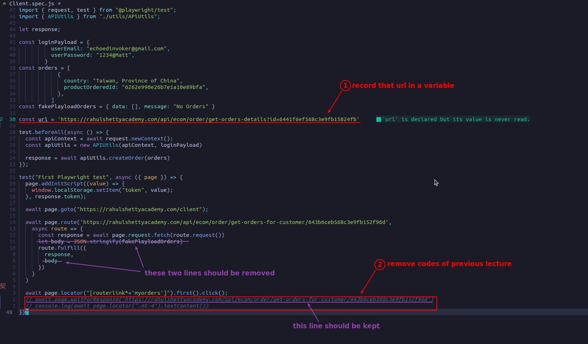

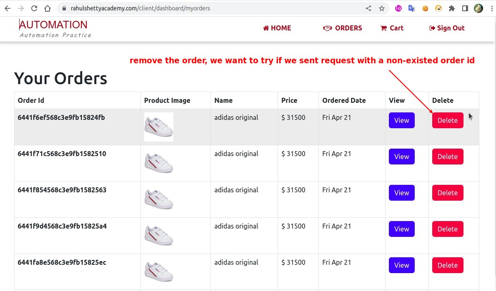

## **Click view button of first order**

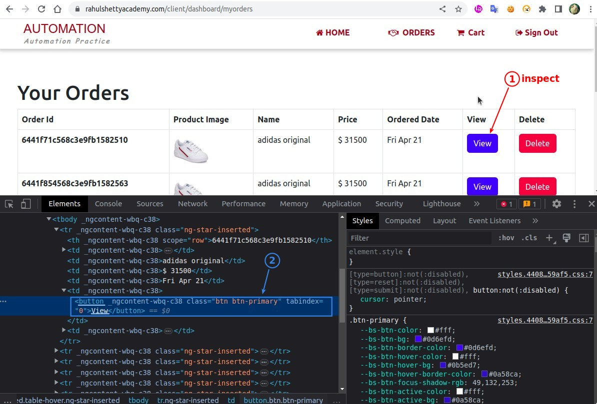

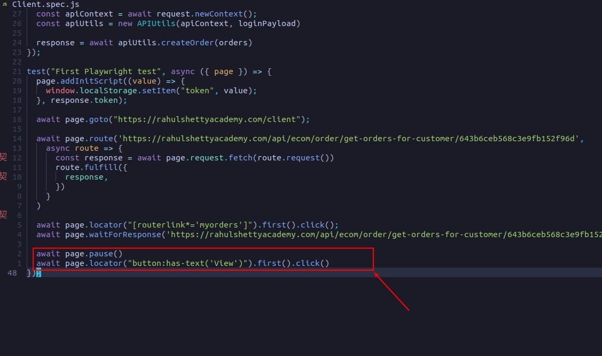

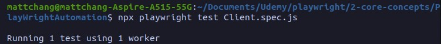

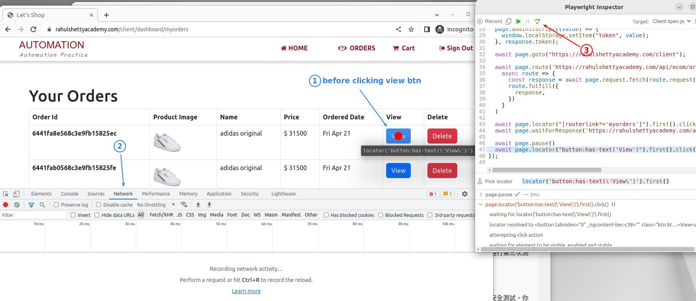

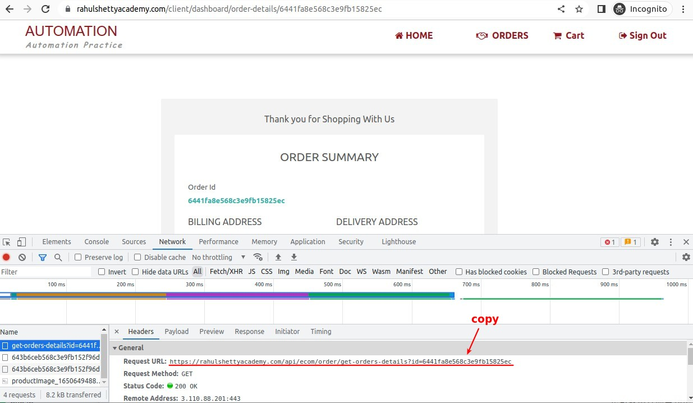

## **Listen view request with 1st order id**

### _inspecting 1st order ids_

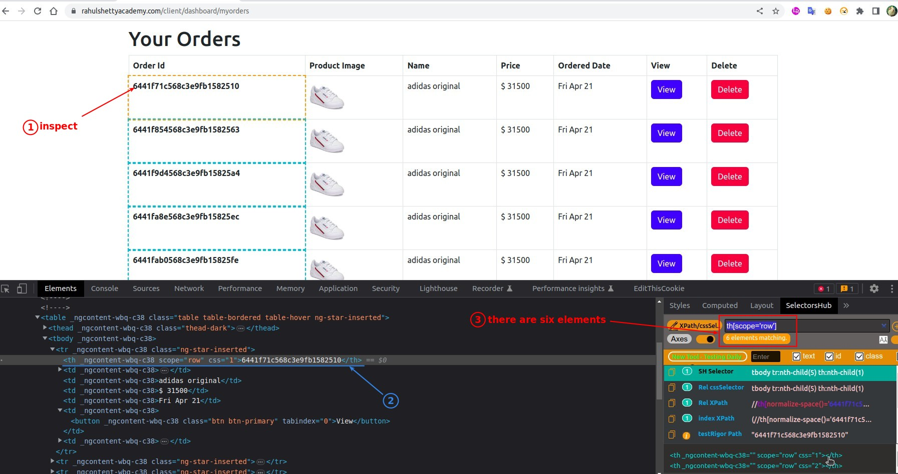

### _route listener with dynamic order id_

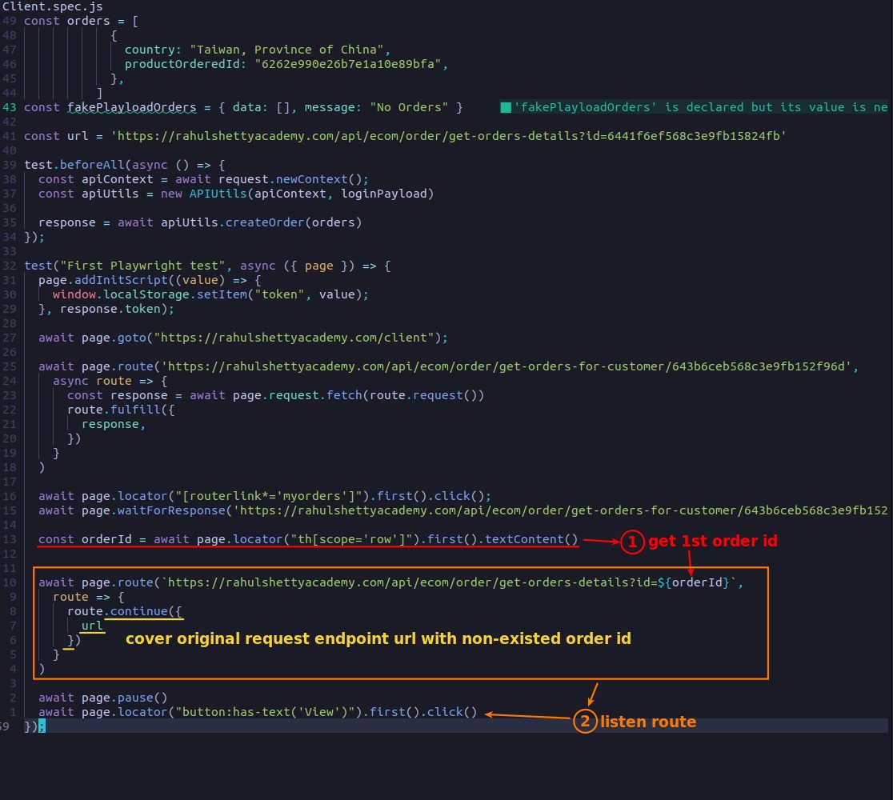

## **TEST**

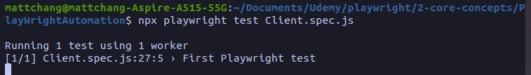

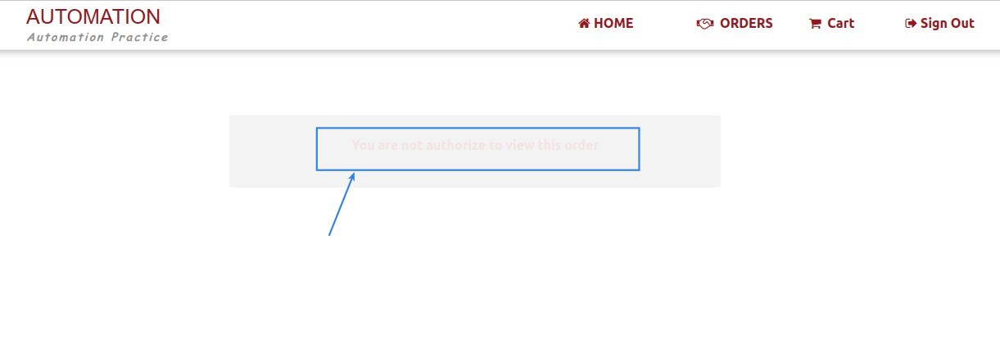

- Even if the average user can't find the view button to send such a request, hecker will still get confidential information this way.

  - This is the reason why we do this kind of test, Playwright because the integration of API test and UI test, in this area can be more simple and effective.
