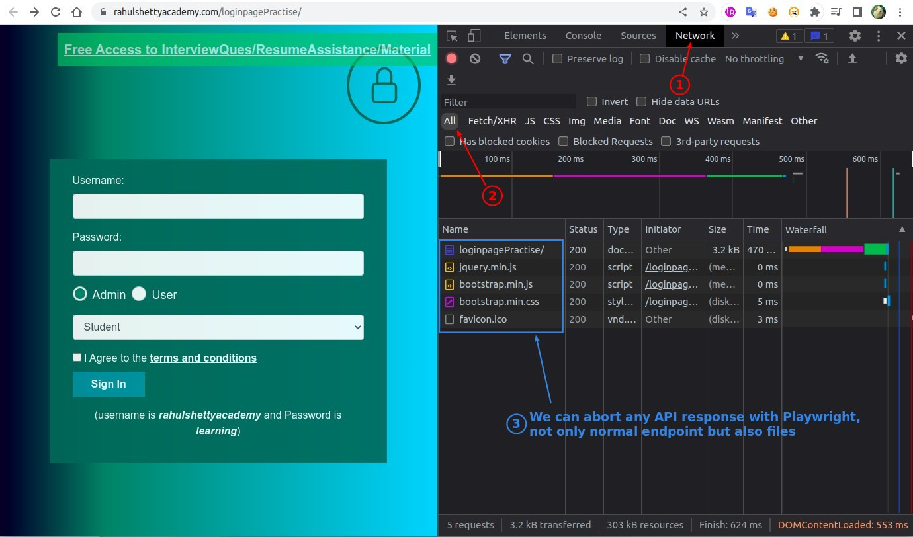
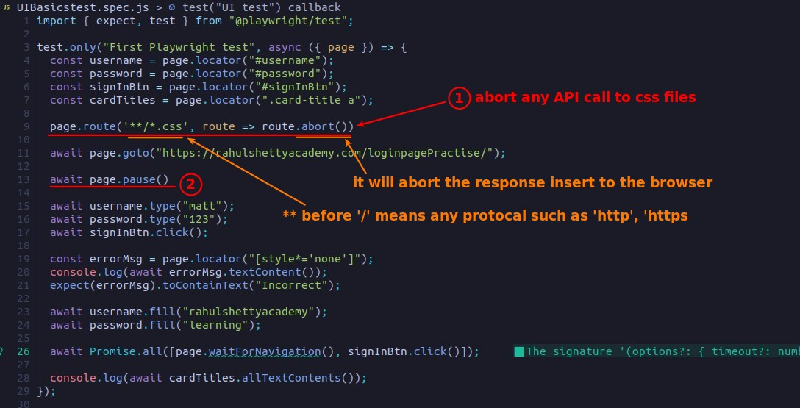
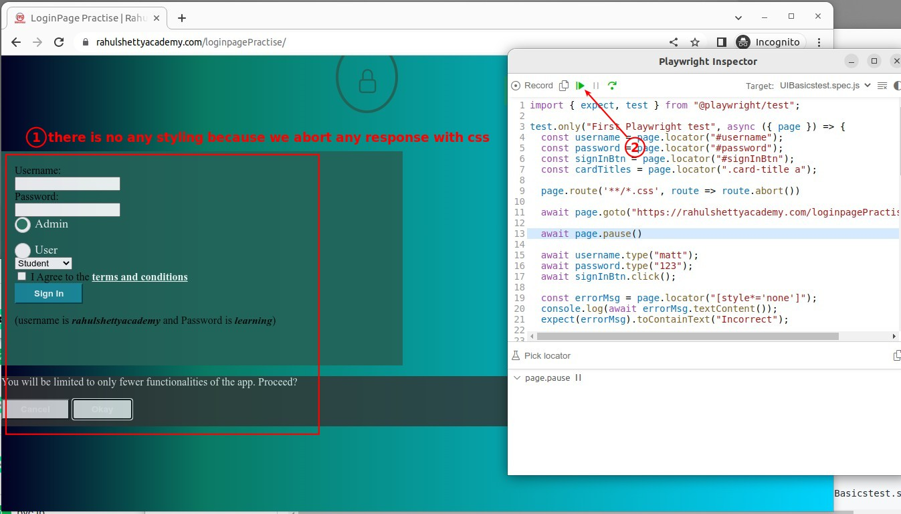
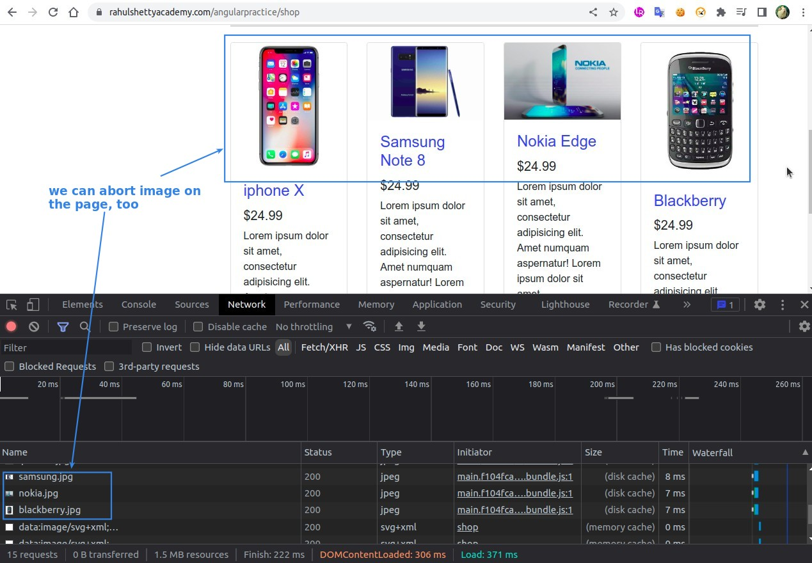
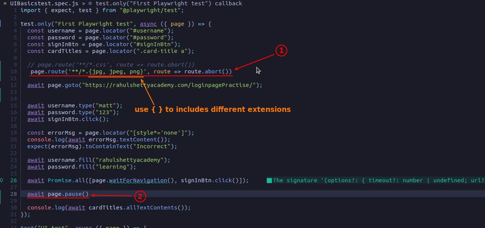
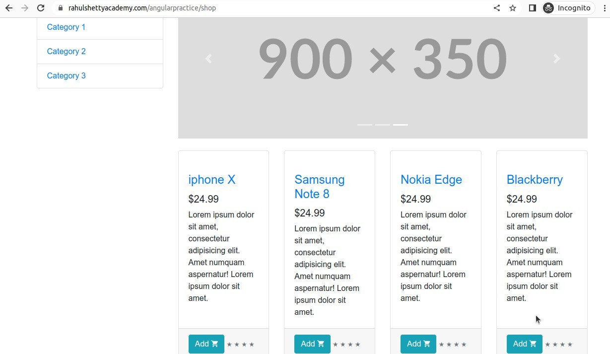
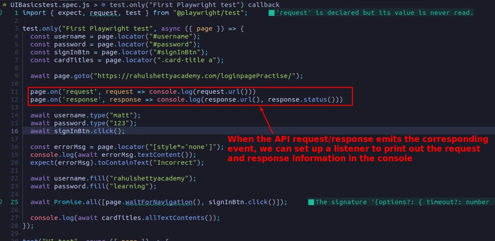
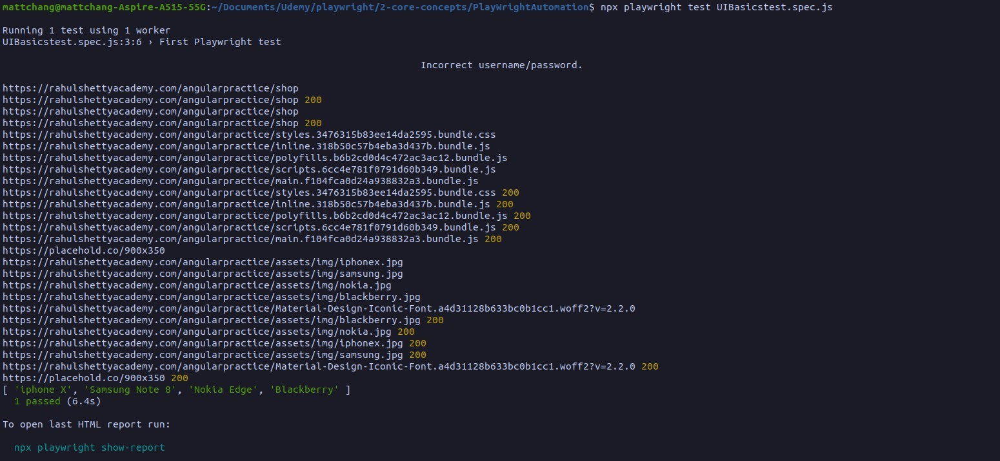

## **Abort CSS response**

> This will speed up the test but we will be unable to use the css content to select element, be careful.

- As shown above, the route url parameter can use wildcard \(\*\), so there is no need to get the order id into the url in the last lecture.

## **Abort Images response**

> Same as aborting CSS, this will speed up the test.

## **Abort Funtionalities API Call response**

> Such as login response, orders list response, We can simulate the situation where the backend fails to respond properly, and test the UI of the frontend in this case.

- The project provided by the class did not have codes written for this situation, so it was skipped.

## **Print request/response informations in the console**

> Sometimes the point of the test scenario is the network, which requires the use of the above techniques.

